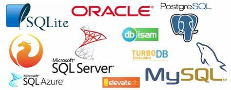

<!-- tags:  -->
<!-- created: 2020-08-22 16:00 -->

# 数据库介绍

<!-- more -->

### 概念简介

- 数据库(Data Base, DB)

    是按一定结构组织并长期存储在计算机内的、可共享的大量数据的有机集合。

- 数据库管理系统(Data Base Management System，DBMS)

    是管理和维护数据库的系统软件。

- 数据库管理员（Date Base Administrator ,DBA)

    管理操作数据库人员。

- 数据库系统（Data Base System，DBS）
  
    是实现有组织的、动态地存储大量关联数据、方便多用户访问的计算机软件、硬件和数据资源组成的系统，简化为：DBS=计算机系统（硬件、软件平台、人）+DBMS+DB

### 数据库分类

比较流行的数据库模型有三种，分别是`层次式数据库`，`网络式数据库`和`关系型数据库`。最常用的数据库模型有两种，即关系型数据库和非关系型数据库NOSQL。

##### 关系型数据库

关系型数据库模型是把复杂的数据结构归结为简单的二元关系（即二维表格形式）。在关系型数据库中，对数据的操作几乎全部建立在一个或多个关系表格上。通过对这些关联的表格分类、合并、链接或选取等运算来实现数据的管理。

关系型数据库的代表有：Oracle、MySQL、MariaDB、SQL Server(微软开发的大型关系型数据库)、Access、DB2、PostgrelSQL等

##### 非关系型数据库

非关系型数据库也被称为NoSQL(Not Only SQL)数据库。在高并发情况下传统的关系型数据库IO瓶颈、性能瓶颈都难以有突破于是出现了大批针对特定场景，以高性能和使用便利为目的的数据库产品NoSQL数据库出现了。NoSQL数据库不需要固定的表结构，通常也不存在连接操作
主要产品：

1. 键值（key-value）存储数据库
    键值数据库就类似传统语言中使用的哈希表，可以通过key来添加、查询或者删除数据，因为使用key主键访问，所以会获得很高的性能及扩展性。键值（key-value）数据库主要是用一个哈希表，这个表中有一个特定的键和一个指针指向特定的数据。key-value模型对于IT系统来说简单、易于部署、高并发。
    主要产品：Memcached、Redis、MemchachedDB、Berkeley DB、MongoDB。
2. 列存储数据库
    列存储数据库将数据存储在列族中，一个列族存储经常被一起查询的相关数据，比如人类，我们经常会查询某个人的姓名和年龄，而不是薪资。这种情况下姓名和年龄会被放到一个列族中，薪资会被放到另一个列族中。这种数据库通常用来应对分布式存储海量数据；这种数据库的典型产品有：Cassandra、HBase
3. 面向文档数据库
    文档型数据库的灵感是来自于Lotus Notes办公软件，而且它同第一种键值数据库类似。该类型的数据模型是版本化的文档，半结构化的文档以特定的格式存储，比如JSON。文档型数据库可以看作是键值数据库的升级版，允许之间嵌套键值。而且文档型数据库比键值数据库的查询效率更高；
    面向文档数据库会将数据以文档形式存储。每个文档都是自包含的数据单元，是一系列数据项的集合。每个数据项都有一个名词与对应值，值既可以是简单的数据类型，如字符串、数字和日期等；也可以是复杂的类型，如有序列表和关联对象。数据存储的最小单位是文档，同一个表中存储的文档属性可以是不同的，数据可以使用XML、JSON或JSONB等多种形式存储。这种数据库的典型产品有：MongoDB、CouchDB；
4. 图形数据库
    图形数据库允许我们将数据以图的方式存储。实体会被作为顶点，而实体之间的关系则会被作为边。比如我们有三个实体，Steve Jobs、Apple和Next，则会有两个“Founded by”的边将Apple和Next连接到Steve Jobs。这种数据库的典型产品有：Neo4J、InforGrid。

### 数据库选型

> 既然有这么多数据库, 那么我们应该如何选择呢?

具体业务需要具体分析, 那么常见的一些选型关键点有这些:

- 功能和特性

  首先数据库所具有的功能和特性要能满足产品系统的功能需要
  1. 关系型还是非关系型
  2. 是否需要支持ACID事务, 分布式事务
  3. 是否需要全文搜索
  4. 是否需要数据分析
  5. 特殊业务场景
  6. 等等

- 安全和稳定

  如果是用于生产, 不安全不稳定的数据库要慎重考虑. 一旦数据丢失或损坏, 想再恢复回来是相当困难的.

  1. 上要符合审计要求, 不容易出现 SQL 注入或拖库情况。
  2. 是否需要容错, 高可用, 多活

- 性能

  1. 写入速度, 查询速度,延迟
  2. 是否需要支持分级存储
  3. 是否需要水平扩展数据库集群

- 扩展

  如果业务的需求不确定，是否容易横向扩展和纵向扩容；

- 文档和技术支持

  1. 文档是否齐全, 社区是否稳定
  2. 官方技术支持或市场技术人才情况

- 跨平台

  1. 是否需要支持多平台部署
  2. 是否需要支持特定平台部署

- 成本

  成本是非常重要的一个选型要点, 这不仅体现在数据库是否付费, 还体现在它所影响的人力成本的开发成本和运维成本等

  1. 价格(软件费用, 硬件费用, 带宽费用等)
  2. 运维(人才成本, 部署, 监控, 备份/恢复, 升级/迁移, 调优, 故障排查难易等)
  3. 开发(人才成本, 开发周期, 代码维护)
