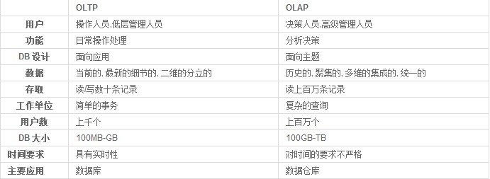
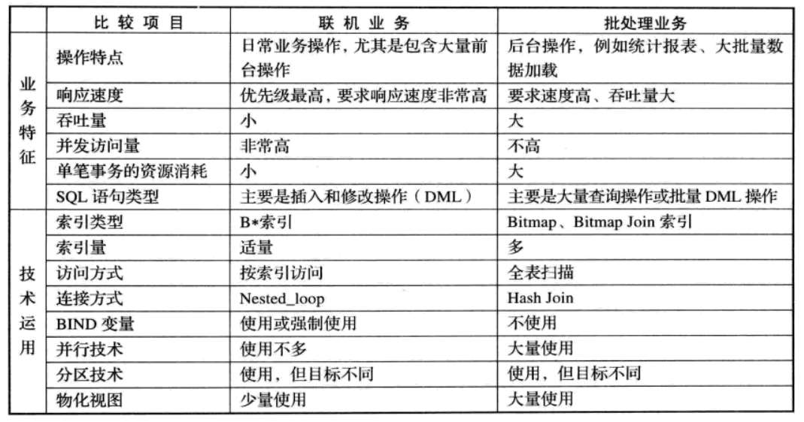

<!-- tags:  -->
<!-- created: 2020-08-22 16:00 -->

# 数据库介绍

 

> 本文摘自互联网

<!-- more -->

### 名词介绍

- 数据库(Data Base, DB)

    是按一定结构组织并长期存储在计算机内的、可共享的大量数据的有机集合。

- 数据库管理系统(Data Base Management System，DBMS)

    是管理和维护数据库的系统软件。

- 数据库管理员（Date Base Administrator ,DBA)

    管理操作数据库人员。

- 数据库系统（Data Base System，DBS）
  
    是实现有组织的、动态地存储大量关联数据、方便多用户访问的计算机软件、硬件和数据资源组成的系统，简化为：DBS=计算机系统（硬件、软件平台、人）+DBMS+DB

### 数据库分类

比较流行的数据库模型有三种，分别是`层次式数据库`，`网络式数据库`和`关系型数据库`。最常用的数据库模型有两种，即关系型数据库和非关系型数据库NOSQL。

#### 关系型数据库(SQL)

我们通常所说的SQL是关系型数据库管理系统(RDBMS)，顾名思义，它是围绕关系代数和元组关系演算构建的。 关系型数据库模型是把复杂的数据结构归结为简单的二元关系（即二维表格形式）。在关系型数据库中，对数据的操作几乎全部建立在一个或多个关系表格上。通过对这些关联的表格分类、合并、链接或选取等运算来实现数据的管理。

关系型数据库的代表有：Oracle、MySQL、MariaDB、SQL Server(微软开发的大型关系型数据库)、Access、DB2、PostgrelSQL等

其主要优点如下：

- 不同的角色（开发者，用户，数据库管理员）使用相同的语言。
- 不同的RDBMS使用统一标准的语言。
- SQL使用一种高级的非结构化查询语言。.
- 它坚持 ACID 准则 (原子性，一致性，隔离性，持久性),，这些准则保证了数据库尤其是每个事务的稳定性，安全性和可预测性。

如你所见，许多SQL的好处来源于它的统一性，舒适性和易用性。 即使你只有非常有限的SQL知识（或完全没有，如果需要），你可以在像 online SQL Query Builder 这样的特殊工具帮助下使用它。

然而，它的缺点使得它非常不适合某些类型的项目。 SQL的主要问题是它难以扩展，因为它的性能随着数据库的变大而快速下降。 分布式也是有问题的。

NoSQL和NewSQL出现的原因之一是，以前的RDBMS的设计不能满足现代数据库每秒处理的事务数量。 像亚马逊或阿里巴巴等需要处理惊人数据量的巨头，以前的RDBMS会在几分钟内出现问题。

#### 非关系型数据库(NoSQL)

非关系型数据库也被称为NoSQL(Not Only SQL)数据库。在高并发情况下传统的关系型数据库IO瓶颈、性能瓶颈都难以有突破于是出现了大批针对特定场景，以高性能和使用便利为目的的数据库产品NoSQL数据库出现了。NoSQL数据库不需要固定的表结构，通常也不存在连接操作

主要产品：

1. 键值（key-value）存储数据库
    键值数据库就类似传统语言中使用的哈希表，可以通过key来添加、查询或者删除数据，因为使用key主键访问，所以会获得很高的性能及扩展性。键值（key-value）数据库主要是用一个哈希表，这个表中有一个特定的键和一个指针指向特定的数据。key-value模型对于IT系统来说简单、易于部署、高并发。
    主要产品：Memcached、Redis、MemchachedDB、Berkeley DB、MongoDB。
2. 列存储数据库
    列存储数据库将数据存储在列族中，一个列族存储经常被一起查询的相关数据，比如人类，我们经常会查询某个人的姓名和年龄，而不是薪资。这种情况下姓名和年龄会被放到一个列族中，薪资会被放到另一个列族中。这种数据库通常用来应对分布式存储海量数据；这种数据库的典型产品有：Cassandra、HBase
3. 面向文档数据库
    文档型数据库的灵感是来自于Lotus Notes办公软件，而且它同第一种键值数据库类似。该类型的数据模型是版本化的文档，半结构化的文档以特定的格式存储，比如JSON。文档型数据库可以看作是键值数据库的升级版，允许之间嵌套键值。而且文档型数据库比键值数据库的查询效率更高；
    面向文档数据库会将数据以文档形式存储。每个文档都是自包含的数据单元，是一系列数据项的集合。每个数据项都有一个名词与对应值，值既可以是简单的数据类型，如字符串、数字和日期等；也可以是复杂的类型，如有序列表和关联对象。数据存储的最小单位是文档，同一个表中存储的文档属性可以是不同的，数据可以使用XML、JSON或JSONB等多种形式存储。这种数据库的典型产品有：MongoDB、CouchDB；
4. 图形数据库
    图形数据库允许我们将数据以图的方式存储。实体会被作为顶点，而实体之间的关系则会被作为边。比如我们有三个实体，Steve Jobs、Apple和Next，则会有两个“Founded by”的边将Apple和Next连接到Steve Jobs。这种数据库的典型产品有：Neo4J、InforGrid。

NoSQL越来越受欢迎，其中最重要的实现是Apache Cassandra，MongoDB等产品。 它主要用于解决SQL的可扩展性问题。 因此，它是没有架构的并且建立在分布式系统上，这使得它易于扩展和分片。

然而，这些好处是以放宽ACID原则为代价的：NoSQL采取最终一致性原则，而不是所有四个参数在每个事务中保持一致。 这意味着如果在特定时间段内没有特定数据项的更新，则最终对其所有的访问都将返回最后更新的值。 这就是这样的系统通常被描述为提供基本保证的原因（基本可用，软状态，最终一致性） — 而不是ACID。

虽然这个方案极大地增加了可用时间和伸缩性,它也会导致数据丢失----这个问题的严重程度取决于数据库服务器的支持情况和应用代码质量.在某些情况下,这个问题十分严重.

另一个NoSQL出现的问题是现在有很多类型的NoSQL系统,但它们之间却几乎没有一致性.诸如灵活性,性能,复杂性,伸缩性等等特性在不同系统间差别巨大,这使得甚至是专家在他们之间都很难选择.不过,当你根据项目特点作出了合适的选择,NoSQL可以在不显著丢失稳定性的情况下提供一个远比SQL系统更高效的解决方案.

#### 新型关系型数据库(NewSQL)

NewSQL是一种相对较新的形式，旨在使用现有的编程语言和以前不可用的技术来结合SQL和NoSQL中最好的部分。 NewSQL目标是将SQL的ACID保证与NoSQL的可扩展性和高性能相结合。

显然，因为结合了过去仅单独存在的优点，NewSQL看起来很有前途; 或许，在未来的某个时候，它将成为大多数人使用的标准。 不幸的是，目前大多数NewSQL数据库都是专有软件或仅适用于特定场景，这显然限制了新技术的普及和应用。

除此之外，NewSQL在每个方面比较均匀，每个解决方案都有自己的缺点和优势。 例如，SAP HANA可以轻松处理低到中等的事务性工作负载，但不使用本机集群，MemSQL对于集群分析很有用，但在ACID事务上表现出较差的一致性，等等。 因此，在这些解决方案变得真正普及之前，可能还需要一段时间。

NewSQL 的主要产品有: Spanner, F1, TiDB, CockroachDB, FoundationDB, OceanBase, TDSQL, UDDB, SequoiaDB, Fusion-NewSQL等

### 数据处理

数据处理大致可以分成两大类：联机事务处理OLTP（on-line transaction processing）、联机分析处理OLAP（On-Line Analytical Processing）。OLTP是传统的关系型数据库的主要应用，主要是基本的、日常的事务处理，例如银行交易。OLAP是数据仓库系统的主要应用，支持复杂的分析操作，侧重决策支持，并且提供直观易懂的查询结果。

针对两类系统的数据管理和系统设计方式都有很大差异。

1. 对OLTP的数据模型采用基本的约束E-R图模型，而OLAP的数据模型则需要采用特殊的“星型模型”，数据立方等数据仓库相关的技术。
2. 对OLTP的数据存储通常采用行式组织，而OLAP采用列式组织。
3. OLTP的业务通常对实时要求比OLAP高很多。
4. 传统的数据库，为了同时支持两类业务。通常采用两个数据源, 分别对两套系统进行优化设计。

下面是网络收集的两张对比图

**HTAP** 混合事务/分析处理（Hybrid Transaction Analytical Processing, HTAP）是数据库技术领域的新名词，是在线事务（OnLine Transaction Processing）和在线分析（Online Analytical Processing）合称简写，即（HTAP = OLAP +OLTP）, HTAP既可以在线交易事务，又可以在线实时分析。

HTAP系统，主要有一下几点好处：

1. 数据不需要从操作型数据库导入到决策类系统；
2. 操作事务，实时地对分析业务可见；
3. 上钻下取等分析操作，时刻操作最新的数据；
4. 减少对副本的要求。
