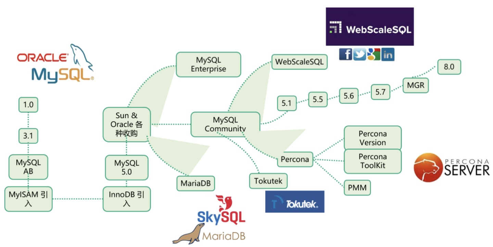

<!-- tags:  -->
<!-- created: 2020-08-22 18:15 -->

# MySQL

> MySQL是一个关系型数据库管理系统，由瑞典MySQL AB 公司开发，属于 Oracle 旗下产品。MySQL 是最流行的关系型数据库管理系统之一，在 WEB 应用方面，MySQL是最好的 RDBMS (Relational Database Management System，关系数据库管理系统) 应用软件之一。

<!-- more -->

MySQL所使用的 SQL 语言是用于访问数据库的最常用标准化语言。MySQL 软件采用了双授权政策，分为社区版和商业版，由于其体积小、速度快、总体拥有成本低，尤其是开放源码这一特点，一般中小型网站的开发都选择 MySQL 作为网站数据库。

### 分支

自从甲骨文公司收购了MySQL后，有将MySQL闭源的潜在风险。而且Oracle对培养MySQL这个免费的儿子并不太用心，漏洞修补和版本升级的速度一段时间非常缓慢，所以业界对MySQL的未来普遍不抱有乐观态度。因此社区采用分支的方式来避开这个风险，例如谷歌、Facebook、RedHat都将MySQL替换成了衍生版，国内也有企业纷纷放弃了MySQL官方版,像阿里和腾讯还做起了自己的MySQL衍生版。

目前MySQL领域存在着众多的衍生版数据库，主流的有官方MySQL、MariaDB以及Percona Server等。

- MariaDB

    起初MySQL之父Monty在1979年写下MySQL的第一行代码，后来逐渐创建起MySQL公司，后将其以10亿美金卖给Sun，结果Sun又把MySQL转手卖给Oracle，Monty愤而出走，以MySQL5.5为基础创造了MariaDB数据库，这样就诞生出了MySQL分支里知名度最高的一个衍生版。

- Percona Server

    Percona Server是MySQL咨询公司Percona发布的性能最接近MySQL企业版的MySQL产品。Percona公司在MySQL数据库优化方面做了非常多的工作，以至于Percona Server数据库是MySQL众多分支中，在高负载、高并发情况下表现非常突出，乃至阿里巴巴的OceanBase数据库都要借鉴Percona Server。

### 版本

> 未完待续