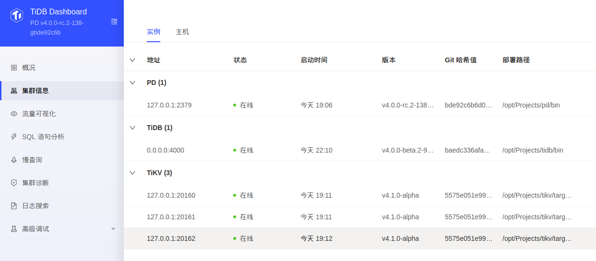
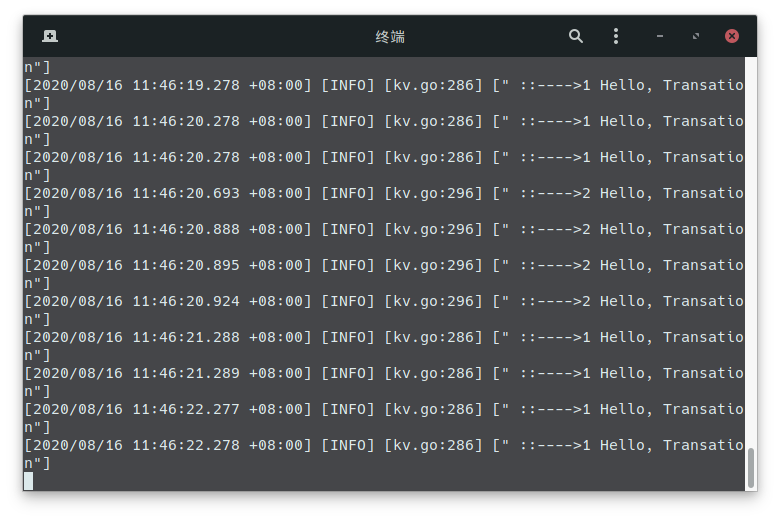

<!-- tags: pingcap, tidb -->
<!-- created: 2020-08-12 18:00 -->

# **High Performance TiDB** 第一课

<center>

<!-- iframe 
<iframe
    src="//player.bilibili.com/player.html?bvid=BV17K411T7Kd&page=1"
    sandbox="allow-top-navigation allow-same-origin allow-forms allow-scripts"
    scrolling="no" border="0" frameborder="no" framespacing="0" allowfullscreen="true">
</iframe>
 -->

[【High Performance TiDB】Lesson 01：TiDB 整体架构](https://www.bilibili.com/video/BV17K411T7Kd)

</center>

> 本节课程作为 High Performance TiDB 课程系列的第一节课程，主要包括以下几个方面： </br>
> 
> 1. 对 High Performance TiDB 课程发起背景的介绍
> 2. 对 High Performance TiDB 课程设计的简要介绍，包括课程目标、受众、考核方式等
> 3. 对 TiDB 整体架构的介绍
> 
<!-- more -->

## 💻 一、准备开发环境

#### 操作系统

```text
First, 现大概看了下三个项目在线源码和文档，
Hmm，`Makefile`, `sh`, `llvm` 啥的， 还是用Linux吧
Ok, MBP刚好拿去修了， 虚拟机安装个 Manjaro Linux， 分配2C8G
```

#### 编译环境

> 参考 ·[setting-up-your-development-environment](https://github.com/pingcap/community/blob/master/contributors/README.md#setting-up-your-development-environment)

```bash
# 基本需要
sudo pacman -S git gcc clang llvm make cmake

# TiKV 需要
sudo pacman -S rustup

# TiDB & PD 需要
sudo pacman -S go

# 配置go模块代理
go env -w GO111MODULE=on
go env -w GOPROXY=https://goproxy.io,direct
```

## 📥 二、下载 `TiDB`, `TiKV`, `PD` 源代码

#### 准备好工作目录

```bash
# Workspace
Workspace=/opt/Projects
mkdir ${Workspace} -p
cd ${Workspace}
```

#### 克隆代码

> 这里直接克隆了官方仓库， 后面提交 PR 的时候应该要先 Fork

```bash
# TiKV
git clone --recursive https://github.com/tikv/tikv.git

# TiDB
git clone --recursive https://github.com/pingcap/tidb.git

# PD
git clone --recursive https://github.com/pingcap/pd.git
```

## 📜 三、构建和测试

> 克隆代码后， 先把每个项目都编译构建一次，确保一切正常

#### TiKV

```bash
cd ${Workspace}/tikv

# 配置RUST工具链
rustup component add rustfmt
rustup component add clippy

# 构建和测试
make build
# 这个编译时间有点久
# Finished dev [unoptimized + debuginfo] target(s) in 31m 38s
# Ok，用时半个多小时

cargo check -all

```

#### PD

```bash
cd ${Workspace}/pd
make
```

#### TiDB

```bash
cd ${Workspace}/tidb
make
# 这个编译完成可以看到 Build TiDB Server successfully!
```

## 🚀 四、启动服务

> Ok，三个项目都已经构建通过，启动服务，先跑起来看一下

> PD和TiKV参考： https://github.com/tikv/tikv/blob/master/docs/how-to/deploy/using-binary.md </br>
> TiDB参考： https://pingcap.com/blog/building-running-and-benchmarking-tikv-and-tidb/

```bash
# 设置一个运行目录
mkdir -p /opt/cluster
cd /opt/cluster
```

#### 启动 PD*1

> 参数配置说明： https://docs.pingcap.com/zh/tidb/stable/command-line-flags-for-pd-configuration

```bash
PD=${Workspace}/pd/bin

${PD}/pd-server --name=pd1 \
                --data-dir=pd1 \
                --client-urls="http://127.0.0.1:2379" \
                --peer-urls="http://127.0.0.1:2380" \
                --initial-cluster="pd1=http://127.0.0.1:2380" \
                --log-file=pd1.log
```

#### 启动 TiKV*3

> 参数配置说明： https://docs.pingcap.com/zh/tidb/stable/command-line-flags-for-tikv-configuration

```bash
TIKV=${Workspace}/tikv/target/debug

${TIKV}/tikv-server --pd-endpoints="127.0.0.1:2379" \
                --addr="127.0.0.1:20160" \
                --data-dir=tikv1 \
                --log-file=tikv1.log

${TIKV}/tikv-server --pd-endpoints="127.0.0.1:2379" \
                --addr="127.0.0.1:20161" \
                --data-dir=tikv2 \
                --log-file=tikv2.log

${TIKV}/tikv-server --pd-endpoints="127.0.0.1:2379" \
                --addr="127.0.0.1:20162" \
                --data-dir=tikv3 \
                --log-file=tikv3.log
```
#### 验证TiKV状态

```bash
# pd-ctl doc： https://tikv.org/docs/4.0/reference/tools/pd-ctl/
${Workspace}/pd/bin/pd-ctl store -u http://127.0.0.1:2379

# Ok. 看到输出一块JSON数据，三个节点全部 "state_name:"up"
```

#### 启动 TiDB*1

> 参数配置说明： https://docs.pingcap.com/zh/tidb/stable/command-line-flags-for-tidb-configuration

```bash
TIDB=${Workspace}/tidb/bin
${TIDB}/tidb-server --store=tikv \
                --path="127.0.0.1:2379" \
                --log-file=tidb1.log
# 注意： --path参数不能有空格，不然会报错
```

#### 验证TiDB状态

```bash
sudo pacman -S mariadb

mysql -h 127.0.0.1 -P 4000 -u root
# 输出
# Welcome to the MariaDB monitor.  Commands end with ; or \g.
# Your MySQL connection id is 16
# Server version: 5.7.25-TiDB-v4.0.0-beta.2-953-gbaedc336a # TiDB Server (Apache License 2.0) Community Edition, MySQL 5.7 # compatible
# 
# Copyright (c) 2000, 2018, Oracle, MariaDB Corporation Ab and # others.
# 
# Type 'help;' or '\h' for help. Type '\c' to clear the current input statement.
# 
# MySQL [(none)]> 
# 
```

#### Dashboard

> `{pd-ip}:{pd-port}/dashboard `



## 📝 五、修改

> 需求: 修改源码并部署(1 TiDB, 1 PD, 3 TiKV)， 使`TiDB` 启动事务时, 输出一个`"hello transaction"`的日志 </br>

> 惭愧， 学过 Rust 还没学 Go，接下来要学下 Golang 了

#### 定位

```go
// 先找到程序入口：启动用的 tidb-server， 那么先看下tidb-server/main.go
// 找到 func main, 有个 runServer()，跳过去， 有个svr.Run(), 再跳
// 有个 for 循环的 s.listener.Accept()， 应该是客户端监听， 往下翻，
// 果然， clientConn := s.newConn(conn)
// 再翻， go s.onConn(clientConn)， 跳过去，
// 找到一个 conn.Run(ctx)， 跳过去
// data, err := cc.readPacket() 应该是从客户端读取数据
// cc.dispatch(ctx, data) 应该是下推， 跳过去看下
// 有个 switch cmd { /*case 一堆命令类型*/  }， 是在解析
// case mysql.ComQuery 被注释高频使用， 
// cc.handleQuery(ctx, dataStr) 跳过去看下，
// 看注释  是一个执行查询语句和返回结果的函数
// 跟踪一下 stmts 变量， for 循环 cc.handleStmt 处理， 跳过去，
// 囧， 没有注释， 翻翻看。。。
// 有个 cc.ctx.ExecuteStmt，直接跳过去
// tc.Session.ExecuteStmt， 再跳， 
// 额， 是个接口

// 检索一下 那个 ExecuteStmt， 翻了翻
// 看到session.go 的 ExecuteStmt 函数中有一句 s.PrepareTxnCtx(ctx)
// 它会创建事物上下文， 执行SQL语句前被调用
// 字面意思， 这里只是创建， 准备， 还没开启事务

// 往下找， 看到 rs, err = s.Exec(ctx) 和 recordSet, err := runStmt(ctx, s, stmt)，
// 搜索Exec(ctx， 在 adapter.go 中找到该方法， 
// 再看到一个 txn, err := sctx.Txn(false) 和 txnStartTS = txn.StartTS()时， 应该是事务启动时间
// 那么事务启动应该在附近， 点开 sctx.Txn(false);
// 看到
type Context interface {
	// NewTxn creates a new transaction for further execution.
	// If old transaction is valid, it is committed first.
	// It's used in BEGIN statement and DDL statements to commit old transaction.
	NewTxn(context.Context) error

	// Txn returns the current transaction which is created before executing a statement.
	// The returned kv.Transaction is not nil, but it maybe pending or invalid.
	// If the active parameter is true, call this function will wait for the pending txn
	// to become valid.
	Txn(active bool) (kv.Transaction, error)
	
	// ...
	
	
	// InitTxnWithStartTS initializes a transaction with startTS.
	// It should be called right before we builds an executor.
	InitTxnWithStartTS(startTS uint64) error
	
	// ...
}

// 看到 InitTxnWithStartTS 方法， 根据注释， 它会在创建执行器前调用
// 正常来说事务开始的时候要记录开始时间， 那么反过来说，赋予开始时间的时候， 应该也是事务开始的时候
// 检索一下 InitTxnWithStartTS， 看到adapter.go 中创建执行器 buildExecutor 方法中有调用，
// 再翻下检索结果， 看到 session.go 和 context.go 下都实现了 InitTxnWithStartTS 方法
// 而 context.go 在mock包下，  显示注释为 Package mock is just for test only. 那么不管它
// 来看一下 session.go 下的 InitTxnWithStartTS 实现，
func (s *session) InitTxnWithStartTS(startTS uint64) error {
	// ...
	txn, err := s.store.BeginWithStartTS(startTS)
	// ...
}
// 最终在这里创建了一个 txn， 跳过去， 进入了kv.go, 找到该方法实现

func (s *tikvStore) Begin() (kv.Transaction, error) {
	txn, err := newTiKVTxn(s)
	if err != nil {
		return nil, errors.Trace(err)
	}
	return txn, nil
}
// BeginWithStartTS begins a transaction with startTS.
func (s *tikvStore) BeginWithStartTS(startTS uint64) (kv.Transaction, error) {
	txn, err := newTikvTxnWithStartTS(s, startTS, s.nextReplicaReadSeed())
	if err != nil {
		return nil, errors.Trace(err)
	}
	return txn, nil
}

// OK， 看到注释， 用startTS开始一个事务， 
// 注意到该方法上面还有一个没有startTS参数的Begin方法， 
// 好了定位到代码， 开始下一步修改
```

#### 修改✏️ 

```go
// kv.go
// 既然有 Begin 和 BeginWithStartTS 两个开始事务的方法
// 那么两处都修改一下好了
// 在成功拿到txn后， 返回txn前， 增加一个打印输出
// 修改后

func (s *tikvStore) Begin() (kv.Transaction, error) {
	txn, err := newTiKVTxn(s)
	if err != nil {
		return nil, errors.Trace(err)
	}
	logutil.BgLogger().Info(" ::---->1 Hello, Transation")
	return txn, nil
}
// BeginWithStartTS begins a transaction with startTS.
func (s *tikvStore) BeginWithStartTS(startTS uint64) (kv.Transaction, error) {
	txn, err := newTikvTxnWithStartTS(s, startTS, s.nextReplicaReadSeed())
	if err != nil {
		return nil, errors.Trace(err)
	}
	logutil.BgLogger().Info(" ::---->2 Hello, Transation")
	return txn, nil
}
```

#### 重新编译

```bash
make

# tidb-server tidb-server/main.go
# Build TiDB Server successfully!
# Ok， 很快编译完
```

#### 重新启动服务

```bash
# 设置下环境变量
Workspace=/opt/Projects
PD=${Workspace}/pd/bin
TIKV=${Workspace}/tikv/target/debug
TIDB=${Workspace}/tidb/bin
export PATH=$PATH:${PD}:${TIKV}:${TIDB}

# 清空一下
cd /opt/cluster
rm -rf *

# 这次在后台启动服务

# 启动PD
nohup pd-server \
	--name=pd1 \
	--data-dir=pd1 \
	--client-urls="http://127.0.0.1:2379" \
	--peer-urls="http://127.0.0.1:2380" \
	--initial-cluster="pd1=http://127.0.0.1:2380" \
	--log-file=pd1.log \
	&

# 启动TiKV

nohup tikv-server \
	--pd-endpoints="127.0.0.1:2379" \
	--addr="127.0.0.1:20160" \
	--data-dir=tikv1 \
	--log-file=tikv1.log \
	&

nohup tikv-server \
	--pd-endpoints="127.0.0.1:2379" \
	--addr="127.0.0.1:20161" \
	--data-dir=tikv2 \
	--log-file=tikv2.log \
	&

nohup tikv-server \
	--pd-endpoints="127.0.0.1:2379" \
	--addr="127.0.0.1:20162" \
	--data-dir=tikv3 \
	--log-file=tikv3.log \
	&
	
# 验证
pd-ctl store | grep "Up"
# Ok

# 启动TiDB
# 为了方便查看日志，直接输出日志到控制台, 并用grep过滤
tidb-server \
	--store=tikv \
	--path="127.0.0.1:2379" \
	| grep "::---->"

#
# 可以看到控制台一直交替打印
# *** ::---->1 Hello, Transation
# *** ::---->2 Hello, Transation

```



#### 为什么启动后一直打印

> 打印调用堆栈看一下

```log
[2020/08/16 12:06:06.579 +08:00] [INFO] [kv.go:287] [" ::---->1 Hello, Transation"]
::----> goroutine 323 [running]:
runtime/debug.Stack(0xc0007db020, 0x3416137, 0x1b)
	/usr/lib/go/src/runtime/debug/stack.go:24 +0x9d
github.com/pingcap/tidb/store/tikv.(*tikvStore).Begin(0xc00031b500, 0x39a9860, 0xc00011c000, 0x0, 0x0)
	/opt/Projects/tidb/store/tikv/kv.go:289 +0xc0
github.com/pingcap/tidb/kv.RunInNewTxn(0x39dcc00, 0xc00031b500, 0x203000, 0xc00001fce8, 0x0, 0x0)
	/opt/Projects/tidb/kv/txn.go:36 +0x83
github.com/pingcap/tidb/ddl.(*worker).handleDDLJobQueue(0xc0000fa060, 0xc000536640, 0x24, 0xc000e44500)
	/opt/Projects/tidb/ddl/ddl_worker.go:433 +0x152
github.com/pingcap/tidb/ddl.(*worker).start(0xc0000fa060, 0xc000536640)
	/opt/Projects/tidb/ddl/ddl_worker.go:154 +0x369
created by github.com/pingcap/tidb/ddl.(*ddl).Start
	/opt/Projects/tidb/ddl/ddl.go:340 +0x67f
[2020/08/16 12:06:06.693 +08:00] [INFO] [kv.go:299] [" ::---->2 Hello, Transation"]
::----> goroutine 399 [running]:
runtime/debug.Stack(0xc0007db020, 0x3416152, 0x1b)
	/usr/lib/go/src/runtime/debug/stack.go:24 +0x9d
github.com/pingcap/tidb/store/tikv.(*tikvStore).BeginWithStartTS(0xc00031b500, 0x5cfd5c8a8f00001, 0x0, 0x0, 0xa, 0xa)
	/opt/Projects/tidb/store/tikv/kv.go:300 +0xe0
github.com/pingcap/tidb/session.(*txnFuture).wait(0xc000e23100, 0xc000e4c890, 0x11e5906, 0x5f38b0ae, 0x7fd52918c944)
	/opt/Projects/tidb/session/txn.go:373 +0x344
github.com/pingcap/tidb/session.(*TxnState).changePendingToValid(0xc00047d690, 0xbda8ef4c, 0x542e540)
	/opt/Projects/tidb/session/txn.go:169 +0x51
github.com/pingcap/tidb/session.(*session).Txn(0xc00047d680, 0xc0000bb601, 0x0, 0x0, 0x0, 0x0)
	/opt/Projects/tidb/session/session.go:1434 +0x183
github.com/pingcap/tidb/executor.(*executorBuilder).getSnapshotTS(0xc000e44e40, 0xa, 0xc000e64870, 0x1)
	/opt/Projects/tidb/executor/builder.go:1337 +0x73
github.com/pingcap/tidb/executor.buildNoRangeIndexLookUpReader(0xc000e44e40, 0xc000e663c0, 0x40, 0x545ec20, 0x0)
	/opt/Projects/tidb/executor/builder.go:2662 +0x1c7
github.com/pingcap/tidb/executor.(*executorBuilder).buildIndexLookUpReader(0xc000e44e40, 0xc000e663c0, 0xc000e4cd30, 0x118adc4)
	/opt/Projects/tidb/executor/builder.go:2722 +0x89
github.com/pingcap/tidb/executor.(*executorBuilder).build(0xc000e44e40, 0x39d8800, 0xc000e663c0, 0x39d8800, 0xc000e663c0)
	/opt/Projects/tidb/executor/builder.go:213 +0x353
github.com/pingcap/tidb/executor.(*executorBuilder).buildProjection(0xc000e44e40, 0xc000e6a1e0, 0x39d8800, 0xc000e4cf08)
	/opt/Projects/tidb/executor/builder.go:1296 +0x91
github.com/pingcap/tidb/executor.(*executorBuilder).build(0xc000e44e40, 0x39d8c80, 0xc000e6a1e0, 0xc000e6a1e0, 0x0)
	/opt/Projects/tidb/executor/builder.go:197 +0x4db
github.com/pingcap/tidb/executor.(*ExecStmt).buildExecutor(0xc000cf1b00, 0xc0000bb600, 0x39ec960, 0xc00047d680, 0x39a98e0)
	/opt/Projects/tidb/executor/adapter.go:705 +0x160
github.com/pingcap/tidb/executor.(*ExecStmt).Exec(0xc000cf1b00, 0x39a98e0, 0xc000e1fc50, 0x0, 0x0, 0x0, 0x0)
	/opt/Projects/tidb/executor/adapter.go:315 +0x195
github.com/pingcap/tidb/session.runStmt(0x39a98e0, 0xc000e1f3b0, 0xc00047d680, 0x39b2da0, 0xc000cf1b00, 0x0, 0x0, 0x0, 0x0)
	/opt/Projects/tidb/session/session.go:1197 +0x2a8
github.com/pingcap/tidb/session.(*session).ExecuteStmt(0xc00047d680, 0x39a98e0, 0xc000e1f3b0, 0x39b25a0, 0xc000e50000, 0x0, 0x0, 0x0, 0x0)
	/opt/Projects/tidb/session/session.go:1162 +0x89e
github.com/pingcap/tidb/session.(*session).Execute(0xc00047d680, 0x39a98e0, 0xc000e1f3b0, 0xc000289200, 0xbb, 0x0, 0x0, 0x0, 0x0, 0x0)
	/opt/Projects/tidb/session/session.go:1075 +0x317
github.com/pingcap/tidb/session.execRestrictedSQL(0x39a98e0, 0xc000e1f3b0, 0xc00047d680, 0xc000289200, 0xbb, 0x11a8b0f, 0xbb, 0xc000289200, 0xbb, 0xc000289200, ...)
	/opt/Projects/tidb/session/session.go:829 +0x115
github.com/pingcap/tidb/session.(*session).ExecRestrictedSQLWithContext(0xc00029b590, 0x39a9860, 0xc00011c008, 0xc000289200, 0xbb, 0x0, 0x0, 0x0, 0x0, 0x0, ...)
	/opt/Projects/tidb/session/session.go:768 +0x208
github.com/pingcap/tidb/session.(*session).ExecRestrictedSQL(0xc00029b590, 0xc000289200, 0xbb, 0x7fd575277cf0, 0xc00029b590, 0xc000289200, 0xbb, 0x33da49d, 0x1, 0xc00002e9a0, ...)
	/opt/Projects/tidb/session/session.go:738 +0x61
github.com/pingcap/tidb/bindinfo.(*BindHandle).Update(0xc00090b280, 0xc00073e600, 0x0, 0x0)
	/opt/Projects/tidb/bindinfo/handle.go:137 +0x152
github.com/pingcap/tidb/domain.(*Domain).globalBindHandleWorkerLoop.func1(0xc00058e120)
	/opt/Projects/tidb/domain/domain.go:935 +0x17a
created by github.com/pingcap/tidb/domain.(*Domain).globalBindHandleWorkerLoop
	/opt/Projects/tidb/domain/domain.go:922 +0x5f
[2020/08/16 12:06:09.765 +08:00] [INFO] [kv.go:299] [" ::---->2 Hello, Transation"]
::----> goroutine 483 [running]:
runtime/debug.Stack(0xc0007db020, 0x3416152, 0x1b)
	/usr/lib/go/src/runtime/debug/stack.go:24 +0x9d
github.com/pingcap/tidb/store/tikv.(*tikvStore).BeginWithStartTS(0xc00031b500, 0x5cfd5c8d9600001, 0x0, 0x0, 0x5, 0x5)
	/opt/Projects/tidb/store/tikv/kv.go:300 +0xe0
github.com/pingcap/tidb/session.(*txnFuture).wait(0xc000928360, 0xc000b48538, 0x11e5906, 0x5f38b0b1, 0x7fd52d956914)
	/opt/Projects/tidb/session/txn.go:373 +0x344
github.com/pingcap/tidb/session.(*TxnState).changePendingToValid(0xc00047d690, 0x174f5ed1e, 0x542e540)
	/opt/Projects/tidb/session/txn.go:169 +0x51
github.com/pingcap/tidb/session.(*session).Txn(0xc00047d680, 0xc0000bb601, 0x0, 0x0, 0x0, 0x0)
	/opt/Projects/tidb/session/session.go:1434 +0x183
github.com/pingcap/tidb/executor.(*executorBuilder).getSnapshotTS(0xc000497fc0, 0x5, 0xc000ba4c30, 0x1)
	/opt/Projects/tidb/executor/builder.go:1337 +0x73
github.com/pingcap/tidb/executor.buildNoRangeIndexLookUpReader(0xc000497fc0, 0xc000457e00, 0x40, 0x545ec20, 0x0)
	/opt/Projects/tidb/executor/builder.go:2662 +0x1c7
github.com/pingcap/tidb/executor.(*executorBuilder).buildIndexLookUpReader(0xc000497fc0, 0xc000457e00, 0xc000b489d8, 0x118adc4)
	/opt/Projects/tidb/executor/builder.go:2722 +0x89
github.com/pingcap/tidb/executor.(*executorBuilder).build(0xc000497fc0, 0x39d8800, 0xc000457e00, 0x39d8800, 0xc000457e00)
	/opt/Projects/tidb/executor/builder.go:213 +0x353
github.com/pingcap/tidb/executor.(*executorBuilder).buildProjection(0xc000497fc0, 0xc000cb3360, 0x39d8800, 0xc000b48bb0)
	/opt/Projects/tidb/executor/builder.go:1296 +0x91
github.com/pingcap/tidb/executor.(*executorBuilder).build(0xc000497fc0, 0x39d8c80, 0xc000cb3360, 0xc000cb3360, 0x0)
	/opt/Projects/tidb/executor/builder.go:197 +0x4db
github.com/pingcap/tidb/executor.(*ExecStmt).buildExecutor(0xc000577290, 0xc0000bb600, 0x39ec960, 0xc00047d680, 0x39a98e0)
	/opt/Projects/tidb/executor/adapter.go:705 +0x160
github.com/pingcap/tidb/executor.(*ExecStmt).Exec(0xc000577290, 0x39a98e0, 0xc000552a20, 0x0, 0x0, 0x0, 0x0)
	/opt/Projects/tidb/executor/adapter.go:315 +0x195
github.com/pingcap/tidb/session.runStmt(0x39a98e0, 0xc00074cf30, 0xc00047d680, 0x39b2da0, 0xc000577290, 0x0, 0x0, 0x0, 0x0)
	/opt/Projects/tidb/session/session.go:1197 +0x2a8
github.com/pingcap/tidb/session.(*session).ExecuteStmt(0xc00047d680, 0x39a98e0, 0xc00074cf30, 0x39b25a0, 0xc000e51520, 0x0, 0x0, 0x0, 0x0)
	/opt/Projects/tidb/session/session.go:1162 +0x89e
github.com/pingcap/tidb/session.(*session).Execute(0xc00047d680, 0x39a98e0, 0xc00074cf30, 0xc00007e4d0, 0x66, 0x0, 0x0, 0x0, 0x0, 0x0)
	/opt/Projects/tidb/session/session.go:1075 +0x317
github.com/pingcap/tidb/session.execRestrictedSQL(0x39a98e0, 0xc00074cf30, 0xc00047d680, 0xc00007e4d0, 0x66, 0xc000d872b0, 0x0, 0xc000cd8000, 0x0, 0x10000c00011c008, ...)
	/opt/Projects/tidb/session/session.go:829 +0x115
github.com/pingcap/tidb/session.(*session).ExecRestrictedSQLWithContext(0xc000c82d20, 0x39a9860, 0xc00011c008, 0xc00007e4d0, 0x66, 0x0, 0x0, 0x0, 0x0, 0x0, ...)
	/opt/Projects/tidb/session/session.go:768 +0x208
github.com/pingcap/tidb/session.(*session).ExecRestrictedSQL(0xc000c82d20, 0xc00007e4d0, 0x66, 0x1, 0x1, 0xc00007e4d0, 0x66, 0x203000, 0x0, 0x0, ...)
	/opt/Projects/tidb/session/session.go:738 +0x61
github.com/pingcap/tidb/statistics/handle.(*Handle).Update(0xc000c81d40, 0x39e1540, 0xc0004bcb40, 0x39e1540, 0xc0004bcb40)
	/opt/Projects/tidb/statistics/handle/handle.go:177 +0x19c
github.com/pingcap/tidb/domain.(*Domain).loadStatsWorker(0xc00058e120)
	/opt/Projects/tidb/domain/domain.go:1099 +0x4a2
created by github.com/pingcap/tidb/domain.(*Domain).UpdateTableStatsLoop
	/opt/Projects/tidb/domain/domain.go:1044 +0x249

```

#### 分析

```go
// 找到 domain.go:1044附近


// RunAutoAnalyze indicates if this TiDB server starts auto analyze worker and can run auto analyze job.
var RunAutoAnalyze = true

// UpdateTableStatsLoop creates a goroutine loads stats info and updates stats info in a loop.
// It will also start a goroutine to analyze tables automatically.
// It should be called only once in BootstrapSession.
func (do *Domain) UpdateTableStatsLoop(ctx sessionctx.Context) error {
	// ...
}

// Ok, 原来是默认开启了自动分析, 它会循环加载和更新信息
```

## ✍️ 六、问题总结

> 目前都是网络问题

#### 编译TiKV有点慢(超时)

> 替换[中科大]国内源

```bash
tee $HOME/.cargo/config <<-'EOF'
[source.crates-io]
registry = "https://github.com/rust-lang/crates.io-index"
replace-with = 'ustc'
[source.ustc]
registry = "git://mirrors.ustc.edu.cn/crates.io-index"
EOF
```

#### 构建过程拉取部分 Github 仓库源码时一直超时错误

```text
Linux翻墙有些麻烦， 用手机热点解决。
```
