<!-- tags: pingcap, tidb -->
<!-- created: 2020-08-19 19:00 -->

# **High Performance TiDB** 第二课

<center>

<!-- iframe 
<iframe
    src="//player.bilibili.com/player.html?bvid=BV1TD4y1m7AF&page=1"
    sandbox="allow-top-navigation allow-same-origin allow-forms allow-scripts"
    scrolling="no" border="0" frameborder="no" framespacing="0" allowfullscreen="true">
</iframe>
 -->

[【High Performance TiDB】Lesson 02：对 TiDB 进行基准测试](https://www.bilibili.com/video/BV1TD4y1m7AF)

</center>

> 本次课程介绍了如何使用TiUP部署, 以及比较常用的几个测试工具的使用方法以及测试内容，通过这些工具对 TiDB 的测试，来发现 TiDB 潜在的瓶颈和优化点

<!-- more -->

### 环境准备

> 官方推荐参考配置: [https://docs.pingcap.com/zh/tidb/stable/hardware-and-software-requirements](https://docs.pingcap.com/zh/tidb/stable/hardware-and-software-requirements)
> </br>
> 目前基准测试主要是OLTP, 所以这里暂不部署TiFlash </br>
> Ok, 群里小伙伴的提议, 买几台按需云主机

##### 机器配置

| 组件      | CPU        | 内存 | 磁盘      | 网络 | 实例数量 |
| --------- | ---------- | ---- | --------- | ---- | -------- |
| TiDB      | 2.6GHz 8核 | 16G  | -         | 千兆 | 1        |
| PD        | 2.6GHz 4核 | 8G   | SSD, 256G | 千兆 | 1        |
| TiKV      | 3.0GHz 8核 | 32G  | SSD, 256G | 千兆 | 3        |
| Monitor   | 2.6GHz 4核 | 8G   | SSD, 64G  | 千兆 | 1        |
| Benchmark | 2.6GHz 8核 | 16G  | SSD, 128G | 千兆 | 1        |

> 对于我初学者来说, 还没有查到如何确定磁盘容量大小, </br>
> 包括 PD, TiKV , Monitoring & Grafana, TiFlash 等有状态组件之间的容量大小比例.

##### 拓扑结构

| 实例       | 个数 | 物理机配置         | 数量 | IP                                     |
| :--------- | :--- | :----------------- | :--- | :------------------------------------- |
| TiDB       | 1    | 8 VCore 16GB       | 1    | 10.0.0.3                               |
| PD         | 1    | 4 VCore  8GB 256GB | 1    | 10.0.0.4                               |
| TiKV       | 3    | 8 VCore 32GB 256GB | 3    | 10.0.0.5 </br> 10.0.0.6 </br> 10.0.0.7 |
| Monitoring | 1    | 4 VCore  8GB  64GB | 1    | 10.0.0.8                               |
| Benchmark  | 1    | 8 VCore 16GB 128GB | 1    | 10.0.0.9                               |

##### 系统初始化

参考[https://docs.pingcap.com/zh/tidb/stable/check-before-deployment](https://docs.pingcap.com/zh/tidb/stable/check-before-deployment)

```shell
# 安装Ansible
sudo dnf install https://dl.fedoraproject.org/pub/epel/epel-release-latest-8.noarch.rpm -y
sudo dnf install ansible
ansible --version

# 安装 sshpass
yum install -y sshpass;

# 关闭SSH Host Key 检查
sed -i '/.*StrictHostKeyChecking.*/d' /etc/ssh/ssh_config ;
echo "StrictHostKeyChecking no" > /etc/ssh/ssh_config ;
cat /etc/ssh/ssh_config | grep StrictHostKeyChecking ;

# 生成新的 SSH Host Key
rm -rf ~/.ssh/id_rsa*;
echo "" | ssh-keygen -t rsa -P '' ;

# 初始化变量: 所有节点IP
SSH_GROUP=( \
        10.0.0.3 10.0.0.4 \
        10.0.0.5 10.0.0.6 10.0.0.7 \
        10.0.0.8 10.0.0.9\
        );
SSH_PWD=tidb@7758

# 清空旧数据
mkdir -p /etc/ansible
echo "" > ~/.ssh/known_hosts;
echo "" > /etc/ansible/hosts;

echo "[tidb]" >> /etc/ansible/hosts;

# 初始化SSH免密
declare -i node_x=0; \
for x in ${SSH_GROUP[*]}; do \
  node_x+=1; \
  echo $node_x $x $SSH_PWD; \
  echo $x \
    hostname=tidb-$node_x \
    ansible_ssh_port=22 \
    ansible_ssh_user=root \
    ansible_ssh_pass=$SSH_PWD >> /etc/ansible/hosts; \
  sshpass -p "$SSH_PWD" \
    ssh-copy-id -i ~/.ssh/id_rsa.pub $x; \
done;

cat /etc/ansible/hosts;
```

```shell
# 关闭防火墙
ansible all -m selinux -a "state=disabled"
ansible all -m systemd -a "name=firewalld state=stopped"
ansible all -m service -a "name=firewalld enabled=no"

# 安装NTP服务
ansible all -m raw -a "rpm -ivh http://mirrors.wlnmp.com/centos/wlnmp-release-centos.noarch.rpm"
ansible all -m raw -a "yum install -y wntp"
ansible all -m raw -a "ntpdate ntp1.aliyun.com"
```

### 🛠️ 使用[TiUP](https://github.com/pingcap/tiup)部署TiDB集群

##### 安装TiUP

```shell
curl --proto '=https' --tlsv1.2 -sSf https://tiup-mirrors.pingcap.com/install.sh | sh

source .bash_profile

which tiup

tiup update --self && tiup update cluster
```

##### 创建拓扑配置文件

`cat > topology.yaml <<EOF`

```yaml
global:
  user: "tidb"
  ssh_port: 22
  deploy_dir: "/tidb-deploy"
  data_dir: "/tidb-data"

pd_servers:
  - host: 10.0.0.4

tidb_servers:
  - host: 10.0.0.3

tikv_servers:
  - host: 10.0.0.5
  - host: 10.0.0.6
  - host: 10.0.0.7

monitoring_servers:
  - host: 10.0.0.8

grafana_servers:
  - host: 10.0.0.8

alertmanager_servers:
  - host: 10.0.0.8
```

`EOF`

##### 部署集群

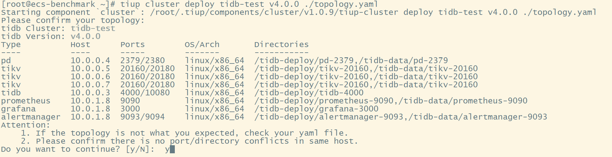

```shell
# 部署
tiup cluster deploy tidb-test v4.0.0 ./topology.yaml
# 启动
tiup cluster start tidb-test
# 查看
tiup cluster list
```

##### 访问

- Dashboard:  {pd-ip}:{pd-port}/dashboard

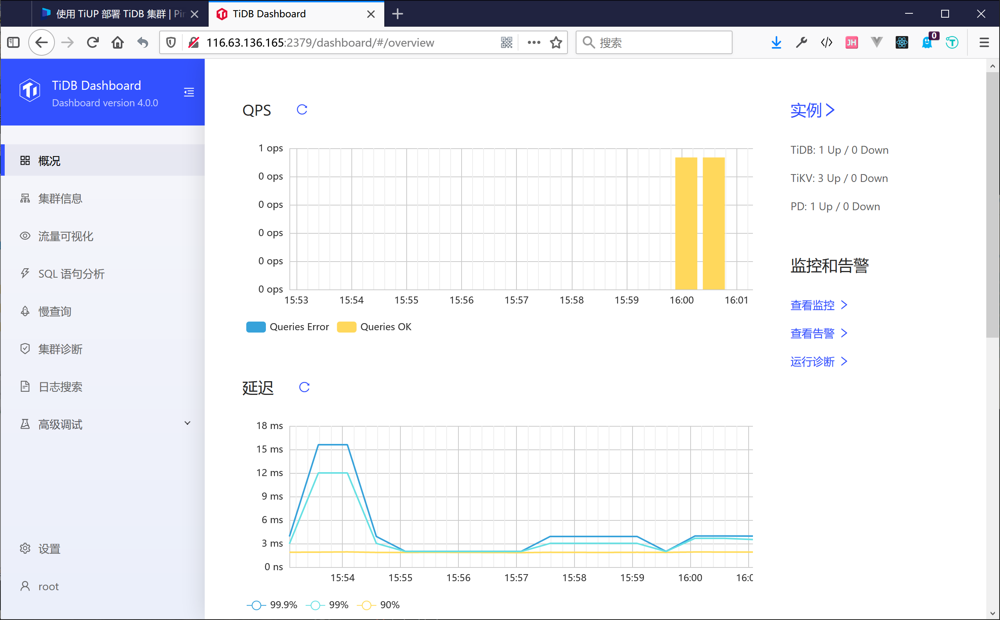

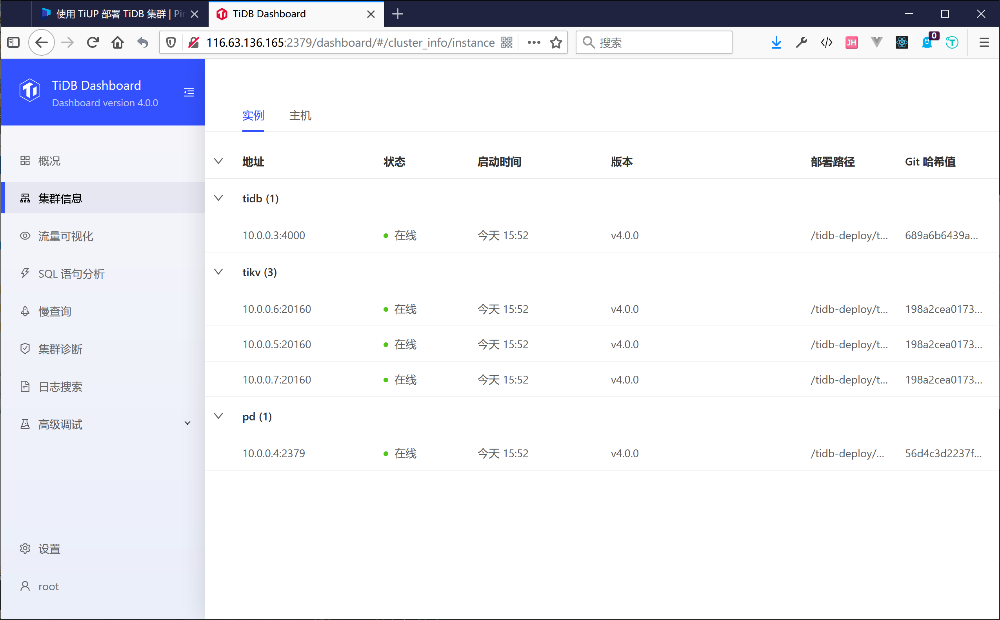

- Grafana: {Grafana-ip}:3000

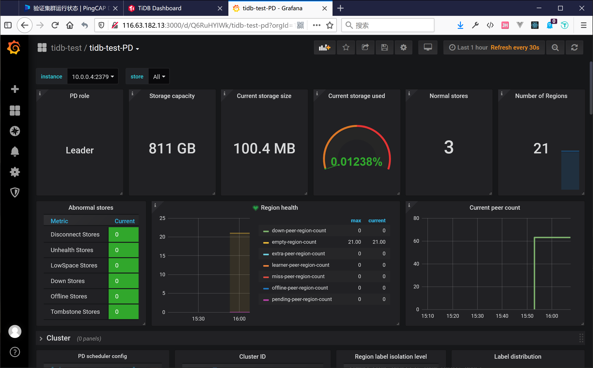

##### 修改参数配置

> 参考[https://docs.pingcap.com/zh/tidb/stable/maintain-tidb-using-tiup](https://docs.pingcap.com/zh/tidb/stable/maintain-tidb-using-tiup)

- 打开配置编辑

```shell
tiup cluster edit-config tidb-test
```

- 增加全局配置

```yaml
server_configs:
  tidb:
    log.slow-threshold: 300
    binlog.enable: false
    binlog.ignore-error: false
  tikv:
    # 默认4, 如果部署的机器 CPU 核数特别少(<=8)，可以考虑将该配置设置为 2
    server.grpc-concurrency: 2
    # raftstore.apply-pool-size: 2
    # raftstore.store-pool-size: 2
    # rocksdb.max-sub-compactions: 1
    # storage.block-cache.capacity: "16GB"
    # readpool.unified.max-thread-count: 12
    # 如果机器 CPU 核数较少，可将 rocksdb.max-background-jobs 与 raftdb.max-background-jobs 同时设置为 4
    rocksdb.max-background-jobs: 4
    raftdb.max-background-jobs: 4
    #
    readpool.storage.use-unified-pool: false
    readpool.coprocessor.use-unified-pool: true
```

- 重新加载

```shell
tiup cluster reload tidb-test
```


### 🩺 [sysbench](https://github.com/akopytov/sysbench) 基准测试

> 参考文档: [https://book.tidb.io/session4/chapter3/sysbench.html](https://book.tidb.io/session4/chapter3/sysbench.html)

##### 安装

```shell
curl -s https://packagecloud.io/install/repositories/akopytov/sysbench/script.rpm.sh | sudo bash
yum -y install sysbench
sysbench --version
```

##### 编辑配置文件 `config`

```ini
mysql-host=10.0.0.3
mysql-port=4000
mysql-user=root
mysql-password=
mysql-db=sbtest
time=600
threads=16
report-interval=10
db-driver=mysql
```

##### 创建测试数据库

```sql
create database sbtest;
```

##### 导入测试数据

- 导入数据前先将数据库设置为乐观事务模式

```sql
set global tidb_disable_txn_auto_retry = off;
set global tidb_txn_mode="optimistic";
```

- 导入数据

```shell
sysbench --config-file=config oltp_point_select --tables=32 --table-size=10000000 prepare
```

- 导入数据后再将数据库设置为悲观事务模式

```sql
set global tidb_txn_mode="pessimistic";
```

- 导入记录

> 导入测试数据用了4个小时
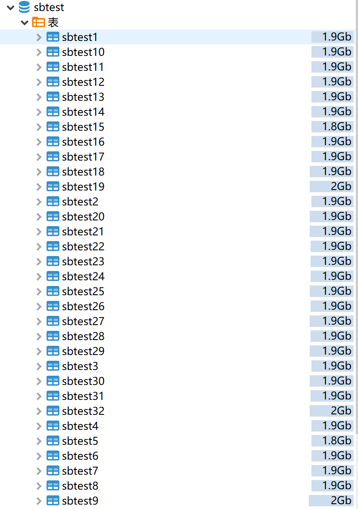

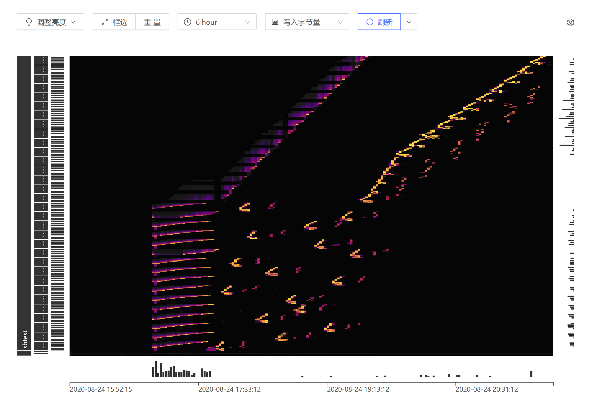

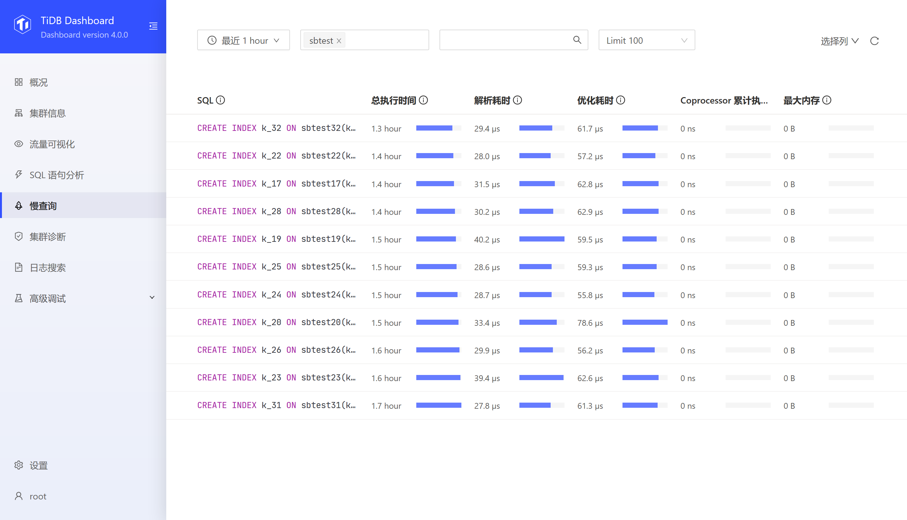


##### 测试

- point select

```shell
nohup \
sysbench --config-file=config oltp_point_select --threads=128 --tables=32--table-size=5000000 run \
> point_select.out &
```

```log
sysbench 1.0.20 (using bundled LuaJIT 2.1.0-beta2)

Running the test with following options:
Number of threads: 128
Report intermediate results every 10 second(s)
Initializing random number generator from current time


Initializing worker threads...

Threads started!

[ 10s ] thds: 128 tps: 79646.71 qps: 79646.71 (r/w/o: 79646.71/0.00/0.00) lat (ms,95%): 2.97 err/s: 0.00 reconn/s: 0.00
[ 20s ] thds: 128 tps: 80558.15 qps: 80558.15 (r/w/o: 80558.15/0.00/0.00) lat (ms,95%): 2.97 err/s: 0.00 reconn/s: 0.00
[ 30s ] thds: 128 tps: 79975.63 qps: 79975.63 (r/w/o: 79975.63/0.00/0.00) lat (ms,95%): 2.97 err/s: 0.00 reconn/s: 0.00
[ 40s ] thds: 128 tps: 80085.65 qps: 80085.65 (r/w/o: 80085.65/0.00/0.00) lat (ms,95%): 2.97 err/s: 0.00 reconn/s: 0.00
[ 50s ] thds: 128 tps: 80200.29 qps: 80200.29 (r/w/o: 80200.29/0.00/0.00) lat (ms,95%): 2.97 err/s: 0.00 reconn/s: 0.00
[ 60s ] thds: 128 tps: 79926.75 qps: 79926.75 (r/w/o: 79926.75/0.00/0.00) lat (ms,95%): 2.97 err/s: 0.00 reconn/s: 0.00
[ 70s ] thds: 128 tps: 80182.20 qps: 80182.20 (r/w/o: 80182.20/0.00/0.00) lat (ms,95%): 2.97 err/s: 0.00 reconn/s: 0.00
[ 80s ] thds: 128 tps: 79901.83 qps: 79901.83 (r/w/o: 79901.83/0.00/0.00) lat (ms,95%): 2.97 err/s: 0.00 reconn/s: 0.00
[ 90s ] thds: 128 tps: 80044.60 qps: 80044.60 (r/w/o: 80044.60/0.00/0.00) lat (ms,95%): 2.97 err/s: 0.00 reconn/s: 0.00
[ 100s ] thds: 128 tps: 80138.82 qps: 80138.82 (r/w/o: 80138.82/0.00/0.00) lat (ms,95%): 2.97 err/s: 0.00 reconn/s: 0.00
[ 110s ] thds: 128 tps: 80104.19 qps: 80104.19 (r/w/o: 80104.19/0.00/0.00) lat (ms,95%): 2.97 err/s: 0.00 reconn/s: 0.00
[ 120s ] thds: 128 tps: 80179.98 qps: 80179.98 (r/w/o: 80179.98/0.00/0.00) lat (ms,95%): 2.97 err/s: 0.00 reconn/s: 0.00
[ 130s ] thds: 128 tps: 80102.66 qps: 80102.66 (r/w/o: 80102.66/0.00/0.00) lat (ms,95%): 2.97 err/s: 0.00 reconn/s: 0.00
[ 140s ] thds: 128 tps: 79961.28 qps: 79961.28 (r/w/o: 79961.28/0.00/0.00) lat (ms,95%): 2.97 err/s: 0.00 reconn/s: 0.00
[ 150s ] thds: 128 tps: 79425.74 qps: 79425.74 (r/w/o: 79425.74/0.00/0.00) lat (ms,95%): 3.02 err/s: 0.00 reconn/s: 0.00
[ 160s ] thds: 128 tps: 79786.92 qps: 79786.92 (r/w/o: 79786.92/0.00/0.00) lat (ms,95%): 2.97 err/s: 0.00 reconn/s: 0.00
[ 170s ] thds: 128 tps: 80080.82 qps: 80080.82 (r/w/o: 80080.82/0.00/0.00) lat (ms,95%): 2.97 err/s: 0.00 reconn/s: 0.00
[ 180s ] thds: 128 tps: 80072.33 qps: 80072.33 (r/w/o: 80072.33/0.00/0.00) lat (ms,95%): 2.97 err/s: 0.00 reconn/s: 0.00
[ 190s ] thds: 128 tps: 79998.43 qps: 79998.43 (r/w/o: 79998.43/0.00/0.00) lat (ms,95%): 2.97 err/s: 0.00 reconn/s: 0.00
[ 200s ] thds: 128 tps: 80554.70 qps: 80554.70 (r/w/o: 80554.70/0.00/0.00) lat (ms,95%): 2.97 err/s: 0.00 reconn/s: 0.00
[ 210s ] thds: 128 tps: 80199.65 qps: 80199.65 (r/w/o: 80199.65/0.00/0.00) lat (ms,95%): 2.97 err/s: 0.00 reconn/s: 0.00
[ 220s ] thds: 128 tps: 80338.68 qps: 80338.68 (r/w/o: 80338.68/0.00/0.00) lat (ms,95%): 2.97 err/s: 0.00 reconn/s: 0.00
[ 230s ] thds: 128 tps: 80458.94 qps: 80458.94 (r/w/o: 80458.94/0.00/0.00) lat (ms,95%): 2.91 err/s: 0.00 reconn/s: 0.00
[ 240s ] thds: 128 tps: 80331.63 qps: 80331.63 (r/w/o: 80331.63/0.00/0.00) lat (ms,95%): 2.97 err/s: 0.00 reconn/s: 0.00
[ 250s ] thds: 128 tps: 80576.13 qps: 80576.13 (r/w/o: 80576.13/0.00/0.00) lat (ms,95%): 2.97 err/s: 0.00 reconn/s: 0.00
[ 260s ] thds: 128 tps: 80514.19 qps: 80514.19 (r/w/o: 80514.19/0.00/0.00) lat (ms,95%): 2.91 err/s: 0.00 reconn/s: 0.00
[ 270s ] thds: 128 tps: 79979.60 qps: 79979.60 (r/w/o: 79979.60/0.00/0.00) lat (ms,95%): 2.97 err/s: 0.00 reconn/s: 0.00
[ 280s ] thds: 128 tps: 80251.85 qps: 80251.85 (r/w/o: 80251.85/0.00/0.00) lat (ms,95%): 2.97 err/s: 0.00 reconn/s: 0.00
[ 290s ] thds: 128 tps: 80473.16 qps: 80473.16 (r/w/o: 80473.16/0.00/0.00) lat (ms,95%): 2.91 err/s: 0.00 reconn/s: 0.00
[ 300s ] thds: 128 tps: 78564.66 qps: 78564.76 (r/w/o: 78564.76/0.00/0.00) lat (ms,95%): 3.02 err/s: 0.00 reconn/s: 0.00
[ 310s ] thds: 128 tps: 79213.27 qps: 79213.17 (r/w/o: 79213.17/0.00/0.00) lat (ms,95%): 3.02 err/s: 0.00 reconn/s: 0.00
[ 320s ] thds: 128 tps: 80180.53 qps: 80180.53 (r/w/o: 80180.53/0.00/0.00) lat (ms,95%): 2.97 err/s: 0.00 reconn/s: 0.00
[ 330s ] thds: 128 tps: 79847.94 qps: 79847.94 (r/w/o: 79847.94/0.00/0.00) lat (ms,95%): 2.97 err/s: 0.00 reconn/s: 0.00
[ 340s ] thds: 128 tps: 80085.73 qps: 80085.73 (r/w/o: 80085.73/0.00/0.00) lat (ms,95%): 2.97 err/s: 0.00 reconn/s: 0.00
[ 350s ] thds: 128 tps: 80072.06 qps: 80072.06 (r/w/o: 80072.06/0.00/0.00) lat (ms,95%): 2.97 err/s: 0.00 reconn/s: 0.00
[ 360s ] thds: 128 tps: 79960.35 qps: 79960.35 (r/w/o: 79960.35/0.00/0.00) lat (ms,95%): 2.97 err/s: 0.00 reconn/s: 0.00
[ 370s ] thds: 128 tps: 80144.48 qps: 80144.48 (r/w/o: 80144.48/0.00/0.00) lat (ms,95%): 2.97 err/s: 0.00 reconn/s: 0.00
[ 380s ] thds: 128 tps: 80277.57 qps: 80277.57 (r/w/o: 80277.57/0.00/0.00) lat (ms,95%): 2.97 err/s: 0.00 reconn/s: 0.00
[ 390s ] thds: 128 tps: 80228.37 qps: 80228.37 (r/w/o: 80228.37/0.00/0.00) lat (ms,95%): 2.97 err/s: 0.00 reconn/s: 0.00
[ 400s ] thds: 128 tps: 80390.20 qps: 80390.10 (r/w/o: 80390.10/0.00/0.00) lat (ms,95%): 2.97 err/s: 0.00 reconn/s: 0.00
[ 410s ] thds: 128 tps: 80270.64 qps: 80270.74 (r/w/o: 80270.74/0.00/0.00) lat (ms,95%): 2.97 err/s: 0.00 reconn/s: 0.00
[ 420s ] thds: 128 tps: 80044.57 qps: 80044.57 (r/w/o: 80044.57/0.00/0.00) lat (ms,95%): 2.97 err/s: 0.00 reconn/s: 0.00
[ 430s ] thds: 128 tps: 79980.21 qps: 79980.21 (r/w/o: 79980.21/0.00/0.00) lat (ms,95%): 2.97 err/s: 0.00 reconn/s: 0.00
[ 440s ] thds: 128 tps: 79689.57 qps: 79689.57 (r/w/o: 79689.57/0.00/0.00) lat (ms,95%): 2.97 err/s: 0.00 reconn/s: 0.00
[ 450s ] thds: 128 tps: 79781.79 qps: 79781.79 (r/w/o: 79781.79/0.00/0.00) lat (ms,95%): 3.02 err/s: 0.00 reconn/s: 0.00
[ 460s ] thds: 128 tps: 80058.52 qps: 80058.62 (r/w/o: 80058.62/0.00/0.00) lat (ms,95%): 2.97 err/s: 0.00 reconn/s: 0.00
[ 470s ] thds: 128 tps: 79840.13 qps: 79840.03 (r/w/o: 79840.03/0.00/0.00) lat (ms,95%): 2.97 err/s: 0.00 reconn/s: 0.00
[ 480s ] thds: 128 tps: 79542.42 qps: 79542.42 (r/w/o: 79542.42/0.00/0.00) lat (ms,95%): 3.02 err/s: 0.00 reconn/s: 0.00
[ 490s ] thds: 128 tps: 79776.78 qps: 79776.78 (r/w/o: 79776.78/0.00/0.00) lat (ms,95%): 2.97 err/s: 0.00 reconn/s: 0.00
[ 500s ] thds: 128 tps: 79883.58 qps: 79883.58 (r/w/o: 79883.58/0.00/0.00) lat (ms,95%): 2.97 err/s: 0.00 reconn/s: 0.00
[ 510s ] thds: 128 tps: 79696.93 qps: 79696.93 (r/w/o: 79696.93/0.00/0.00) lat (ms,95%): 2.97 err/s: 0.00 reconn/s: 0.00
[ 520s ] thds: 128 tps: 79677.05 qps: 79677.05 (r/w/o: 79677.05/0.00/0.00) lat (ms,95%): 2.97 err/s: 0.00 reconn/s: 0.00
[ 530s ] thds: 128 tps: 79956.57 qps: 79956.57 (r/w/o: 79956.57/0.00/0.00) lat (ms,95%): 2.97 err/s: 0.00 reconn/s: 0.00
[ 540s ] thds: 128 tps: 79833.63 qps: 79833.63 (r/w/o: 79833.63/0.00/0.00) lat (ms,95%): 2.97 err/s: 0.00 reconn/s: 0.00
[ 550s ] thds: 128 tps: 79566.87 qps: 79566.87 (r/w/o: 79566.87/0.00/0.00) lat (ms,95%): 3.02 err/s: 0.00 reconn/s: 0.00
[ 560s ] thds: 128 tps: 79935.47 qps: 79935.47 (r/w/o: 79935.47/0.00/0.00) lat (ms,95%): 2.97 err/s: 0.00 reconn/s: 0.00
[ 570s ] thds: 128 tps: 79520.46 qps: 79520.46 (r/w/o: 79520.46/0.00/0.00) lat (ms,95%): 2.97 err/s: 0.00 reconn/s: 0.00
[ 580s ] thds: 128 tps: 79525.75 qps: 79525.75 (r/w/o: 79525.75/0.00/0.00) lat (ms,95%): 3.02 err/s: 0.00 reconn/s: 0.00
[ 590s ] thds: 128 tps: 80199.86 qps: 80199.86 (r/w/o: 80199.86/0.00/0.00) lat (ms,95%): 2.97 err/s: 0.00 reconn/s: 0.00
[ 600s ] thds: 128 tps: 80424.37 qps: 80424.37 (r/w/o: 80424.37/0.00/0.00) lat (ms,95%): 2.97 err/s: 0.00 reconn/s: 0.00
SQL statistics:
    queries performed:
        read:                            48002467
        write:                           0
        other:                           0
        total:                           48002467
    transactions:                        48002467 (80002.01 per sec.)
    queries:                             48002467 (80002.01 per sec.)
    ignored errors:                      0      (0.00 per sec.)
    reconnects:                          0      (0.00 per sec.)

General statistics:
    total time:                          600.0144s
    total number of events:              48002467

Latency (ms):
         min:                                    0.48
         avg:                                    1.60
         max:                                   29.74
         95th percentile:                        2.97
         sum:                             76778988.57

Threads fairness:
    events (avg/stddev):           375019.2734/7952.89
    execution time (avg/stddev):   599.8358/0.02
```

- update index

```shell
nohup \
sysbench --config-file=config oltp_update_index --threads=128 --tables=32--table-size=5000000 run \
> update_index.out &
```

```log
sysbench 1.0.20 (using bundled LuaJIT 2.1.0-beta2)

Running the test with following options:
Number of threads: 128
Report intermediate results every 10 second(s)
Initializing random number generator from current time


Initializing worker threads...

Threads started!

[ 10s ] thds: 128 tps: 5342.90 qps: 5342.90 (r/w/o: 0.00/5342.90/0.00) lat (ms,95%): 28.67 err/s: 0.00 reconn/s: 0.00
[ 20s ] thds: 128 tps: 5306.72 qps: 5306.72 (r/w/o: 0.00/5306.72/0.00) lat (ms,95%): 28.67 err/s: 0.00 reconn/s: 0.00
[ 30s ] thds: 128 tps: 5333.50 qps: 5333.50 (r/w/o: 0.00/5333.50/0.00) lat (ms,95%): 28.67 err/s: 0.00 reconn/s: 0.00
[ 40s ] thds: 128 tps: 5173.92 qps: 5173.92 (r/w/o: 0.00/5173.92/0.00) lat (ms,95%): 27.17 err/s: 0.00 reconn/s: 0.00
[ 50s ] thds: 128 tps: 4621.88 qps: 4621.88 (r/w/o: 0.00/4621.88/0.00) lat (ms,95%): 28.16 err/s: 0.00 reconn/s: 0.00
[ 60s ] thds: 128 tps: 3760.51 qps: 3760.51 (r/w/o: 0.00/3760.51/0.00) lat (ms,95%): 23.52 err/s: 0.00 reconn/s: 0.00
FATAL: mysql_stmt_execute() returned error 9007 (Write conflict, txnStartTS=418979941669666883, conflictStartTS=418979941682774200, conflictCommitTS=0, key=tor query 'UPDATE sbtest16 SET k=k+1 WHERE id=?'
FATAL: `thread_run' function failed: /usr/share/sysbench/oltp_common.lua:458: SQL error, errno = 9007, state = 'HY000': Write conflict, txnStartTS=418979941669666883, conflictStartTS=418979941682774200, conflictCommitTS=0, key=tATAL: mysql_stmt_execute() returned error 9007 (Write conflict, txnStartTS=418979941643452763, conflictStartTS=418979941643452578, conflictCommitTS=418979941669666832, key={tableID=67, indexID=1, indexValues={5002407, 4976, }} primary={tableID=67, indexID=1, indexValues={5002407, 4976, }} [try again later]) for query 'UPDATE sbtest16 SET k=k+1 WHERE id=?'
FATAL: `thread_run' function failed: /usr/share/sysbench/oltp_common.lua:458: SQL error, errno = 9007, state = 'HY000': Write conflict, txnStartTS=418979941643452763, conflictStartTS=418979941643452578, conflictCommitTS=418979941669666832, key={tableID=67, indexID=1, indexValues={5002407, 4976, }} primary={tableID=67, indexID=1, indexValues={5002407, 4976, }} [try again later]
FATAL: mysql_stmt_execute() returned error 9007 (Write conflict, txnStartTS=418979941669667006, conflictStartTS=418979941682774200, conflictCommitTS=0, key=tor query 'UPDATE sbtest16 SET k=k+1 WHERE id=?'
FATAL: `thread_run' function failed: /usr/share/sysbench/oltp_common.lua:458: SQL error, errno = 9007, state = 'HY000': Write conflict, txnStartTS=418979941669667006, conflictStartTS=418979941682774200, conflictCommitTS=0, key=tATAL: mysql_stmt_execute() returned error 9007 (Write conflict, txnStartTS=418979941695881510, conflictStartTS=418979941682774200, conflictCommitTS=418979941708988639, key={tableID=67, indexID=1, indexValues={5002408, 4976, }} primary={tableID=67, indexID=1, indexValues={5002408, 4976, }} [try again later]) for query 'UPDATE sbtest16 SET k=k+1 WHERE id=?'
FATAL: `thread_run' function failed: /usr/share/sysbench/oltp_common.lua:458: SQL error, errno = 9007, state = 'HY000': Write conflict, txnStartTS=418979941695881510, conflictStartTS=418979941682774200, conflictCommitTS=418979941708988639, key={tableID=67, indexID=1, indexValues={5002408, 4976, }} primary={tableID=67, indexID=1, indexValues={5002408, 4976, }} [try again later]
FATAL: mysql_stmt_execute() returned error 9007 (Write conflict, txnStartTS=418979941748310019, conflictStartTS=418979941708988668, conflictCommitTS=418979941748310022, key={tableID=67, handle=4976} primary={tableID=67, indexID=1, indexValues={5002409, 4976, }} [try again later]) for query 'UPDATE sbtest16 SET k=k+1 WHERE id=?'
FATAL: `thread_run' function failed: /usr/share/sysbench/oltp_common.lua:458: SQL error, errno = 9007, state = 'HY000': Write conflict, txnStartTS=418979941748310019, conflictStartTS=418979941708988668, conflictCommitTS=418979941748310022, key={tableID=67, handle=4976} primary={tableID=67, indexID=1, indexValues={5002409, 4976, }} [try again later]
FATAL: mysql_stmt_execute() returned error 9007 (Write conflict, txnStartTS=418979941722095645, conflictStartTS=418979941761417223, conflictCommitTS=418979941761417226, key={tableID=67, handle=4976} primary={tableID=67, indexID=1, indexValues={5002409, 4976, }} [try again later]) for query 'UPDATE sbtest16 SET k=k+1 WHERE id=?'
FATAL: `thread_run' function failed: /usr/share/sysbench/oltp_common.lua:458: SQL error, errno = 9007, state = 'HY000': Write conflict, txnStartTS=418979941722095645, conflictStartTS=418979941761417223, conflictCommitTS=418979941761417226, key={tableID=67, handle=4976} primary={tableID=67, indexID=1, indexValues={5002409, 4976, }} [try again later]
FATAL: mysql_stmt_execute() returned error 9007 (Write conflict, txnStartTS=418979941761417222, conflictStartTS=418979941761417223, conflictCommitTS=418979941761417226, key={tableID=67, indexID=1, indexValues={5002410, 4976, }} primary={tableID=67, indexID=1, indexValues={5002410, 4976, }} [try again later]) for query 'UPDATE sbtest16 SET k=k+1 WHERE id=?'
FATAL: `thread_run' function failed: /usr/share/sysbench/oltp_common.lua:458: SQL error, errno = 9007, state = 'HY000': Write conflict, txnStartTS=418979941761417222, conflictStartTS=418979941761417223, conflictCommitTS=418979941761417226, key={tableID=67, indexID=1, indexValues={5002410, 4976, }} primary={tableID=67, indexID=1, indexValues={5002410, 4976, }} [try again later]
FATAL: mysql_stmt_execute() returned error 9007 (Write conflict, txnStartTS=418979941774524421, conflictStartTS=418979941761417227, conflictCommitTS=418979941774524422, key={tableID=67, handle=4976} primary={tableID=67, indexID=1, indexValues={5002411, 4976, }} [try again later]) for query 'UPDATE sbtest16 SET k=k+1 WHERE id=?'
FATAL: `thread_run' function failed: /usr/share/sysbench/oltp_common.lua:458: SQL error, errno = 9007, state = 'HY000': Write conflict, txnStartTS=418979941774524421, conflictStartTS=418979941761417227, conflictCommitTS=418979941774524422, key={tableID=67, handle=4976} primary={tableID=67, indexID=1, indexValues={5002411, 4976, }} [try again later]
FATAL: mysql_stmt_execute() returned error 9007 (Write conflict, txnStartTS=418979941774524420, conflictStartTS=418979941761417227, conflictCommitTS=418979941774524422, key={tableID=67, handle=4976} primary={tableID=67, indexID=1, indexValues={5002411, 4976, }} [try again later]) for query 'UPDATE sbtest16 SET k=k+1 WHERE id=?'
FATAL: `thread_run' function failed: /usr/share/sysbench/oltp_common.lua:458: SQL error, errno = 9007, state = 'HY000': Write conflict, txnStartTS=418979941774524420, conflictStartTS=418979941761417227, conflictCommitTS=418979941774524422, key={tableID=67, handle=4976} primary={tableID=67, indexID=1, indexValues={5002411, 4976, }} [try again later]
FATAL: mysql_stmt_execute() returned error 9007 (Write conflict, txnStartTS=418979941774524417, conflictStartTS=418979941761417227, conflictCommitTS=418979941774524422, key={tableID=67, indexID=1, indexValues={5002411, 4976, }} primary={tableID=67, indexID=1, indexValues={5002411, 4976, }} [try again later]) for query 'UPDATE sbtest16 SET k=k+1 WHERE id=?'
FATAL: `thread_run' function failed: /usr/share/sysbench/oltp_common.lua:458: SQL error, errno = 9007, state = 'HY000': Write conflict, txnStartTS=418979941774524417, conflictStartTS=418979941761417227, conflictCommitTS=418979941774524422, key={tableID=67, indexID=1, indexValues={5002411, 4976, }} primary={tableID=67, indexID=1, indexValues={5002411, 4976, }} [try again later]
FATAL: mysql_stmt_execute() returned error 9007 (Write conflict, txnStartTS=418979941774524419, conflictStartTS=418979941761417227, conflictCommitTS=418979941774524422, key={tableID=67, handle=4976} primary={tableID=67, indexID=1, indexValues={5002411, 4976, }} [try again later]) for query 'UPDATE sbtest16 SET k=k+1 WHERE id=?'
FATAL: `thread_run' function failed: /usr/share/sysbench/oltp_common.lua:458: SQL error, errno = 9007, state = 'HY000': Write conflict, txnStartTS=418979941774524419, conflictStartTS=418979941761417227, conflictCommitTS=418979941774524422, key={tableID=67, handle=4976} primary={tableID=67, indexID=1, indexValues={5002411, 4976, }} [try again later]
FATAL: mysql_stmt_execute() returned error 9007 (Write conflict, txnStartTS=418979941800738820, conflictStartTS=418979941800738819, conflictCommitTS=418979941826953220, key={tableID=67, handle=4976} primary={tableID=67, indexID=1, indexValues={5002413, 4976, }} [try again later]) for query 'UPDATE sbtest16 SET k=k+1 WHERE id=?'
FATAL: `thread_run' function failed: /usr/share/sysbench/oltp_common.lua:458: SQL error, errno = 9007, state = 'HY000': Write conflict, txnStartTS=418979941800738820, conflictStartTS=418979941800738819, conflictCommitTS=418979941826953220, key={tableID=67, handle=4976} primary={tableID=67, indexID=1, indexValues={5002413, 4976, }} [try again later]
FATAL: mysql_stmt_execute() returned error 9007 (Write conflict, txnStartTS=418979941813846023, conflictStartTS=418979941800738819, conflictCommitTS=418979941826953220, key={tableID=67, handle=4976} primary={tableID=67, indexID=1, indexValues={5002413, 4976, }} [try again later]) for query 'UPDATE sbtest16 SET k=k+1 WHERE id=?'
FATAL: `thread_run' function failed: /usr/share/sysbench/oltp_common.lua:458: SQL error, errno = 9007, state = 'HY000': Write conflict, txnStartTS=418979941813846023, conflictStartTS=418979941800738819, conflictCommitTS=418979941826953220, key={tableID=67, handle=4976} primary={tableID=67, indexID=1, indexValues={5002413, 4976, }} [try again later]
FATAL: mysql_stmt_execute() returned error 9007 (Write conflict, txnStartTS=418979941840060417, conflictStartTS=418979941826953221, conflictCommitTS=418979941840060419, key={tableID=67, indexID=1, indexValues={5002414, 4976, }} primary={tableID=67, indexID=1, indexValues={5002414, 4976, }} [try again later]) for query 'UPDATE sbtest16 SET k=k+1 WHERE id=?'
FATAL: `thread_run' function failed: /usr/share/sysbench/oltp_common.lua:458: SQL error, errno = 9007, state = 'HY000': Write conflict, txnStartTS=418979941840060417, conflictStartTS=418979941826953221, conflictCommitTS=418979941840060419, key={tableID=67, indexID=1, indexValues={5002414, 4976, }} primary={tableID=67, indexID=1, indexValues={5002414, 4976, }} [try again later]
[ 70s ] thds: 118 tps: 3287.90 qps: 3287.90 (r/w/o: 0.00/3287.90/0.00) lat (ms,95%): 24.38 err/s: 1.40 reconn/s: 0.00
```

> 囧 !!! 报错了...... </br>
> 看起来是 TS 冲突, 不知道是不是 NTP 引起的 </br>
> 先往下进行吧

- read only

```shell
nohup \
sysbench --config-file=config oltp_read_only --threads=128 --tables=32--table-size=5000000 run \
> read_only.out &
```

```log
sysbench 1.0.20 (using bundled LuaJIT 2.1.0-beta2)

Running the test with following options:
Number of threads: 128
Report intermediate results every 10 second(s)
Initializing random number generator from current time


Initializing worker threads...

Threads started!

[ 10s ] thds: 128 tps: 1416.24 qps: 22756.10 (r/w/o: 19911.81/0.00/2844.29) lat (ms,95%): 114.72 err/s: 0.00 reconn/s: 0.00
[ 20s ] thds: 128 tps: 1412.95 qps: 22605.65 (r/w/o: 19778.95/0.00/2826.69) lat (ms,95%): 112.67 err/s: 0.00 reconn/s: 0.00
[ 30s ] thds: 128 tps: 1414.70 qps: 22643.68 (r/w/o: 19814.78/0.00/2828.90) lat (ms,95%): 114.72 err/s: 0.00 reconn/s: 0.00
[ 40s ] thds: 128 tps: 1419.80 qps: 22700.42 (r/w/o: 19860.62/0.00/2839.80) lat (ms,95%): 112.67 err/s: 0.00 reconn/s: 0.00
[ 50s ] thds: 128 tps: 1415.20 qps: 22669.26 (r/w/o: 19839.06/0.00/2830.19) lat (ms,95%): 114.72 err/s: 0.00 reconn/s: 0.00
[ 60s ] thds: 128 tps: 1416.60 qps: 22669.98 (r/w/o: 19836.79/0.00/2833.20) lat (ms,95%): 114.72 err/s: 0.00 reconn/s: 0.00
[ 70s ] thds: 128 tps: 1411.90 qps: 22572.04 (r/w/o: 19748.74/0.00/2823.29) lat (ms,95%): 114.72 err/s: 0.00 reconn/s: 0.00
[ 80s ] thds: 128 tps: 1410.31 qps: 22570.60 (r/w/o: 19749.39/0.00/2821.21) lat (ms,95%): 114.72 err/s: 0.00 reconn/s: 0.00
[ 90s ] thds: 128 tps: 1414.70 qps: 22625.30 (r/w/o: 19797.40/0.00/2827.90) lat (ms,95%): 114.72 err/s: 0.00 reconn/s: 0.00
[ 100s ] thds: 128 tps: 1419.90 qps: 22704.88 (r/w/o: 19864.19/0.00/2840.70) lat (ms,95%): 114.72 err/s: 0.00 reconn/s: 0.00
[ 110s ] thds: 128 tps: 1407.80 qps: 22533.75 (r/w/o: 19718.26/0.00/2815.49) lat (ms,95%): 114.72 err/s: 0.00 reconn/s: 0.00
[ 120s ] thds: 128 tps: 1422.40 qps: 22757.75 (r/w/o: 19913.95/0.00/2843.81) lat (ms,95%): 112.67 err/s: 0.00 reconn/s: 0.00
[ 130s ] thds: 128 tps: 1423.60 qps: 22782.73 (r/w/o: 19934.74/0.00/2847.99) lat (ms,95%): 114.72 err/s: 0.00 reconn/s: 0.00
[ 140s ] thds: 128 tps: 1421.51 qps: 22750.82 (r/w/o: 19907.50/0.00/2843.31) lat (ms,95%): 114.72 err/s: 0.00 reconn/s: 0.00
[ 150s ] thds: 128 tps: 1421.29 qps: 22720.12 (r/w/o: 19877.23/0.00/2842.89) lat (ms,95%): 114.72 err/s: 0.00 reconn/s: 0.00
[ 160s ] thds: 128 tps: 1422.10 qps: 22756.66 (r/w/o: 19913.37/0.00/2843.30) lat (ms,95%): 114.72 err/s: 0.00 reconn/s: 0.00
[ 170s ] thds: 128 tps: 1414.10 qps: 22650.84 (r/w/o: 19821.54/0.00/2829.31) lat (ms,95%): 114.72 err/s: 0.00 reconn/s: 0.00
[ 180s ] thds: 128 tps: 1427.20 qps: 22823.37 (r/w/o: 19969.26/0.00/2854.11) lat (ms,95%): 114.72 err/s: 0.00 reconn/s: 0.00
[ 190s ] thds: 128 tps: 1423.80 qps: 22788.35 (r/w/o: 19940.96/0.00/2847.39) lat (ms,95%): 112.67 err/s: 0.00 reconn/s: 0.00
[ 200s ] thds: 128 tps: 1416.60 qps: 22655.26 (r/w/o: 19822.76/0.00/2832.49) lat (ms,95%): 114.72 err/s: 0.00 reconn/s: 0.00
[ 210s ] thds: 128 tps: 1433.40 qps: 22944.00 (r/w/o: 20076.00/0.00/2868.00) lat (ms,95%): 114.72 err/s: 0.00 reconn/s: 0.00
[ 220s ] thds: 128 tps: 1420.50 qps: 22717.81 (r/w/o: 19877.31/0.00/2840.50) lat (ms,95%): 114.72 err/s: 0.00 reconn/s: 0.00
[ 230s ] thds: 128 tps: 1431.90 qps: 22896.94 (r/w/o: 20034.33/0.00/2862.60) lat (ms,95%): 112.67 err/s: 0.00 reconn/s: 0.00
[ 240s ] thds: 128 tps: 1434.10 qps: 22961.16 (r/w/o: 20092.47/0.00/2868.70) lat (ms,95%): 112.67 err/s: 0.00 reconn/s: 0.00
[ 250s ] thds: 128 tps: 1430.10 qps: 22879.20 (r/w/o: 20018.60/0.00/2860.60) lat (ms,95%): 112.67 err/s: 0.00 reconn/s: 0.00
[ 260s ] thds: 128 tps: 1424.91 qps: 22805.00 (r/w/o: 19955.29/0.00/2849.71) lat (ms,95%): 114.72 err/s: 0.00 reconn/s: 0.00
[ 270s ] thds: 128 tps: 1429.60 qps: 22876.16 (r/w/o: 20015.87/0.00/2860.30) lat (ms,95%): 112.67 err/s: 0.00 reconn/s: 0.00
[ 280s ] thds: 128 tps: 1428.80 qps: 22854.00 (r/w/o: 19997.30/0.00/2856.70) lat (ms,95%): 114.72 err/s: 0.00 reconn/s: 0.00
[ 290s ] thds: 128 tps: 1425.09 qps: 22799.90 (r/w/o: 19949.41/0.00/2850.49) lat (ms,95%): 114.72 err/s: 0.00 reconn/s: 0.00
[ 300s ] thds: 128 tps: 1425.10 qps: 22796.56 (r/w/o: 19946.37/0.00/2850.20) lat (ms,95%): 112.67 err/s: 0.00 reconn/s: 0.00
[ 310s ] thds: 128 tps: 1428.11 qps: 22840.40 (r/w/o: 19985.49/0.00/2854.91) lat (ms,95%): 114.72 err/s: 0.00 reconn/s: 0.00
[ 320s ] thds: 128 tps: 1421.90 qps: 22755.24 (r/w/o: 19909.83/0.00/2845.40) lat (ms,95%): 114.72 err/s: 0.00 reconn/s: 0.00
[ 330s ] thds: 128 tps: 1428.19 qps: 22863.31 (r/w/o: 20006.62/0.00/2856.69) lat (ms,95%): 114.72 err/s: 0.00 reconn/s: 0.00
[ 340s ] thds: 128 tps: 1432.91 qps: 22922.70 (r/w/o: 20057.19/0.00/2865.51) lat (ms,95%): 114.72 err/s: 0.00 reconn/s: 0.00
[ 350s ] thds: 128 tps: 1426.79 qps: 22832.42 (r/w/o: 19978.53/0.00/2853.89) lat (ms,95%): 114.72 err/s: 0.00 reconn/s: 0.00
[ 360s ] thds: 128 tps: 1433.29 qps: 22940.98 (r/w/o: 20074.59/0.00/2866.38) lat (ms,95%): 114.72 err/s: 0.00 reconn/s: 0.00
[ 370s ] thds: 128 tps: 1422.41 qps: 22755.65 (r/w/o: 19911.24/0.00/2844.42) lat (ms,95%): 114.72 err/s: 0.00 reconn/s: 0.00
[ 380s ] thds: 128 tps: 1418.38 qps: 22699.49 (r/w/o: 19862.33/0.00/2837.16) lat (ms,95%): 114.72 err/s: 0.00 reconn/s: 0.00
[ 390s ] thds: 128 tps: 1436.53 qps: 22978.92 (r/w/o: 20105.87/0.00/2873.05) lat (ms,95%): 112.67 err/s: 0.00 reconn/s: 0.00
[ 400s ] thds: 128 tps: 1422.29 qps: 22754.54 (r/w/o: 19910.06/0.00/2844.48) lat (ms,95%): 114.72 err/s: 0.00 reconn/s: 0.00
[ 410s ] thds: 128 tps: 1429.11 qps: 22840.83 (r/w/o: 19982.81/0.00/2858.02) lat (ms,95%): 112.67 err/s: 0.00 reconn/s: 0.00
[ 420s ] thds: 128 tps: 1431.69 qps: 22927.87 (r/w/o: 20064.80/0.00/2863.07) lat (ms,95%): 112.67 err/s: 0.00 reconn/s: 0.00
[ 430s ] thds: 128 tps: 1425.72 qps: 22814.99 (r/w/o: 19962.85/0.00/2852.14) lat (ms,95%): 114.72 err/s: 0.00 reconn/s: 0.00
[ 440s ] thds: 128 tps: 1423.68 qps: 22765.00 (r/w/o: 19918.14/0.00/2846.86) lat (ms,95%): 114.72 err/s: 0.00 reconn/s: 0.00
[ 450s ] thds: 128 tps: 1435.30 qps: 22979.14 (r/w/o: 20108.14/0.00/2871.01) lat (ms,95%): 112.67 err/s: 0.00 reconn/s: 0.00
[ 460s ] thds: 128 tps: 1427.40 qps: 22824.38 (r/w/o: 19970.48/0.00/2853.90) lat (ms,95%): 114.72 err/s: 0.00 reconn/s: 0.00
[ 470s ] thds: 128 tps: 1428.01 qps: 22850.00 (r/w/o: 19993.97/0.00/2856.02) lat (ms,95%): 114.72 err/s: 0.00 reconn/s: 0.00
[ 480s ] thds: 128 tps: 1434.31 qps: 22944.21 (r/w/o: 20074.49/0.00/2869.71) lat (ms,95%): 114.72 err/s: 0.00 reconn/s: 0.00
[ 490s ] thds: 128 tps: 1427.39 qps: 22872.78 (r/w/o: 20017.81/0.00/2854.97) lat (ms,95%): 114.72 err/s: 0.00 reconn/s: 0.00
[ 500s ] thds: 128 tps: 1423.01 qps: 22740.01 (r/w/o: 19894.29/0.00/2845.73) lat (ms,95%): 114.72 err/s: 0.00 reconn/s: 0.00
[ 510s ] thds: 128 tps: 1431.99 qps: 22914.76 (r/w/o: 20050.88/0.00/2863.88) lat (ms,95%): 114.72 err/s: 0.00 reconn/s: 0.00
[ 520s ] thds: 128 tps: 1426.49 qps: 22833.52 (r/w/o: 19980.93/0.00/2852.59) lat (ms,95%): 114.72 err/s: 0.00 reconn/s: 0.00
[ 530s ] thds: 128 tps: 1427.01 qps: 22824.29 (r/w/o: 19970.68/0.00/2853.61) lat (ms,95%): 114.72 err/s: 0.00 reconn/s: 0.00
[ 540s ] thds: 128 tps: 1431.10 qps: 22896.73 (r/w/o: 20034.54/0.00/2862.19) lat (ms,95%): 114.72 err/s: 0.00 reconn/s: 0.00
[ 550s ] thds: 128 tps: 1422.71 qps: 22775.14 (r/w/o: 19929.22/0.00/2845.92) lat (ms,95%): 114.72 err/s: 0.00 reconn/s: 0.00
[ 560s ] thds: 128 tps: 1419.19 qps: 22686.28 (r/w/o: 19848.10/0.00/2838.19) lat (ms,95%): 114.72 err/s: 0.00 reconn/s: 0.00
[ 570s ] thds: 128 tps: 1425.30 qps: 22826.51 (r/w/o: 19975.21/0.00/2851.30) lat (ms,95%): 114.72 err/s: 0.00 reconn/s: 0.00
[ 580s ] thds: 128 tps: 1427.00 qps: 22802.35 (r/w/o: 19949.46/0.00/2852.89) lat (ms,95%): 114.72 err/s: 0.00 reconn/s: 0.00
[ 590s ] thds: 128 tps: 1416.00 qps: 22679.25 (r/w/o: 19847.54/0.00/2831.71) lat (ms,95%): 114.72 err/s: 0.00 reconn/s: 0.00
[ 600s ] thds: 128 tps: 1427.90 qps: 22846.53 (r/w/o: 19989.94/0.00/2856.59) lat (ms,95%): 114.72 err/s: 0.00 reconn/s: 0.00
SQL statistics:
    queries performed:
        read:                            11964442
        write:                           0
        other:                           1709206
        total:                           13673648
    transactions:                        854603 (1424.18 per sec.)
    queries:                             13673648 (22786.88 per sec.)
    ignored errors:                      0      (0.00 per sec.)
    reconnects:                          0      (0.00 per sec.)

General statistics:
    total time:                          600.0655s
    total number of events:              854603

Latency (ms):
         min:                                   34.23
         avg:                                   89.87
         max:                                  189.29
         95th percentile:                      114.72
         sum:                             76802737.69

Threads fairness:
    events (avg/stddev):           6676.5859/42.04
    execution time (avg/stddev):   600.0214/0.02
```


##### 监控关键指标截图

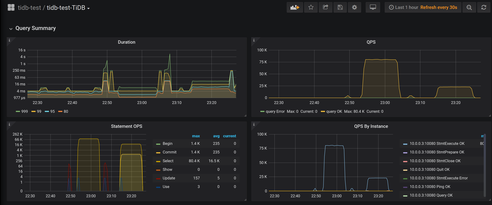


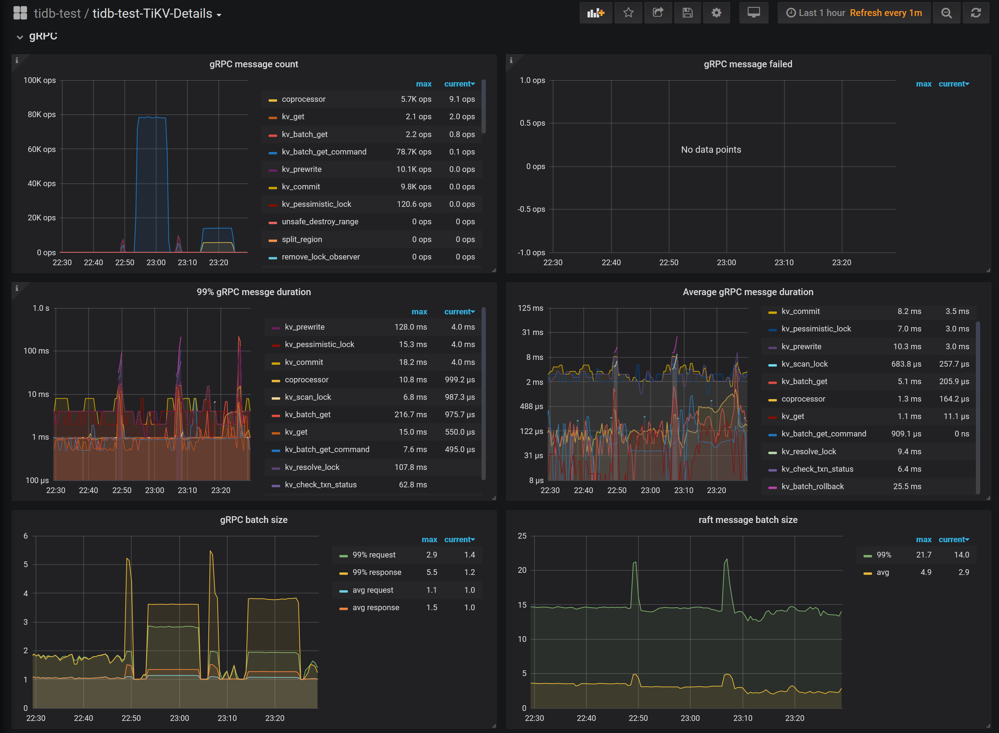

### 🩺 [go-ycsb](https://github.com/pingcap/go-ycsb) 基准测试

> YCSB(Yahoo! Cloud System Benchmark), 雅虎推出的云数据库基准测试套件
> go-ycsb 一个 Go 的 YCSB 移植

##### 安装

```shell
# 需要go环境
git clone https://github.com/pingcap/go-ycsb.git $GOPATH/src/github.com/pingcap/go-ycsb
cd $GOPATH/src/github.com/pingcap/go-ycsb
make

./bin/go-ycsb
```

##### 测试

```shell
# load
./bin/go-ycsb load mysql -P workloads/workloada -p recordcount=10000000 -p mysql.host=10.0.0.3 -p mysql.port=4000 --threads 256
# run
./bin/go-ycsb run mysql -P workloads/workloada -p operationcount=10000000 -p mysql.host=10.0.0.3 -p mysql.port=4000 --threads 256
```

```log
***************** properties *****************
"workload"="core"
"readproportion"="0.5"
"threadcount"="256"
"readallfields"="true"
"updateproportion"="0.5"
"scanproportion"="0"
"requestdistribution"="uniform"
"dotransactions"="true"
"operationcount"="10000000"
"insertproportion"="0"
"mysql.host"="10.0.0.3"
"mysql.port"="4000"
"recordcount"="1000"
**********************************************
READ   - Takes(s): 10.0, Count: 84550, OPS: 8459.1, Avg(us): 2920, Min(us): 1011, Max(us): 42537, 99th(us): 13000, 99.9th(us): 21000, 99.99th(us): 34000
UPDATE - Takes(s): 10.0, Count: 84377, OPS: 8465.6, Avg(us): 27240, Min(us): 11010, Max(us): 538426, 99th(us): 222000, 99.9th(us): 339000, 99.99th(us): 443000
READ   - Takes(s): 20.0, Count: 130440, OPS: 6523.6, Avg(us): 3925, Min(us): 998, Max(us): 848385, 99th(us): 16000, 99.9th(us): 232000, 99.99th(us): 826000
UPDATE - Takes(s): 20.0, Count: 130456, OPS: 6533.5, Avg(us): 35194, Min(us): 11010, Max(us): 2974426, 99th(us): 268000, 99.9th(us): 953000, 99.99th(us): 1855000
READ   - Takes(s): 30.0, Count: 193560, OPS: 6453.0, Avg(us): 3837, Min(us): 961, Max(us): 848385, 99th(us): 16000, 99.9th(us): 369000, 99.99th(us): 824000
UPDATE - Takes(s): 30.0, Count: 192845, OPS: 6435.2, Avg(us): 35885, Min(us): 11010, Max(us): 2974426, 99th(us): 254000, 99.9th(us): 890000, 99.99th(us): 1647000
READ   - Takes(s): 40.0, Count: 257101, OPS: 6428.3, Avg(us): 3689, Min(us): 960, Max(us): 848385, 99th(us): 16000, 99.9th(us): 158000, 99.99th(us): 822000
UPDATE - Takes(s): 40.0, Count: 256107, OPS: 6407.9, Avg(us): 36204, Min(us): 11010, Max(us): 2974426, 99th(us): 249000, 99.9th(us): 864000, 99.99th(us): 1291000
READ   - Takes(s): 50.0, Count: 322704, OPS: 6454.7, Avg(us): 3532, Min(us): 960, Max(us): 848385, 99th(us): 16000, 99.9th(us): 72000, 99.99th(us): 818000
UPDATE - Takes(s): 50.0, Count: 321207, OPS: 6428.3, Avg(us): 36235, Min(us): 11010, Max(us): 2974426, 99th(us): 246000, 99.9th(us): 852000, 99.99th(us): 1029000
READ   - Takes(s): 60.0, Count: 388738, OPS: 6479.4, Avg(us): 3433, Min(us): 944, Max(us): 848385, 99th(us): 16000, 99.9th(us): 37000, 99.99th(us): 812000
UPDATE - Takes(s): 60.0, Count: 387236, OPS: 6457.3, Avg(us): 36170, Min(us): 11010, Max(us): 2974426, 99th(us): 245000, 99.9th(us): 848000, 99.99th(us): 1040000
READ   - Takes(s): 70.0, Count: 455464, OPS: 6507.1, Avg(us): 3324, Min(us): 944, Max(us): 848385, 99th(us): 16000, 99.9th(us): 33000, 99.99th(us): 812000
UPDATE - Takes(s): 70.0, Count: 453474, OPS: 6481.2, Avg(us): 36133, Min(us): 11010, Max(us): 2974426, 99th(us): 244000, 99.9th(us): 842000, 99.99th(us): 1034000
READ   - Takes(s): 80.0, Count: 522685, OPS: 6533.9, Avg(us): 3242, Min(us): 934, Max(us): 848385, 99th(us): 15000, 99.9th(us): 30000, 99.99th(us): 811000
UPDATE - Takes(s): 80.0, Count: 520603, OPS: 6510.2, Avg(us): 36042, Min(us): 11010, Max(us): 2974426, 99th(us): 243000, 99.9th(us): 837000, 99.99th(us): 1015000
READ   - Takes(s): 90.0, Count: 569156, OPS: 6324.3, Avg(us): 3239, Min(us): 934, Max(us): 858307, 99th(us): 16000, 99.9th(us): 31000, 99.99th(us): 813000
UPDATE - Takes(s): 90.0, Count: 566928, OPS: 6301.5, Avg(us): 37348, Min(us): 11010, Max(us): 3143137, 99th(us): 246000, 99.9th(us): 869000, 99.99th(us): 1295000
READ   - Takes(s): 100.0, Count: 635052, OPS: 6350.8, Avg(us): 3179, Min(us): 919, Max(us): 858307, 99th(us): 15000, 99.9th(us): 29000, 99.99th(us): 812000
UPDATE - Takes(s): 100.0, Count: 632842, OPS: 6330.5, Avg(us): 37223, Min(us): 11010, Max(us): 3143137, 99th(us): 246000, 99.9th(us): 863000, 99.99th(us): 1112000
READ   - Takes(s): 110.0, Count: 698335, OPS: 6348.8, Avg(us): 3135, Min(us): 918, Max(us): 858307, 99th(us): 16000, 99.9th(us): 28000, 99.99th(us): 811000
UPDATE - Takes(s): 110.0, Count: 696293, OPS: 6331.8, Avg(us): 37264, Min(us): 10990, Max(us): 3143137, 99th(us): 246000, 99.9th(us): 860000, 99.99th(us): 1112000
READ   - Takes(s): 120.0, Count: 763562, OPS: 6363.3, Avg(us): 3096, Min(us): 918, Max(us): 858307, 99th(us): 15000, 99.9th(us): 28000, 99.99th(us): 810000
UPDATE - Takes(s): 120.0, Count: 761549, OPS: 6348.0, Avg(us): 37201, Min(us): 10990, Max(us): 3143137, 99th(us): 245000, 99.9th(us): 857000, 99.99th(us): 1087000
READ   - Takes(s): 130.0, Count: 830304, OPS: 6387.2, Avg(us): 3062, Min(us): 918, Max(us): 858307, 99th(us): 15000, 99.9th(us): 27000, 99.99th(us): 810000
UPDATE - Takes(s): 130.0, Count: 827826, OPS: 6369.5, Avg(us): 37098, Min(us): 10990, Max(us): 3143137, 99th(us): 245000, 99.9th(us): 849000, 99.99th(us): 1040000
READ   - Takes(s): 140.0, Count: 895952, OPS: 6399.9, Avg(us): 3036, Min(us): 918, Max(us): 858307, 99th(us): 15000, 99.9th(us): 27000, 99.99th(us): 809000
UPDATE - Takes(s): 140.0, Count: 894045, OPS: 6387.5, Avg(us): 37013, Min(us): 9937, Max(us): 3143137, 99th(us): 244000, 99.9th(us): 847000, 99.99th(us): 1051000
READ   - Takes(s): 150.0, Count: 961604, OPS: 6410.9, Avg(us): 3010, Min(us): 918, Max(us): 858307, 99th(us): 15000, 99.9th(us): 27000, 99.99th(us): 807000
UPDATE - Takes(s): 150.0, Count: 960034, OPS: 6401.6, Avg(us): 36953, Min(us): 9937, Max(us): 3143137, 99th(us): 244000, 99.9th(us): 843000, 99.99th(us): 1026000
READ   - Takes(s): 160.0, Count: 1022640, OPS: 6391.7, Avg(us): 2994, Min(us): 918, Max(us): 858307, 99th(us): 15000, 99.9th(us): 27000, 99.99th(us): 640000
UPDATE - Takes(s): 160.0, Count: 1020818, OPS: 6381.4, Avg(us): 37072, Min(us): 9488, Max(us): 3143137, 99th(us): 244000, 99.9th(us): 839000, 99.99th(us): 1029000
READ   - Takes(s): 170.0, Count: 1083718, OPS: 6375.0, Avg(us): 2982, Min(us): 918, Max(us): 858307, 99th(us): 15000, 99.9th(us): 27000, 99.99th(us): 552000
UPDATE - Takes(s): 170.0, Count: 1082470, OPS: 6368.7, Avg(us): 37183, Min(us): 9488, Max(us): 3143137, 99th(us): 245000, 99.9th(us): 837000, 99.99th(us): 1033000
READ   - Takes(s): 180.0, Count: 1141990, OPS: 6344.6, Avg(us): 2978, Min(us): 908, Max(us): 858307, 99th(us): 15000, 99.9th(us): 27000, 99.99th(us): 540000
UPDATE - Takes(s): 180.0, Count: 1140426, OPS: 6336.8, Avg(us): 37397, Min(us): 9488, Max(us): 3143137, 99th(us): 246000, 99.9th(us): 836000, 99.99th(us): 1039000
READ   - Takes(s): 190.0, Count: 1206161, OPS: 6348.4, Avg(us): 2963, Min(us): 908, Max(us): 858307, 99th(us): 15000, 99.9th(us): 27000, 99.99th(us): 536000
UPDATE - Takes(s): 190.0, Count: 1204376, OPS: 6339.9, Avg(us): 37391, Min(us): 9488, Max(us): 3143137, 99th(us): 246000, 99.9th(us): 831000, 99.99th(us): 1036000
READ   - Takes(s): 200.0, Count: 1272633, OPS: 6363.3, Avg(us): 2950, Min(us): 908, Max(us): 858307, 99th(us): 15000, 99.9th(us): 27000, 99.99th(us): 520000
UPDATE - Takes(s): 200.0, Count: 1270689, OPS: 6354.5, Avg(us): 37314, Min(us): 9488, Max(us): 3143137, 99th(us): 245000, 99.9th(us): 813000, 99.99th(us): 1027000
READ   - Takes(s): 210.0, Count: 1339593, OPS: 6379.2, Avg(us): 2938, Min(us): 908, Max(us): 858307, 99th(us): 15000, 99.9th(us): 27000, 99.99th(us): 515000
UPDATE - Takes(s): 210.0, Count: 1337375, OPS: 6369.4, Avg(us): 37232, Min(us): 9488, Max(us): 3143137, 99th(us): 245000, 99.9th(us): 763000, 99.99th(us): 1015000
READ   - Takes(s): 220.0, Count: 1405347, OPS: 6388.1, Avg(us): 2928, Min(us): 908, Max(us): 858307, 99th(us): 15000, 99.9th(us): 27000, 99.99th(us): 493000
UPDATE - Takes(s): 220.0, Count: 1402868, OPS: 6377.6, Avg(us): 37189, Min(us): 7199, Max(us): 3143137, 99th(us): 245000, 99.9th(us): 728000, 99.99th(us): 1018000
READ   - Takes(s): 230.0, Count: 1470833, OPS: 6395.1, Avg(us): 2918, Min(us): 908, Max(us): 858307, 99th(us): 15000, 99.9th(us): 26000, 99.99th(us): 491000
UPDATE - Takes(s): 230.0, Count: 1468276, OPS: 6384.7, Avg(us): 37155, Min(us): 7199, Max(us): 3143137, 99th(us): 245000, 99.9th(us): 683000, 99.99th(us): 1015000
READ   - Takes(s): 240.0, Count: 1509765, OPS: 6290.8, Avg(us): 2943, Min(us): 908, Max(us): 868789, 99th(us): 15000, 99.9th(us): 27000, 99.99th(us): 550000
UPDATE - Takes(s): 240.0, Count: 1507607, OPS: 6282.5, Avg(us): 37782, Min(us): 6843, Max(us): 3143137, 99th(us): 246000, 99.9th(us): 847000, 99.99th(us): 1068000
READ   - Takes(s): 250.0, Count: 1553544, OPS: 6214.3, Avg(us): 2980, Min(us): 908, Max(us): 955410, 99th(us): 15000, 99.9th(us): 28000, 99.99th(us): 792000
UPDATE - Takes(s): 250.0, Count: 1551849, OPS: 6208.2, Avg(us): 38230, Min(us): 6829, Max(us): 4212782, 99th(us): 247000, 99.9th(us): 861000, 99.99th(us): 1862000
READ   - Takes(s): 260.0, Count: 1619171, OPS: 6227.7, Avg(us): 2968, Min(us): 908, Max(us): 955410, 99th(us): 15000, 99.9th(us): 28000, 99.99th(us): 776000
UPDATE - Takes(s): 260.0, Count: 1617281, OPS: 6221.1, Avg(us): 38162, Min(us): 6829, Max(us): 4212782, 99th(us): 247000, 99.9th(us): 859000, 99.99th(us): 1860000
READ   - Takes(s): 270.0, Count: 1664253, OPS: 6164.0, Avg(us): 2987, Min(us): 908, Max(us): 955410, 99th(us): 15000, 99.9th(us): 29000, 99.99th(us): 797000
UPDATE - Takes(s): 270.0, Count: 1662232, OPS: 6157.1, Avg(us): 38571, Min(us): 6787, Max(us): 4321705, 99th(us): 248000, 99.9th(us): 870000, 99.99th(us): 2001000
READ   - Takes(s): 280.0, Count: 1729731, OPS: 6177.7, Avg(us): 2976, Min(us): 908, Max(us): 955410, 99th(us): 15000, 99.9th(us): 28000, 99.99th(us): 788000
UPDATE - Takes(s): 280.0, Count: 1727735, OPS: 6171.2, Avg(us): 38487, Min(us): 6787, Max(us): 4321705, 99th(us): 248000, 99.9th(us): 868000, 99.99th(us): 2001000
READ   - Takes(s): 290.0, Count: 1795479, OPS: 6191.4, Avg(us): 2963, Min(us): 908, Max(us): 955410, 99th(us): 15000, 99.9th(us): 28000, 99.99th(us): 776000
UPDATE - Takes(s): 290.0, Count: 1793075, OPS: 6183.7, Avg(us): 38415, Min(us): 6787, Max(us): 4321705, 99th(us): 247000, 99.9th(us): 865000, 99.99th(us): 1965000
READ   - Takes(s): 300.0, Count: 1859912, OPS: 6199.8, Avg(us): 2953, Min(us): 908, Max(us): 955410, 99th(us): 15000, 99.9th(us): 28000, 99.99th(us): 756000
UPDATE - Takes(s): 300.0, Count: 1857526, OPS: 6192.4, Avg(us): 38367, Min(us): 6787, Max(us): 4321705, 99th(us): 247000, 99.9th(us): 863000, 99.99th(us): 1948000
READ   - Takes(s): 310.0, Count: 1925190, OPS: 6210.4, Avg(us): 2943, Min(us): 908, Max(us): 955410, 99th(us): 15000, 99.9th(us): 28000, 99.99th(us): 744000
UPDATE - Takes(s): 310.0, Count: 1922650, OPS: 6202.7, Avg(us): 38309, Min(us): 6787, Max(us): 4321705, 99th(us): 247000, 99.9th(us): 862000, 99.99th(us): 1934000
READ   - Takes(s): 320.0, Count: 1969127, OPS: 6153.6, Avg(us): 2958, Min(us): 908, Max(us): 955410, 99th(us): 15000, 99.9th(us): 28000, 99.99th(us): 804000
UPDATE - Takes(s): 320.0, Count: 1966660, OPS: 6146.4, Avg(us): 38671, Min(us): 6787, Max(us): 4321705, 99th(us): 248000, 99.9th(us): 871000, 99.99th(us): 1950000
READ   - Takes(s): 330.0, Count: 2017060, OPS: 6112.4, Avg(us): 2976, Min(us): 908, Max(us): 985672, 99th(us): 15000, 99.9th(us): 29000, 99.99th(us): 802000
UPDATE - Takes(s): 330.0, Count: 2014202, OPS: 6104.2, Avg(us): 38942, Min(us): 6612, Max(us): 4321705, 99th(us): 249000, 99.9th(us): 883000, 99.99th(us): 2060000
READ   - Takes(s): 340.0, Count: 2081809, OPS: 6123.0, Avg(us): 2967, Min(us): 908, Max(us): 985672, 99th(us): 15000, 99.9th(us): 29000, 99.99th(us): 799000
UPDATE - Takes(s): 340.0, Count: 2078615, OPS: 6114.1, Avg(us): 38872, Min(us): 6612, Max(us): 4321705, 99th(us): 248000, 99.9th(us): 880000, 99.99th(us): 2049000
READ   - Takes(s): 350.0, Count: 2126814, OPS: 6076.7, Avg(us): 2980, Min(us): 908, Max(us): 985672, 99th(us): 15000, 99.9th(us): 30000, 99.99th(us): 805000
UPDATE - Takes(s): 350.0, Count: 2123554, OPS: 6067.9, Avg(us): 39189, Min(us): 6612, Max(us): 5166766, 99th(us): 249000, 99.9th(us): 900000, 99.99th(us): 2265000
READ   - Takes(s): 360.0, Count: 2192494, OPS: 6090.3, Avg(us): 2971, Min(us): 908, Max(us): 985672, 99th(us): 15000, 99.9th(us): 29000, 99.99th(us): 801000
UPDATE - Takes(s): 360.0, Count: 2189393, OPS: 6082.2, Avg(us): 39099, Min(us): 6612, Max(us): 5166766, 99th(us): 249000, 99.9th(us): 893000, 99.99th(us): 2172000
READ   - Takes(s): 370.0, Count: 2258035, OPS: 6102.9, Avg(us): 2962, Min(us): 908, Max(us): 985672, 99th(us): 15000, 99.9th(us): 29000, 99.99th(us): 795000
UPDATE - Takes(s): 370.0, Count: 2255151, OPS: 6095.5, Avg(us): 39016, Min(us): 6612, Max(us): 5166766, 99th(us): 248000, 99.9th(us): 889000, 99.99th(us): 2148000
READ   - Takes(s): 380.0, Count: 2322469, OPS: 6111.8, Avg(us): 2955, Min(us): 908, Max(us): 985672, 99th(us): 15000, 99.9th(us): 29000, 99.99th(us): 788000
UPDATE - Takes(s): 380.0, Count: 2319547, OPS: 6104.6, Avg(us): 38961, Min(us): 6612, Max(us): 5166766, 99th(us): 248000, 99.9th(us): 886000, 99.99th(us): 2128000
READ   - Takes(s): 390.0, Count: 2387877, OPS: 6122.8, Avg(us): 2947, Min(us): 908, Max(us): 985672, 99th(us): 15000, 99.9th(us): 29000, 99.99th(us): 786000
UPDATE - Takes(s): 390.0, Count: 2384924, OPS: 6115.7, Avg(us): 38893, Min(us): 6612, Max(us): 5166766, 99th(us): 248000, 99.9th(us): 882000, 99.99th(us): 2108000
READ   - Takes(s): 400.0, Count: 2432492, OPS: 6081.3, Avg(us): 2952, Min(us): 908, Max(us): 985672, 99th(us): 15000, 99.9th(us): 29000, 99.99th(us): 798000
UPDATE - Takes(s): 400.0, Count: 2429881, OPS: 6075.2, Avg(us): 39167, Min(us): 6612, Max(us): 5166766, 99th(us): 249000, 99.9th(us): 893000, 99.99th(us): 2108000
READ   - Takes(s): 410.0, Count: 2479963, OPS: 6048.8, Avg(us): 2963, Min(us): 908, Max(us): 985672, 99th(us): 15000, 99.9th(us): 30000, 99.99th(us): 802000
UPDATE - Takes(s): 410.0, Count: 2477229, OPS: 6042.5, Avg(us): 39385, Min(us): 6612, Max(us): 5166766, 99th(us): 250000, 99.9th(us): 909000, 99.99th(us): 2185000
READ   - Takes(s): 420.0, Count: 2538682, OPS: 6044.5, Avg(us): 2960, Min(us): 908, Max(us): 985672, 99th(us): 15000, 99.9th(us): 30000, 99.99th(us): 799000
UPDATE - Takes(s): 420.0, Count: 2536026, OPS: 6038.6, Avg(us): 39375, Min(us): 6612, Max(us): 5166766, 99th(us): 250000, 99.9th(us): 907000, 99.99th(us): 2173000
READ   - Takes(s): 430.0, Count: 2587490, OPS: 6017.5, Avg(us): 2965, Min(us): 908, Max(us): 985672, 99th(us): 15000, 99.9th(us): 30000, 99.99th(us): 802000
UPDATE - Takes(s): 430.0, Count: 2585144, OPS: 6012.4, Avg(us): 39595, Min(us): 6612, Max(us): 5166766, 99th(us): 250000, 99.9th(us): 932000, 99.99th(us): 2261000
READ   - Takes(s): 440.0, Count: 2653981, OPS: 6031.8, Avg(us): 2959, Min(us): 908, Max(us): 985672, 99th(us): 15000, 99.9th(us): 30000, 99.99th(us): 797000
UPDATE - Takes(s): 440.0, Count: 2651265, OPS: 6026.0, Avg(us): 39506, Min(us): 6612, Max(us): 5166766, 99th(us): 250000, 99.9th(us): 924000, 99.99th(us): 2255000
READ   - Takes(s): 450.0, Count: 2720222, OPS: 6045.0, Avg(us): 2951, Min(us): 908, Max(us): 985672, 99th(us): 15000, 99.9th(us): 30000, 99.99th(us): 795000
UPDATE - Takes(s): 450.0, Count: 2717278, OPS: 6038.8, Avg(us): 39422, Min(us): 6612, Max(us): 5166766, 99th(us): 250000, 99.9th(us): 913000, 99.99th(us): 2178000
READ   - Takes(s): 460.0, Count: 2785491, OPS: 6055.5, Avg(us): 2945, Min(us): 908, Max(us): 985672, 99th(us): 15000, 99.9th(us): 30000, 99.99th(us): 790000
UPDATE - Takes(s): 460.0, Count: 2781917, OPS: 6048.1, Avg(us): 39363, Min(us): 6612, Max(us): 5166766, 99th(us): 249000, 99.9th(us): 907000, 99.99th(us): 2162000
READ   - Takes(s): 470.0, Count: 2848955, OPS: 6061.7, Avg(us): 2940, Min(us): 908, Max(us): 985672, 99th(us): 15000, 99.9th(us): 30000, 99.99th(us): 788000
UPDATE - Takes(s): 470.0, Count: 2845679, OPS: 6055.0, Avg(us): 39313, Min(us): 6612, Max(us): 5166766, 99th(us): 249000, 99.9th(us): 903000, 99.99th(us): 2141000
READ   - Takes(s): 480.0, Count: 2897064, OPS: 6035.6, Avg(us): 2950, Min(us): 908, Max(us): 985672, 99th(us): 15000, 99.9th(us): 30000, 99.99th(us): 799000
UPDATE - Takes(s): 480.0, Count: 2893893, OPS: 6029.3, Avg(us): 39490, Min(us): 6612, Max(us): 5166766, 99th(us): 250000, 99.9th(us): 918000, 99.99th(us): 2177000
READ   - Takes(s): 490.0, Count: 2946162, OPS: 6012.6, Avg(us): 2962, Min(us): 908, Max(us): 985672, 99th(us): 15000, 99.9th(us): 30000, 99.99th(us): 804000
UPDATE - Takes(s): 490.0, Count: 2943391, OPS: 6007.3, Avg(us): 39635, Min(us): 6612, Max(us): 5166766, 99th(us): 250000, 99.9th(us): 935000, 99.99th(us): 2192000
READ   - Takes(s): 500.0, Count: 2996599, OPS: 5993.3, Avg(us): 2968, Min(us): 908, Max(us): 985672, 99th(us): 15000, 99.9th(us): 31000, 99.99th(us): 807000
UPDATE - Takes(s): 500.0, Count: 2994566, OPS: 5989.5, Avg(us): 39711, Min(us): 6612, Max(us): 5166766, 99th(us): 251000, 99.9th(us): 942000, 99.99th(us): 2241000
READ   - Takes(s): 510.0, Count: 3054374, OPS: 5989.0, Avg(us): 2972, Min(us): 908, Max(us): 985672, 99th(us): 15000, 99.9th(us): 31000, 99.99th(us): 807000
UPDATE - Takes(s): 510.0, Count: 3052102, OPS: 5984.9, Avg(us): 39785, Min(us): 6612, Max(us): 5166766, 99th(us): 251000, 99.9th(us): 948000, 99.99th(us): 2293000
READ   - Takes(s): 520.0, Count: 3121005, OPS: 6002.0, Avg(us): 2967, Min(us): 908, Max(us): 985672, 99th(us): 15000, 99.9th(us): 31000, 99.99th(us): 805000
UPDATE - Takes(s): 520.0, Count: 3118494, OPS: 5997.5, Avg(us): 39701, Min(us): 6612, Max(us): 5166766, 99th(us): 250000, 99.9th(us): 943000, 99.99th(us): 2246000
READ   - Takes(s): 530.0, Count: 3187055, OPS: 6013.4, Avg(us): 2961, Min(us): 908, Max(us): 985672, 99th(us): 15000, 99.9th(us): 30000, 99.99th(us): 803000
UPDATE - Takes(s): 530.0, Count: 3185152, OPS: 6010.1, Avg(us): 39618, Min(us): 6612, Max(us): 5166766, 99th(us): 250000, 99.9th(us): 937000, 99.99th(us): 2241000
READ   - Takes(s): 540.0, Count: 3250599, OPS: 6019.7, Avg(us): 2956, Min(us): 908, Max(us): 985672, 99th(us): 15000, 99.9th(us): 30000, 99.99th(us): 802000
UPDATE - Takes(s): 540.0, Count: 3249428, OPS: 6017.8, Avg(us): 39568, Min(us): 6612, Max(us): 5166766, 99th(us): 250000, 99.9th(us): 932000, 99.99th(us): 2241000
READ   - Takes(s): 550.0, Count: 3303950, OPS: 6007.2, Avg(us): 2959, Min(us): 908, Max(us): 985672, 99th(us): 15000, 99.9th(us): 31000, 99.99th(us): 803000
UPDATE - Takes(s): 550.0, Count: 3303388, OPS: 6006.5, Avg(us): 39620, Min(us): 6612, Max(us): 5166766, 99th(us): 250000, 99.9th(us): 931000, 99.99th(us): 2225000
READ   - Takes(s): 560.0, Count: 3357375, OPS: 5995.4, Avg(us): 2962, Min(us): 908, Max(us): 985672, 99th(us): 15000, 99.9th(us): 31000, 99.99th(us): 805000
UPDATE - Takes(s): 560.0, Count: 3356986, OPS: 5995.0, Avg(us): 39726, Min(us): 6612, Max(us): 5166766, 99th(us): 250000, 99.9th(us): 942000, 99.99th(us): 2192000
READ   - Takes(s): 570.0, Count: 3404239, OPS: 5972.4, Avg(us): 2971, Min(us): 908, Max(us): 985672, 99th(us): 15000, 99.9th(us): 31000, 99.99th(us): 808000
UPDATE - Takes(s): 570.0, Count: 3403650, OPS: 5971.6, Avg(us): 39883, Min(us): 6612, Max(us): 5166766, 99th(us): 251000, 99.9th(us): 953000, 99.99th(us): 2225000
READ   - Takes(s): 580.0, Count: 3451731, OPS: 5951.3, Avg(us): 2977, Min(us): 908, Max(us): 985672, 99th(us): 15000, 99.9th(us): 32000, 99.99th(us): 808000
UPDATE - Takes(s): 580.0, Count: 3451081, OPS: 5950.5, Avg(us): 39995, Min(us): 6612, Max(us): 5166766, 99th(us): 251000, 99.9th(us): 962000, 99.99th(us): 2241000
READ   - Takes(s): 590.0, Count: 3509317, OPS: 5948.0, Avg(us): 2981, Min(us): 908, Max(us): 985672, 99th(us): 15000, 99.9th(us): 32000, 99.99th(us): 809000
UPDATE - Takes(s): 590.0, Count: 3508303, OPS: 5946.6, Avg(us): 40053, Min(us): 6612, Max(us): 5166766, 99th(us): 252000, 99.9th(us): 968000, 99.99th(us): 2255000
READ   - Takes(s): 600.0, Count: 3574615, OPS: 5957.7, Avg(us): 2976, Min(us): 908, Max(us): 985672, 99th(us): 15000, 99.9th(us): 32000, 99.99th(us): 808000
UPDATE - Takes(s): 600.0, Count: 3573358, OPS: 5955.9, Avg(us): 39990, Min(us): 6612, Max(us): 5166766, 99th(us): 251000, 99.9th(us): 963000, 99.99th(us): 2241000
READ   - Takes(s): 610.0, Count: 3640825, OPS: 5968.6, Avg(us): 2971, Min(us): 908, Max(us): 985672, 99th(us): 15000, 99.9th(us): 32000, 99.99th(us): 808000
UPDATE - Takes(s): 610.0, Count: 3639262, OPS: 5966.3, Avg(us): 39920, Min(us): 6612, Max(us): 5166766, 99th(us): 251000, 99.9th(us): 957000, 99.99th(us): 2240000
READ   - Takes(s): 620.0, Count: 3701895, OPS: 5970.8, Avg(us): 2968, Min(us): 908, Max(us): 985672, 99th(us): 15000, 99.9th(us): 32000, 99.99th(us): 807000
UPDATE - Takes(s): 620.0, Count: 3700556, OPS: 5968.9, Avg(us): 39904, Min(us): 6612, Max(us): 5166766, 99th(us): 251000, 99.9th(us): 955000, 99.99th(us): 2190000
READ   - Takes(s): 630.0, Count: 3761145, OPS: 5970.1, Avg(us): 2968, Min(us): 908, Max(us): 985672, 99th(us): 15000, 99.9th(us): 32000, 99.99th(us): 807000
UPDATE - Takes(s): 630.0, Count: 3759610, OPS: 5967.9, Avg(us): 39889, Min(us): 6612, Max(us): 5166766, 99th(us): 251000, 99.9th(us): 951000, 99.99th(us): 2189000
READ   - Takes(s): 640.0, Count: 3809860, OPS: 5952.9, Avg(us): 2975, Min(us): 908, Max(us): 985672, 99th(us): 15000, 99.9th(us): 32000, 99.99th(us): 809000
UPDATE - Takes(s): 640.0, Count: 3808677, OPS: 5951.4, Avg(us): 40025, Min(us): 6612, Max(us): 5166766, 99th(us): 251000, 99.9th(us): 963000, 99.99th(us): 2225000
READ   - Takes(s): 650.0, Count: 3853859, OPS: 5929.1, Avg(us): 2983, Min(us): 908, Max(us): 985672, 99th(us): 15000, 99.9th(us): 33000, 99.99th(us): 810000
UPDATE - Takes(s): 650.0, Count: 3852703, OPS: 5927.5, Avg(us): 40190, Min(us): 6612, Max(us): 5166766, 99th(us): 252000, 99.9th(us): 975000, 99.99th(us): 2299000
READ   - Takes(s): 660.0, Count: 3907868, OPS: 5921.1, Avg(us): 2985, Min(us): 908, Max(us): 985672, 99th(us): 15000, 99.9th(us): 33000, 99.99th(us): 810000
UPDATE - Takes(s): 660.0, Count: 3906412, OPS: 5919.1, Avg(us): 40218, Min(us): 6612, Max(us): 5166766, 99th(us): 252000, 99.9th(us): 976000, 99.99th(us): 2273000
READ   - Takes(s): 670.0, Count: 3959766, OPS: 5910.1, Avg(us): 2992, Min(us): 908, Max(us): 985672, 99th(us): 15000, 99.9th(us): 34000, 99.99th(us): 811000
UPDATE - Takes(s): 670.0, Count: 3958058, OPS: 5907.8, Avg(us): 40325, Min(us): 6612, Max(us): 5166766, 99th(us): 253000, 99.9th(us): 985000, 99.99th(us): 2398000
READ   - Takes(s): 680.0, Count: 4025791, OPS: 5920.3, Avg(us): 2987, Min(us): 908, Max(us): 985672, 99th(us): 15000, 99.9th(us): 33000, 99.99th(us): 811000
UPDATE - Takes(s): 680.0, Count: 4024420, OPS: 5918.5, Avg(us): 40251, Min(us): 6612, Max(us): 5166766, 99th(us): 252000, 99.9th(us): 980000, 99.99th(us): 2385000
READ   - Takes(s): 690.0, Count: 4083962, OPS: 5918.8, Avg(us): 2986, Min(us): 908, Max(us): 985672, 99th(us): 15000, 99.9th(us): 33000, 99.99th(us): 810000
UPDATE - Takes(s): 690.0, Count: 4082480, OPS: 5916.9, Avg(us): 40263, Min(us): 6612, Max(us): 5166766, 99th(us): 253000, 99.9th(us): 976000, 99.99th(us): 2370000
READ   - Takes(s): 700.0, Count: 4143080, OPS: 5918.7, Avg(us): 2987, Min(us): 908, Max(us): 985672, 99th(us): 15000, 99.9th(us): 34000, 99.99th(us): 810000
UPDATE - Takes(s): 700.0, Count: 4141524, OPS: 5916.7, Avg(us): 40265, Min(us): 6612, Max(us): 5166766, 99th(us): 253000, 99.9th(us): 973000, 99.99th(us): 2355000
READ   - Takes(s): 710.0, Count: 4209388, OPS: 5928.8, Avg(us): 2983, Min(us): 908, Max(us): 985672, 99th(us): 15000, 99.9th(us): 33000, 99.99th(us): 810000
UPDATE - Takes(s): 710.0, Count: 4207778, OPS: 5926.7, Avg(us): 40196, Min(us): 6612, Max(us): 5166766, 99th(us): 253000, 99.9th(us): 968000, 99.99th(us): 2298000
READ   - Takes(s): 720.0, Count: 4250293, OPS: 5903.2, Avg(us): 2996, Min(us): 908, Max(us): 985672, 99th(us): 15000, 99.9th(us): 34000, 99.99th(us): 810000
UPDATE - Takes(s): 720.0, Count: 4249080, OPS: 5901.8, Avg(us): 40365, Min(us): 6612, Max(us): 5166766, 99th(us): 253000, 99.9th(us): 978000, 99.99th(us): 2316000
READ   - Takes(s): 730.0, Count: 4293176, OPS: 5881.1, Avg(us): 3003, Min(us): 908, Max(us): 985672, 99th(us): 15000, 99.9th(us): 35000, 99.99th(us): 811000
UPDATE - Takes(s): 730.0, Count: 4291824, OPS: 5879.5, Avg(us): 40523, Min(us): 6612, Max(us): 5166766, 99th(us): 254000, 99.9th(us): 989000, 99.99th(us): 2385000
READ   - Takes(s): 740.0, Count: 4359452, OPS: 5891.2, Avg(us): 2998, Min(us): 908, Max(us): 985672, 99th(us): 15000, 99.9th(us): 34000, 99.99th(us): 810000
UPDATE - Takes(s): 740.0, Count: 4358374, OPS: 5889.9, Avg(us): 40452, Min(us): 6612, Max(us): 5166766, 99th(us): 254000, 99.9th(us): 985000, 99.99th(us): 2383000
READ   - Takes(s): 750.0, Count: 4402129, OPS: 5869.5, Avg(us): 3006, Min(us): 908, Max(us): 985672, 99th(us): 15000, 99.9th(us): 35000, 99.99th(us): 812000
UPDATE - Takes(s): 750.0, Count: 4401108, OPS: 5868.4, Avg(us): 40602, Min(us): 6612, Max(us): 5166766, 99th(us): 254000, 99.9th(us): 994000, 99.99th(us): 2397000
READ   - Takes(s): 760.0, Count: 4467511, OPS: 5878.3, Avg(us): 3002, Min(us): 908, Max(us): 985672, 99th(us): 15000, 99.9th(us): 35000, 99.99th(us): 811000
UPDATE - Takes(s): 760.0, Count: 4466955, OPS: 5877.8, Avg(us): 40537, Min(us): 6612, Max(us): 5166766, 99th(us): 254000, 99.9th(us): 991000, 99.99th(us): 2398000
READ   - Takes(s): 770.0, Count: 4533289, OPS: 5887.4, Avg(us): 2999, Min(us): 908, Max(us): 985672, 99th(us): 15000, 99.9th(us): 35000, 99.99th(us): 811000
UPDATE - Takes(s): 770.0, Count: 4531991, OPS: 5885.9, Avg(us): 40480, Min(us): 6612, Max(us): 5166766, 99th(us): 254000, 99.9th(us): 988000, 99.99th(us): 2370000
READ   - Takes(s): 780.0, Count: 4598368, OPS: 5895.4, Avg(us): 2995, Min(us): 908, Max(us): 985672, 99th(us): 15000, 99.9th(us): 34000, 99.99th(us): 811000
UPDATE - Takes(s): 780.0, Count: 4597027, OPS: 5893.9, Avg(us): 40425, Min(us): 6612, Max(us): 5166766, 99th(us): 253000, 99.9th(us): 984000, 99.99th(us): 2366000
READ   - Takes(s): 790.0, Count: 4664602, OPS: 5904.6, Avg(us): 2990, Min(us): 908, Max(us): 985672, 99th(us): 15000, 99.9th(us): 34000, 99.99th(us): 810000
UPDATE - Takes(s): 790.0, Count: 4663098, OPS: 5902.9, Avg(us): 40363, Min(us): 6612, Max(us): 5166766, 99th(us): 253000, 99.9th(us): 980000, 99.99th(us): 2355000
READ   - Takes(s): 800.0, Count: 4706655, OPS: 5883.4, Avg(us): 2998, Min(us): 908, Max(us): 985672, 99th(us): 15000, 99.9th(us): 35000, 99.99th(us): 811000
UPDATE - Takes(s): 800.0, Count: 4705223, OPS: 5881.8, Avg(us): 40512, Min(us): 6612, Max(us): 5166766, 99th(us): 254000, 99.9th(us): 988000, 99.99th(us): 2361000
READ   - Takes(s): 810.0, Count: 4750222, OPS: 5864.5, Avg(us): 3003, Min(us): 908, Max(us): 985672, 99th(us): 15000, 99.9th(us): 35000, 99.99th(us): 812000
UPDATE - Takes(s): 810.0, Count: 4748559, OPS: 5862.6, Avg(us): 40647, Min(us): 6612, Max(us): 5166766, 99th(us): 254000, 99.9th(us): 999000, 99.99th(us): 2398000
READ   - Takes(s): 820.0, Count: 4815773, OPS: 5872.9, Avg(us): 2999, Min(us): 908, Max(us): 985672, 99th(us): 15000, 99.9th(us): 35000, 99.99th(us): 812000
UPDATE - Takes(s): 820.0, Count: 4813854, OPS: 5870.8, Avg(us): 40591, Min(us): 6612, Max(us): 5166766, 99th(us): 254000, 99.9th(us): 995000, 99.99th(us): 2386000
READ   - Takes(s): 830.0, Count: 4854715, OPS: 5849.1, Avg(us): 3010, Min(us): 908, Max(us): 985672, 99th(us): 15000, 99.9th(us): 36000, 99.99th(us): 813000
UPDATE - Takes(s): 830.0, Count: 4852839, OPS: 5847.0, Avg(us): 40757, Min(us): 6612, Max(us): 5166766, 99th(us): 255000, 99.9th(us): 1004000, 99.99th(us): 2399000
READ   - Takes(s): 840.0, Count: 4920390, OPS: 5857.6, Avg(us): 3005, Min(us): 908, Max(us): 985672, 99th(us): 15000, 99.9th(us): 35000, 99.99th(us): 813000
UPDATE - Takes(s): 840.0, Count: 4918496, OPS: 5855.6, Avg(us): 40686, Min(us): 6612, Max(us): 5166766, 99th(us): 255000, 99.9th(us): 1000000, 99.99th(us): 2385000
READ   - Takes(s): 850.0, Count: 4978107, OPS: 5856.6, Avg(us): 2998, Min(us): 908, Max(us): 985672, 99th(us): 15000, 99.9th(us): 35000, 99.99th(us): 813000
UPDATE - Takes(s): 850.0, Count: 4975811, OPS: 5854.1, Avg(us): 40594, Min(us): 6612, Max(us): 5166766, 99th(us): 254000, 99.9th(us): 998000, 99.99th(us): 2397000
READ   - Takes(s): 860.0, Count: 5001047, OPS: 5815.2, Avg(us): 2992, Min(us): 908, Max(us): 985672, 99th(us): 15000, 99.9th(us): 35000, 99.99th(us): 812000
UPDATE - Takes(s): 860.0, Count: 4998732, OPS: 5812.7, Avg(us): 40513, Min(us): 6612, Max(us): 5166766, 99th(us): 254000, 99.9th(us): 997000, 99.99th(us): 2395000
Run finished, takes 14m20.408979067s
READ   - Takes(s): 860.4, Count: 5001093, OPS: 5812.5, Avg(us): 2992, Min(us): 908, Max(us): 985672, 99th(us): 15000, 99.9th(us): 35000, 99.99th(us): 812000
UPDATE - Takes(s): 860.4, Count: 4998779, OPS: 5810.0, Avg(us): 40513, Min(us): 6612, Max(us): 5166766, 99th(us): 254000, 99.9th(us): 997000, 99.99th(us): 2397000
```

##### 监控关键指标截图

> 大概`23:40`左右, 开始执行 `load` </br>
> 大搞`00:04`左右, 开始执行 `run`,

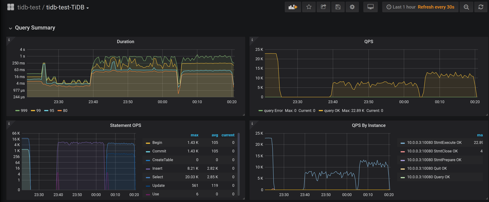

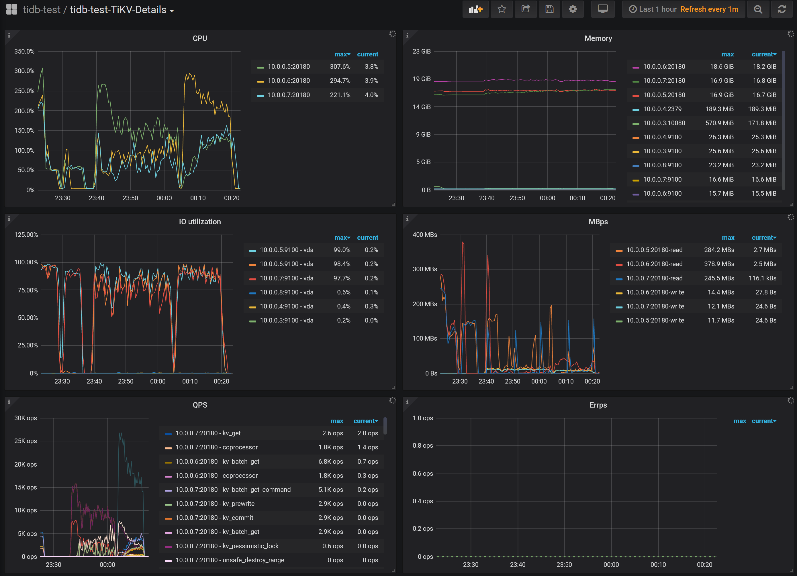


### 🩺 [go-tpc](https://github.com/pingcap/go-tpc) 基准测试

> 用于对 TiDB 和几乎与 MySQL 兼容的数据库的 TPC 中的工作负载进行基准测试的一个工具箱

TPC 是一系列事务处理和数据库基准测试的规范。TPC已经推出了四套基准程序，被称为TPC－A、TPC－B、TPC－C和TPC－D。其中A和B已经过时，不再使用了。TPC－C是在线事务处理(OLTP)的基准程序，TPC－D是决策支持(Decision Support) 的基准程序。TPC即将推TPC－E，作为大型企业(Enterprise)信息服务的基准程序。

##### 安装

```shell
curl --proto '=https' --tlsv1.2 -sSf https://raw.githubusercontent.com/pingcap/go-tpc/master/install.sh | sh
```

##### 测试


```shell
# tpcc prepare
go-tpc tpcc -H 10.0.0.3 -P 4000 -D tpcc --warehouses 1000 prepare
# 因为导入数据太慢, 又是搞到后半夜, 直接睡了
# 早上醒来 云服务欠费冻结...强行增加难度啊这是...
# 重新执行 1000 prepare 报错...

# 好吧, 今天时间不充裕了, 换成 10 warehouses
go-tpc tpcc -H 10.0.0.3 -P 4000 -D tpcc --warehouses 10 prepare -T 8
# tpcc run
go-tpc tpcc -H 10.0.0.3 -P 4000 -D tpcc --warehouses 10 run --time 5m --threads 10
```

```log
[root@ecs-benchmark ~]# go-tpc tpcc -H 10.0.0.3 -P 4000 -D tpcc --warehouses 10 run --time 5m --threads 10
DELIVERY - Takes(s): 9.6, Count: 59, TPM: 370.2, Sum(ms): 12991, Avg(ms): 220, 95th(ms): 512, 99th(ms): 512, 99.9th(ms): 512
NEW_ORDER - Takes(s): 9.9, Count: 633, TPM: 3850.0, Sum(ms): 46247, Avg(ms): 73, 95th(ms): 96, 99th(ms): 160, 99.9th(ms): 192
ORDER_STATUS - Takes(s): 9.9, Count: 55, TPM: 331.9, Sum(ms): 371, Avg(ms): 6, 95th(ms): 9, 99th(ms): 20, 99.9th(ms): 20
PAYMENT - Takes(s): 9.9, Count: 598, TPM: 3619.4, Sum(ms): 37898, Avg(ms): 63, 95th(ms): 112, 99th(ms): 160, 99.9th(ms): 256
STOCK_LEVEL - Takes(s): 9.6, Count: 68, TPM: 424.0, Sum(ms): 614, Avg(ms): 9, 95th(ms): 12, 99th(ms): 20, 99.9th(ms): 20
DELIVERY - Takes(s): 19.6, Count: 106, TPM: 325.1, Sum(ms): 23477, Avg(ms): 221, 95th(ms): 512, 99th(ms): 512, 99.9th(ms): 512
NEW_ORDER - Takes(s): 19.9, Count: 1313, TPM: 3965.8, Sum(ms): 96164, Avg(ms): 73, 95th(ms): 112, 99th(ms): 160, 99.9th(ms): 192
ORDER_STATUS - Takes(s): 19.9, Count: 124, TPM: 373.1, Sum(ms): 816, Avg(ms): 6, 95th(ms): 9, 99th(ms): 16, 99.9th(ms): 20
PAYMENT - Takes(s): 19.9, Count: 1208, TPM: 3639.8, Sum(ms): 75661, Avg(ms): 62, 95th(ms): 112, 99th(ms): 160, 99.9th(ms): 256
STOCK_LEVEL - Takes(s): 19.6, Count: 126, TPM: 385.3, Sum(ms): 1107, Avg(ms): 8, 95th(ms): 16, 99th(ms): 20, 99.9th(ms): 24
DELIVERY - Takes(s): 29.6, Count: 177, TPM: 359.2, Sum(ms): 40035, Avg(ms): 226, 95th(ms): 512, 99th(ms): 512, 99.9th(ms): 1000
NEW_ORDER - Takes(s): 29.9, Count: 1952, TPM: 3921.6, Sum(ms): 143202, Avg(ms): 73, 95th(ms): 112, 99th(ms): 160, 99.9th(ms): 192
ORDER_STATUS - Takes(s): 29.9, Count: 184, TPM: 368.7, Sum(ms): 1212, Avg(ms): 6, 95th(ms): 9, 99th(ms): 16, 99.9th(ms): 20
PAYMENT - Takes(s): 29.9, Count: 1776, TPM: 3562.3, Sum(ms): 110757, Avg(ms): 62, 95th(ms): 112, 99th(ms): 160, 99.9th(ms): 256
STOCK_LEVEL - Takes(s): 29.6, Count: 190, TPM: 384.8, Sum(ms): 1648, Avg(ms): 8, 95th(ms): 16, 99th(ms): 20, 99.9th(ms): 24
DELIVERY - Takes(s): 39.6, Count: 237, TPM: 359.4, Sum(ms): 53688, Avg(ms): 226, 95th(ms): 512, 99th(ms): 512, 99.9th(ms): 1000
NEW_ORDER - Takes(s): 39.9, Count: 2608, TPM: 3925.3, Sum(ms): 190859, Avg(ms): 73, 95th(ms): 112, 99th(ms): 160, 99.9th(ms): 192
ORDER_STATUS - Takes(s): 39.9, Count: 248, TPM: 372.5, Sum(ms): 1606, Avg(ms): 6, 95th(ms): 9, 99th(ms): 16, 99.9th(ms): 20
PAYMENT - Takes(s): 39.9, Count: 2380, TPM: 3577.8, Sum(ms): 147838, Avg(ms): 62, 95th(ms): 112, 99th(ms): 160, 99.9th(ms): 256
STOCK_LEVEL - Takes(s): 39.6, Count: 247, TPM: 374.0, Sum(ms): 2105, Avg(ms): 8, 95th(ms): 12, 99th(ms): 20, 99.9th(ms): 24
DELIVERY - Takes(s): 49.6, Count: 303, TPM: 366.8, Sum(ms): 69071, Avg(ms): 227, 95th(ms): 512, 99th(ms): 512, 99.9th(ms): 1000
NEW_ORDER - Takes(s): 49.9, Count: 3222, TPM: 3876.9, Sum(ms): 235519, Avg(ms): 73, 95th(ms): 112, 99th(ms): 160, 99.9th(ms): 192
ORDER_STATUS - Takes(s): 49.9, Count: 303, TPM: 364.0, Sum(ms): 1967, Avg(ms): 6, 95th(ms): 8, 99th(ms): 16, 99.9th(ms): 20
PAYMENT - Takes(s): 49.9, Count: 2975, TPM: 3576.2, Sum(ms): 186375, Avg(ms): 62, 95th(ms): 112, 99th(ms): 160, 99.9th(ms): 256
STOCK_LEVEL - Takes(s): 49.6, Count: 300, TPM: 362.7, Sum(ms): 2543, Avg(ms): 8, 95th(ms): 12, 99th(ms): 16, 99.9th(ms): 24
DELIVERY - Takes(s): 59.6, Count: 363, TPM: 365.7, Sum(ms): 83469, Avg(ms): 229, 95th(ms): 512, 99th(ms): 512, 99.9th(ms): 1000
NEW_ORDER - Takes(s): 59.9, Count: 3844, TPM: 3852.7, Sum(ms): 280749, Avg(ms): 73, 95th(ms): 112, 99th(ms): 160, 99.9th(ms): 192
ORDER_STATUS - Takes(s): 59.9, Count: 360, TPM: 360.3, Sum(ms): 2339, Avg(ms): 6, 95th(ms): 8, 99th(ms): 16, 99.9th(ms): 20
PAYMENT - Takes(s): 59.9, Count: 3585, TPM: 3590.2, Sum(ms): 225096, Avg(ms): 62, 95th(ms): 112, 99th(ms): 160, 99.9th(ms): 256
STOCK_LEVEL - Takes(s): 59.6, Count: 344, TPM: 346.2, Sum(ms): 2896, Avg(ms): 8, 95th(ms): 12, 99th(ms): 16, 99.9th(ms): 24
DELIVERY - Takes(s): 69.6, Count: 423, TPM: 364.9, Sum(ms): 97348, Avg(ms): 230, 95th(ms): 512, 99th(ms): 512, 99.9th(ms): 1000
NEW_ORDER - Takes(s): 69.9, Count: 4452, TPM: 3823.4, Sum(ms): 325015, Avg(ms): 73, 95th(ms): 112, 99th(ms): 160, 99.9th(ms): 192
ORDER_STATUS - Takes(s): 69.9, Count: 436, TPM: 374.0, Sum(ms): 2840, Avg(ms): 6, 95th(ms): 9, 99th(ms): 16, 99.9th(ms): 20
PAYMENT - Takes(s): 69.9, Count: 4224, TPM: 3625.1, Sum(ms): 265544, Avg(ms): 62, 95th(ms): 112, 99th(ms): 160, 99.9th(ms): 256
STOCK_LEVEL - Takes(s): 69.6, Count: 398, TPM: 343.0, Sum(ms): 3361, Avg(ms): 8, 95th(ms): 12, 99th(ms): 20, 99.9th(ms): 24
DELIVERY - Takes(s): 79.6, Count: 481, TPM: 362.7, Sum(ms): 110701, Avg(ms): 230, 95th(ms): 512, 99th(ms): 512, 99.9th(ms): 1000
NEW_ORDER - Takes(s): 79.9, Count: 5044, TPM: 3789.4, Sum(ms): 368110, Avg(ms): 72, 95th(ms): 112, 99th(ms): 160, 99.9th(ms): 192
ORDER_STATUS - Takes(s): 79.9, Count: 489, TPM: 367.0, Sum(ms): 3172, Avg(ms): 6, 95th(ms): 9, 99th(ms): 16, 99.9th(ms): 20
PAYMENT - Takes(s): 79.9, Count: 4881, TPM: 3664.7, Sum(ms): 307392, Avg(ms): 62, 95th(ms): 112, 99th(ms): 160, 99.9th(ms): 256
STOCK_LEVEL - Takes(s): 79.6, Count: 442, TPM: 333.1, Sum(ms): 3721, Avg(ms): 8, 95th(ms): 12, 99th(ms): 20, 99.9th(ms): 24
DELIVERY - Takes(s): 89.6, Count: 546, TPM: 365.8, Sum(ms): 125260, Avg(ms): 229, 95th(ms): 512, 99th(ms): 512, 99.9th(ms): 1000
NEW_ORDER - Takes(s): 89.9, Count: 5651, TPM: 3773.0, Sum(ms): 412573, Avg(ms): 73, 95th(ms): 112, 99th(ms): 160, 99.9th(ms): 192
ORDER_STATUS - Takes(s): 89.9, Count: 546, TPM: 364.2, Sum(ms): 3545, Avg(ms): 6, 95th(ms): 8, 99th(ms): 16, 99.9th(ms): 20
PAYMENT - Takes(s): 89.9, Count: 5502, TPM: 3671.5, Sum(ms): 346845, Avg(ms): 63, 95th(ms): 112, 99th(ms): 160, 99.9th(ms): 256
STOCK_LEVEL - Takes(s): 89.6, Count: 509, TPM: 340.8, Sum(ms): 4256, Avg(ms): 8, 95th(ms): 12, 99th(ms): 16, 99.9th(ms): 24
DELIVERY - Takes(s): 99.6, Count: 606, TPM: 365.2, Sum(ms): 139321, Avg(ms): 229, 95th(ms): 512, 99th(ms): 512, 99.9th(ms): 1000
NEW_ORDER - Takes(s): 99.9, Count: 6273, TPM: 3768.9, Sum(ms): 457662, Avg(ms): 72, 95th(ms): 112, 99th(ms): 160, 99.9th(ms): 192
ORDER_STATUS - Takes(s): 99.9, Count: 608, TPM: 365.0, Sum(ms): 3957, Avg(ms): 6, 95th(ms): 8, 99th(ms): 12, 99.9th(ms): 20
PAYMENT - Takes(s): 99.9, Count: 6109, TPM: 3668.6, Sum(ms): 386251, Avg(ms): 63, 95th(ms): 112, 99th(ms): 160, 99.9th(ms): 256
STOCK_LEVEL - Takes(s): 99.6, Count: 562, TPM: 338.5, Sum(ms): 4709, Avg(ms): 8, 95th(ms): 12, 99th(ms): 20, 99.9th(ms): 24
DELIVERY - Takes(s): 109.6, Count: 669, TPM: 366.4, Sum(ms): 154420, Avg(ms): 230, 95th(ms): 512, 99th(ms): 512, 99.9th(ms): 1000
NEW_ORDER - Takes(s): 109.9, Count: 6905, TPM: 3771.0, Sum(ms): 504512, Avg(ms): 73, 95th(ms): 112, 99th(ms): 160, 99.9th(ms): 192
ORDER_STATUS - Takes(s): 109.9, Count: 662, TPM: 361.3, Sum(ms): 4317, Avg(ms): 6, 95th(ms): 8, 99th(ms): 16, 99.9th(ms): 20
PAYMENT - Takes(s): 109.9, Count: 6687, TPM: 3650.3, Sum(ms): 422779, Avg(ms): 63, 95th(ms): 112, 99th(ms): 160, 99.9th(ms): 256
STOCK_LEVEL - Takes(s): 109.6, Count: 613, TPM: 335.5, Sum(ms): 5131, Avg(ms): 8, 95th(ms): 12, 99th(ms): 16, 99.9th(ms): 24
DELIVERY - Takes(s): 119.6, Count: 729, TPM: 365.8, Sum(ms): 168504, Avg(ms): 231, 95th(ms): 512, 99th(ms): 512, 99.9th(ms): 1000
NEW_ORDER - Takes(s): 119.9, Count: 7563, TPM: 3785.8, Sum(ms): 552334, Avg(ms): 73, 95th(ms): 112, 99th(ms): 160, 99.9th(ms): 192
ORDER_STATUS - Takes(s): 119.9, Count: 716, TPM: 358.2, Sum(ms): 4700, Avg(ms): 6, 95th(ms): 9, 99th(ms): 16, 99.9th(ms): 20
PAYMENT - Takes(s): 119.9, Count: 7268, TPM: 3636.6, Sum(ms): 459099, Avg(ms): 63, 95th(ms): 112, 99th(ms): 160, 99.9th(ms): 256
STOCK_LEVEL - Takes(s): 119.6, Count: 666, TPM: 334.1, Sum(ms): 5580, Avg(ms): 8, 95th(ms): 12, 99th(ms): 20, 99.9th(ms): 24
DELIVERY - Takes(s): 129.6, Count: 797, TPM: 369.1, Sum(ms): 184371, Avg(ms): 231, 95th(ms): 512, 99th(ms): 512, 99.9th(ms): 1000
NEW_ORDER - Takes(s): 129.9, Count: 8203, TPM: 3789.9, Sum(ms): 598650, Avg(ms): 72, 95th(ms): 96, 99th(ms): 160, 99.9th(ms): 192
ORDER_STATUS - Takes(s): 129.9, Count: 770, TPM: 355.5, Sum(ms): 5054, Avg(ms): 6, 95th(ms): 9, 99th(ms): 16, 99.9th(ms): 20
PAYMENT - Takes(s): 129.9, Count: 7851, TPM: 3626.0, Sum(ms): 495504, Avg(ms): 63, 95th(ms): 112, 99th(ms): 160, 99.9th(ms): 256
STOCK_LEVEL - Takes(s): 129.6, Count: 717, TPM: 331.9, Sum(ms): 6029, Avg(ms): 8, 95th(ms): 12, 99th(ms): 20, 99.9th(ms): 24
DELIVERY - Takes(s): 139.6, Count: 854, TPM: 367.1, Sum(ms): 196972, Avg(ms): 230, 95th(ms): 512, 99th(ms): 512, 99.9th(ms): 1000
NEW_ORDER - Takes(s): 139.9, Count: 8824, TPM: 3785.4, Sum(ms): 644315, Avg(ms): 73, 95th(ms): 96, 99th(ms): 160, 99.9th(ms): 192
ORDER_STATUS - Takes(s): 139.9, Count: 829, TPM: 355.4, Sum(ms): 5443, Avg(ms): 6, 95th(ms): 9, 99th(ms): 16, 99.9th(ms): 20
PAYMENT - Takes(s): 139.9, Count: 8469, TPM: 3631.8, Sum(ms): 535661, Avg(ms): 63, 95th(ms): 112, 99th(ms): 160, 99.9th(ms): 256
STOCK_LEVEL - Takes(s): 139.6, Count: 774, TPM: 332.6, Sum(ms): 6503, Avg(ms): 8, 95th(ms): 12, 99th(ms): 20, 99.9th(ms): 24
DELIVERY - Takes(s): 149.6, Count: 914, TPM: 366.7, Sum(ms): 211139, Avg(ms): 231, 95th(ms): 512, 99th(ms): 512, 99.9th(ms): 1000
NEW_ORDER - Takes(s): 149.9, Count: 9446, TPM: 3781.8, Sum(ms): 690006, Avg(ms): 73, 95th(ms): 96, 99th(ms): 160, 99.9th(ms): 192
ORDER_STATUS - Takes(s): 149.9, Count: 898, TPM: 359.3, Sum(ms): 5913, Avg(ms): 6, 95th(ms): 9, 99th(ms): 16, 99.9th(ms): 20
PAYMENT - Takes(s): 149.9, Count: 9078, TPM: 3633.3, Sum(ms): 574176, Avg(ms): 63, 95th(ms): 112, 99th(ms): 160, 99.9th(ms): 256
STOCK_LEVEL - Takes(s): 149.6, Count: 832, TPM: 333.6, Sum(ms): 6982, Avg(ms): 8, 95th(ms): 12, 99th(ms): 20, 99.9th(ms): 24
DELIVERY - Takes(s): 159.6, Count: 968, TPM: 364.0, Sum(ms): 223265, Avg(ms): 230, 95th(ms): 512, 99th(ms): 512, 99.9th(ms): 1000
NEW_ORDER - Takes(s): 159.9, Count: 10076, TPM: 3781.7, Sum(ms): 736666, Avg(ms): 73, 95th(ms): 96, 99th(ms): 160, 99.9th(ms): 192
ORDER_STATUS - Takes(s): 159.9, Count: 954, TPM: 357.9, Sum(ms): 6275, Avg(ms): 6, 95th(ms): 9, 99th(ms): 16, 99.9th(ms): 20
PAYMENT - Takes(s): 159.9, Count: 9710, TPM: 3643.2, Sum(ms): 614125, Avg(ms): 63, 95th(ms): 112, 99th(ms): 160, 99.9th(ms): 256
STOCK_LEVEL - Takes(s): 159.6, Count: 879, TPM: 330.4, Sum(ms): 7406, Avg(ms): 8, 95th(ms): 12, 99th(ms): 20, 99.9th(ms): 32
DELIVERY - Takes(s): 169.6, Count: 1030, TPM: 364.5, Sum(ms): 237437, Avg(ms): 230, 95th(ms): 512, 99th(ms): 512, 99.9th(ms): 1000
NEW_ORDER - Takes(s): 169.9, Count: 10677, TPM: 3771.4, Sum(ms): 781636, Avg(ms): 73, 95th(ms): 96, 99th(ms): 160, 99.9th(ms): 192
ORDER_STATUS - Takes(s): 169.9, Count: 1003, TPM: 354.1, Sum(ms): 6600, Avg(ms): 6, 95th(ms): 9, 99th(ms): 16, 99.9th(ms): 20
PAYMENT - Takes(s): 169.9, Count: 10295, TPM: 3635.4, Sum(ms): 653032, Avg(ms): 63, 95th(ms): 112, 99th(ms): 160, 99.9th(ms): 256
STOCK_LEVEL - Takes(s): 169.6, Count: 919, TPM: 325.1, Sum(ms): 7764, Avg(ms): 8, 95th(ms): 12, 99th(ms): 20, 99.9th(ms): 32
DELIVERY - Takes(s): 179.6, Count: 1079, TPM: 360.5, Sum(ms): 249303, Avg(ms): 231, 95th(ms): 512, 99th(ms): 512, 99.9th(ms): 1000
NEW_ORDER - Takes(s): 179.9, Count: 11312, TPM: 3773.5, Sum(ms): 829422, Avg(ms): 73, 95th(ms): 96, 99th(ms): 160, 99.9th(ms): 192
ORDER_STATUS - Takes(s): 179.9, Count: 1066, TPM: 355.4, Sum(ms): 7039, Avg(ms): 6, 95th(ms): 9, 99th(ms): 16, 99.9th(ms): 20
PAYMENT - Takes(s): 179.9, Count: 10908, TPM: 3637.8, Sum(ms): 691922, Avg(ms): 63, 95th(ms): 112, 99th(ms): 160, 99.9th(ms): 256
STOCK_LEVEL - Takes(s): 179.6, Count: 987, TPM: 329.7, Sum(ms): 8383, Avg(ms): 8, 95th(ms): 12, 99th(ms): 20, 99.9th(ms): 32
DELIVERY - Takes(s): 189.6, Count: 1130, TPM: 357.7, Sum(ms): 260907, Avg(ms): 230, 95th(ms): 512, 99th(ms): 512, 99.9th(ms): 1000
NEW_ORDER - Takes(s): 189.9, Count: 11940, TPM: 3773.2, Sum(ms): 876566, Avg(ms): 73, 95th(ms): 112, 99th(ms): 160, 99.9th(ms): 192
ORDER_STATUS - Takes(s): 189.9, Count: 1119, TPM: 353.5, Sum(ms): 7381, Avg(ms): 6, 95th(ms): 9, 99th(ms): 16, 99.9th(ms): 20
PAYMENT - Takes(s): 189.9, Count: 11524, TPM: 3640.8, Sum(ms): 731532, Avg(ms): 63, 95th(ms): 112, 99th(ms): 160, 99.9th(ms): 256
STOCK_LEVEL - Takes(s): 189.6, Count: 1042, TPM: 329.7, Sum(ms): 8852, Avg(ms): 8, 95th(ms): 12, 99th(ms): 20, 99.9th(ms): 24
DELIVERY - Takes(s): 199.6, Count: 1180, TPM: 354.8, Sum(ms): 272157, Avg(ms): 230, 95th(ms): 512, 99th(ms): 512, 99.9th(ms): 1000
NEW_ORDER - Takes(s): 199.9, Count: 12587, TPM: 3778.7, Sum(ms): 924478, Avg(ms): 73, 95th(ms): 112, 99th(ms): 160, 99.9th(ms): 192
ORDER_STATUS - Takes(s): 199.9, Count: 1174, TPM: 352.3, Sum(ms): 7767, Avg(ms): 6, 95th(ms): 9, 99th(ms): 16, 99.9th(ms): 20
PAYMENT - Takes(s): 199.9, Count: 12145, TPM: 3645.1, Sum(ms): 771082, Avg(ms): 63, 95th(ms): 112, 99th(ms): 160, 99.9th(ms): 256
STOCK_LEVEL - Takes(s): 199.6, Count: 1099, TPM: 330.3, Sum(ms): 9348, Avg(ms): 8, 95th(ms): 12, 99th(ms): 20, 99.9th(ms): 24
DELIVERY - Takes(s): 209.6, Count: 1204, TPM: 344.7, Sum(ms): 279428, Avg(ms): 232, 95th(ms): 512, 99th(ms): 512, 99.9th(ms): 1000
NEW_ORDER - Takes(s): 209.9, Count: 12900, TPM: 3688.1, Sum(ms): 965634, Avg(ms): 74, 95th(ms): 112, 99th(ms): 160, 99.9th(ms): 1000
ORDER_STATUS - Takes(s): 209.9, Count: 1207, TPM: 345.0, Sum(ms): 7988, Avg(ms): 6, 95th(ms): 9, 99th(ms): 16, 99.9th(ms): 20
PAYMENT - Takes(s): 209.9, Count: 12494, TPM: 3571.2, Sum(ms): 821784, Avg(ms): 65, 95th(ms): 128, 99th(ms): 192, 99.9th(ms): 1000
STOCK_LEVEL - Takes(s): 209.6, Count: 1123, TPM: 321.4, Sum(ms): 9587, Avg(ms): 8, 95th(ms): 12, 99th(ms): 20, 99.9th(ms): 32
DELIVERY - Takes(s): 219.6, Count: 1267, TPM: 346.2, Sum(ms): 294396, Avg(ms): 232, 95th(ms): 512, 99th(ms): 512, 99.9th(ms): 1000
NEW_ORDER - Takes(s): 219.9, Count: 13468, TPM: 3675.3, Sum(ms): 1009476, Avg(ms): 74, 95th(ms): 112, 99th(ms): 160, 99.9th(ms): 1000
ORDER_STATUS - Takes(s): 219.9, Count: 1264, TPM: 344.8, Sum(ms): 8369, Avg(ms): 6, 95th(ms): 9, 99th(ms): 16, 99.9th(ms): 20
PAYMENT - Takes(s): 219.9, Count: 13065, TPM: 3564.6, Sum(ms): 861370, Avg(ms): 65, 95th(ms): 128, 99th(ms): 192, 99.9th(ms): 1000
STOCK_LEVEL - Takes(s): 219.6, Count: 1172, TPM: 320.2, Sum(ms): 9995, Avg(ms): 8, 95th(ms): 12, 99th(ms): 20, 99.9th(ms): 32
DELIVERY - Takes(s): 229.6, Count: 1320, TPM: 345.0, Sum(ms): 306721, Avg(ms): 232, 95th(ms): 512, 99th(ms): 512, 99.9th(ms): 1000
NEW_ORDER - Takes(s): 229.9, Count: 14025, TPM: 3660.8, Sum(ms): 1052448, Avg(ms): 75, 95th(ms): 112, 99th(ms): 160, 99.9th(ms): 1000
ORDER_STATUS - Takes(s): 229.9, Count: 1333, TPM: 347.8, Sum(ms): 8848, Avg(ms): 6, 95th(ms): 9, 99th(ms): 16, 99.9th(ms): 20
PAYMENT - Takes(s): 229.9, Count: 13680, TPM: 3570.0, Sum(ms): 903690, Avg(ms): 66, 95th(ms): 128, 99th(ms): 192, 99.9th(ms): 1000
STOCK_LEVEL - Takes(s): 229.6, Count: 1239, TPM: 323.7, Sum(ms): 10590, Avg(ms): 8, 95th(ms): 12, 99th(ms): 20, 99.9th(ms): 32
DELIVERY - Takes(s): 239.6, Count: 1385, TPM: 346.9, Sum(ms): 322941, Avg(ms): 233, 95th(ms): 512, 99th(ms): 512, 99.9th(ms): 1000
NEW_ORDER - Takes(s): 239.9, Count: 14608, TPM: 3654.1, Sum(ms): 1098363, Avg(ms): 75, 95th(ms): 112, 99th(ms): 160, 99.9th(ms): 1000
ORDER_STATUS - Takes(s): 239.9, Count: 1374, TPM: 343.6, Sum(ms): 9126, Avg(ms): 6, 95th(ms): 9, 99th(ms): 16, 99.9th(ms): 20
PAYMENT - Takes(s): 239.9, Count: 14220, TPM: 3556.3, Sum(ms): 940557, Avg(ms): 66, 95th(ms): 128, 99th(ms): 192, 99.9th(ms): 1000
STOCK_LEVEL - Takes(s): 239.6, Count: 1286, TPM: 322.0, Sum(ms): 11001, Avg(ms): 8, 95th(ms): 12, 99th(ms): 20, 99.9th(ms): 32
DELIVERY - Takes(s): 249.6, Count: 1440, TPM: 346.2, Sum(ms): 336395, Avg(ms): 233, 95th(ms): 512, 99th(ms): 512, 99.9th(ms): 1000
NEW_ORDER - Takes(s): 249.9, Count: 15180, TPM: 3645.2, Sum(ms): 1144578, Avg(ms): 75, 95th(ms): 112, 99th(ms): 160, 99.9th(ms): 1000
ORDER_STATUS - Takes(s): 249.9, Count: 1439, TPM: 345.4, Sum(ms): 9565, Avg(ms): 6, 95th(ms): 9, 99th(ms): 12, 99.9th(ms): 20
PAYMENT - Takes(s): 249.9, Count: 14771, TPM: 3546.3, Sum(ms): 979638, Avg(ms): 66, 95th(ms): 128, 99th(ms): 192, 99.9th(ms): 1000
STOCK_LEVEL - Takes(s): 249.6, Count: 1331, TPM: 319.9, Sum(ms): 11417, Avg(ms): 8, 95th(ms): 12, 99th(ms): 20, 99.9th(ms): 32
DELIVERY - Takes(s): 259.6, Count: 1495, TPM: 345.6, Sum(ms): 350881, Avg(ms): 234, 95th(ms): 512, 99th(ms): 512, 99.9th(ms): 1000
NEW_ORDER - Takes(s): 259.9, Count: 15701, TPM: 3625.2, Sum(ms): 1190063, Avg(ms): 75, 95th(ms): 112, 99th(ms): 160, 99.9th(ms): 1000
ORDER_STATUS - Takes(s): 259.9, Count: 1484, TPM: 342.5, Sum(ms): 9875, Avg(ms): 6, 95th(ms): 9, 99th(ms): 16, 99.9th(ms): 20
PAYMENT - Takes(s): 259.9, Count: 15288, TPM: 3529.2, Sum(ms): 1018416, Avg(ms): 66, 95th(ms): 128, 99th(ms): 192, 99.9th(ms): 1000
STOCK_LEVEL - Takes(s): 259.6, Count: 1372, TPM: 317.1, Sum(ms): 11983, Avg(ms): 8, 95th(ms): 12, 99th(ms): 20, 99.9th(ms): 32
DELIVERY - Takes(s): 269.6, Count: 1546, TPM: 344.1, Sum(ms): 365465, Avg(ms): 236, 95th(ms): 512, 99th(ms): 512, 99.9th(ms): 1000
NEW_ORDER - Takes(s): 269.9, Count: 16226, TPM: 3607.6, Sum(ms): 1231712, Avg(ms): 75, 95th(ms): 112, 99th(ms): 160, 99.9th(ms): 1000
ORDER_STATUS - Takes(s): 269.9, Count: 1534, TPM: 341.0, Sum(ms): 10209, Avg(ms): 6, 95th(ms): 9, 99th(ms): 12, 99.9th(ms): 20
PAYMENT - Takes(s): 269.9, Count: 15873, TPM: 3528.5, Sum(ms): 1060523, Avg(ms): 66, 95th(ms): 128, 99th(ms): 192, 99.9th(ms): 1000
STOCK_LEVEL - Takes(s): 269.6, Count: 1425, TPM: 317.1, Sum(ms): 12461, Avg(ms): 8, 95th(ms): 12, 99th(ms): 20, 99.9th(ms): 40
DELIVERY - Takes(s): 279.6, Count: 1601, TPM: 343.6, Sum(ms): 377928, Avg(ms): 236, 95th(ms): 512, 99th(ms): 512, 99.9th(ms): 1000
NEW_ORDER - Takes(s): 279.9, Count: 16913, TPM: 3626.0, Sum(ms): 1283462, Avg(ms): 75, 95th(ms): 112, 99th(ms): 160, 99.9th(ms): 1000
ORDER_STATUS - Takes(s): 279.9, Count: 1581, TPM: 338.9, Sum(ms): 10526, Avg(ms): 6, 95th(ms): 9, 99th(ms): 16, 99.9th(ms): 20
PAYMENT - Takes(s): 279.9, Count: 16418, TPM: 3519.2, Sum(ms): 1094862, Avg(ms): 66, 95th(ms): 128, 99th(ms): 192, 99.9th(ms): 1000
STOCK_LEVEL - Takes(s): 279.6, Count: 1486, TPM: 318.9, Sum(ms): 13020, Avg(ms): 8, 95th(ms): 16, 99th(ms): 20, 99.9th(ms): 40
DELIVERY - Takes(s): 289.6, Count: 1662, TPM: 344.4, Sum(ms): 392519, Avg(ms): 236, 95th(ms): 512, 99th(ms): 512, 99.9th(ms): 1000
NEW_ORDER - Takes(s): 289.9, Count: 17521, TPM: 3626.7, Sum(ms): 1328870, Avg(ms): 75, 95th(ms): 112, 99th(ms): 160, 99.9th(ms): 1000
ORDER_STATUS - Takes(s): 289.9, Count: 1637, TPM: 338.8, Sum(ms): 10902, Avg(ms): 6, 95th(ms): 9, 99th(ms): 16, 99.9th(ms): 20
PAYMENT - Takes(s): 289.9, Count: 17017, TPM: 3521.8, Sum(ms): 1133342, Avg(ms): 66, 95th(ms): 128, 99th(ms): 192, 99.9th(ms): 1000
STOCK_LEVEL - Takes(s): 289.6, Count: 1537, TPM: 318.4, Sum(ms): 13480, Avg(ms): 8, 95th(ms): 16, 99th(ms): 20, 99.9th(ms): 40
Finished
DELIVERY - Takes(s): 299.6, Count: 1707, TPM: 341.9, Sum(ms): 403847, Avg(ms): 236, 95th(ms): 512, 99th(ms): 512, 99.9th(ms): 1000
DELIVERY_ERR - Takes(s): 0.0, Count: 1, TPM: 3335.0, Sum(ms): 180, Avg(ms): 180, 95th(ms): 192, 99th(ms): 192, 99.9th(ms): 192
NEW_ORDER - Takes(s): 299.9, Count: 18079, TPM: 3617.2, Sum(ms): 1373403, Avg(ms): 75, 95th(ms): 112, 99th(ms): 160, 99.9th(ms): 1000
NEW_ORDER_ERR - Takes(s): 0.0, Count: 3, TPM: 9946.1, Sum(ms): 54, Avg(ms): 18, 95th(ms): 32, 99th(ms): 32, 99.9th(ms): 32
ORDER_STATUS - Takes(s): 300.0, Count: 1688, TPM: 337.6, Sum(ms): 11261, Avg(ms): 6, 95th(ms): 9, 99th(ms): 16, 99.9th(ms): 20
PAYMENT - Takes(s): 299.9, Count: 17594, TPM: 3519.6, Sum(ms): 1176043, Avg(ms): 66, 95th(ms): 128, 99th(ms): 192, 99.9th(ms): 1000
PAYMENT_ERR - Takes(s): 0.0, Count: 3, TPM: 9931.2, Sum(ms): 136, Avg(ms): 45, 95th(ms): 96, 99th(ms): 96, 99.9th(ms): 96
STOCK_LEVEL - Takes(s): 299.6, Count: 1594, TPM: 319.2, Sum(ms): 14016, Avg(ms): 8, 95th(ms): 16, 99th(ms): 20, 99.9th(ms): 40
```

```shell
# tpch prepare
go-tpc tpch -H 10.0.0.3 -P 4000 -D tpch --sf 2 prepare
# tpch run
go-tpc tpch -H 10.0.0.3 -P 4000 -D tpch --sf 2 run --time 1m --threads 4
# 由于时间问题, 后来将sf降为2重新执行
```

```log
[root@ecs-benchmark ~]# go-tpc tpch -H 10.0.0.3 -P 4000 -D tpch --sf 2 run 
[mysql] 2020/08/25 12:04:26 connection.go:372: invalid connection
[mysql] 2020/08/25 12:04:27 connection.go:372: invalid connection
[mysql] 2020/08/25 12:04:28 connection.go:372: invalid connection
[mysql] 2020/08/25 12:04:28 connection.go:372: invalid connection
[mysql] 2020/08/25 12:04:29 connection.go:372: invalid connection
[mysql] 2020/08/25 12:04:30 connection.go:372: invalid connection
[mysql] 2020/08/25 12:04:31 connection.go:372: invalid connection
Q1     - Takes(s): 2.0, Count: 1, TPM: 29.9, Sum(ms): 7992, Avg(ms): 7992, 95th(ms): 8000, 99th(ms): 8000, 99.9th(ms): 8000
Q11    - Takes(s): 3.0, Count: 1, TPM: 19.8, Sum(ms): 6963, Avg(ms): 6963, 95th(ms): 8000, 99th(ms): 8000, 99.9th(ms): 8000
Q12    - Takes(s): 0.2, Count: 1, TPM: 248.7, Sum(ms): 9757, Avg(ms): 9757, 95th(ms): 16000, 99th(ms): 16000, 99.9th(ms): 16000
Q13    - Takes(s): 4.3, Count: 1, TPM: 13.9, Sum(ms): 5671, Avg(ms): 5671, 95th(ms): 8000, 99th(ms): 8000, 99.9th(ms): 8000
Q16    - Takes(s): 4.8, Count: 1, TPM: 12.4, Sum(ms): 5159, Avg(ms): 5159, 95th(ms): 8000, 99th(ms): 8000, 99.9th(ms): 8000
Q2     - Takes(s): 2.8, Count: 1, TPM: 21.4, Sum(ms): 7192, Avg(ms): 7192, 95th(ms): 8000, 99th(ms): 8000, 99.9th(ms): 8000
Q6     - Takes(s): 0.9, Count: 1, TPM: 69.7, Sum(ms): 9136, Avg(ms): 9136, 95th(ms): 16000, 99th(ms): 16000, 99.9th(ms): 16000
[mysql] 2020/08/25 12:04:32 connection.go:372: invalid connection
[mysql] 2020/08/25 12:04:33 connection.go:372: invalid connection
[mysql] 2020/08/25 12:04:33 connection.go:372: invalid connection
[mysql] 2020/08/25 12:04:33 connection.go:372: invalid connection
[mysql] 2020/08/25 12:04:33 connection.go:372: invalid connection
[mysql] 2020/08/25 12:04:33 connection.go:372: invalid connection
[mysql] 2020/08/25 12:04:34 connection.go:372: invalid connection
[mysql] 2020/08/25 12:04:34 connection.go:372: invalid connection
Q1     - Takes(s): 12.0, Count: 1, TPM: 5.0, Sum(ms): 7992, Avg(ms): 7992, 95th(ms): 8000, 99th(ms): 8000, 99.9th(ms): 8000
Q10    - Takes(s): 8.1, Count: 1, TPM: 7.4, Sum(ms): 11878, Avg(ms): 11878, 95th(ms): 16000, 99th(ms): 16000, 99.9th(ms): 16000
Q11    - Takes(s): 13.0, Count: 1, TPM: 4.6, Sum(ms): 6963, Avg(ms): 6963, 95th(ms): 8000, 99th(ms): 8000, 99.9th(ms): 8000
Q12    - Takes(s): 10.2, Count: 1, TPM: 5.9, Sum(ms): 9757, Avg(ms): 9757, 95th(ms): 16000, 99th(ms): 16000, 99.9th(ms): 16000
Q13    - Takes(s): 14.3, Count: 1, TPM: 4.2, Sum(ms): 5671, Avg(ms): 5671, 95th(ms): 8000, 99th(ms): 8000, 99.9th(ms): 8000
Q14    - Takes(s): 9.6, Count: 1, TPM: 6.3, Sum(ms): 10433, Avg(ms): 10433, 95th(ms): 16000, 99th(ms): 16000, 99.9th(ms): 16000
Q15    - Takes(s): 8.1, Count: 1, TPM: 7.4, Sum(ms): 11910, Avg(ms): 11910, 95th(ms): 16000, 99th(ms): 16000, 99.9th(ms): 16000
Q16    - Takes(s): 14.8, Count: 1, TPM: 4.0, Sum(ms): 5159, Avg(ms): 5159, 95th(ms): 8000, 99th(ms): 8000, 99.9th(ms): 8000
Q2     - Takes(s): 12.8, Count: 1, TPM: 4.7, Sum(ms): 7192, Avg(ms): 7192, 95th(ms): 8000, 99th(ms): 8000, 99.9th(ms): 8000
Q3     - Takes(s): 7.3, Count: 1, TPM: 8.3, Sum(ms): 12746, Avg(ms): 12746, 95th(ms): 16000, 99th(ms): 16000, 99.9th(ms): 16000
Q4     - Takes(s): 8.1, Count: 1, TPM: 7.5, Sum(ms): 11948, Avg(ms): 11948, 95th(ms): 16000, 99th(ms): 16000, 99.9th(ms): 16000
Q6     - Takes(s): 10.9, Count: 1, TPM: 5.5, Sum(ms): 9136, Avg(ms): 9136, 95th(ms): 16000, 99th(ms): 16000, 99.9th(ms): 16000
Q7     - Takes(s): 8.6, Count: 1, TPM: 7.0, Sum(ms): 11446, Avg(ms): 11446, 95th(ms): 16000, 99th(ms): 16000, 99.9th(ms): 16000
Q8     - Takes(s): 7.1, Count: 1, TPM: 8.4, Sum(ms): 12895, Avg(ms): 12895, 95th(ms): 16000, 99th(ms): 16000, 99.9th(ms): 16000
Q9     - Takes(s): 8.4, Count: 1, TPM: 7.1, Sum(ms): 11566, Avg(ms): 11566, 95th(ms): 16000, 99th(ms): 16000, 99.9th(ms): 16000
Q1     - Takes(s): 22.0, Count: 1, TPM: 2.7, Sum(ms): 7992, Avg(ms): 7992, 95th(ms): 8000, 99th(ms): 8000, 99.9th(ms): 8000
Q10    - Takes(s): 18.1, Count: 1, TPM: 3.3, Sum(ms): 11878, Avg(ms): 11878, 95th(ms): 16000, 99th(ms): 16000, 99.9th(ms): 16000
Q11    - Takes(s): 23.0, Count: 1, TPM: 2.6, Sum(ms): 6963, Avg(ms): 6963, 95th(ms): 8000, 99th(ms): 8000, 99.9th(ms): 8000
Q12    - Takes(s): 20.2, Count: 1, TPM: 3.0, Sum(ms): 9757, Avg(ms): 9757, 95th(ms): 16000, 99th(ms): 16000, 99.9th(ms): 16000
Q13    - Takes(s): 24.3, Count: 1, TPM: 2.5, Sum(ms): 5671, Avg(ms): 5671, 95th(ms): 8000, 99th(ms): 8000, 99.9th(ms): 8000
Q14    - Takes(s): 19.6, Count: 1, TPM: 3.1, Sum(ms): 10433, Avg(ms): 10433, 95th(ms): 16000, 99th(ms): 16000, 99.9th(ms): 16000
Q15    - Takes(s): 18.1, Count: 1, TPM: 3.3, Sum(ms): 11910, Avg(ms): 11910, 95th(ms): 16000, 99th(ms): 16000, 99.9th(ms): 16000
Q16    - Takes(s): 24.8, Count: 1, TPM: 2.4, Sum(ms): 5159, Avg(ms): 5159, 95th(ms): 8000, 99th(ms): 8000, 99.9th(ms): 8000
Q2     - Takes(s): 22.8, Count: 1, TPM: 2.6, Sum(ms): 7192, Avg(ms): 7192, 95th(ms): 8000, 99th(ms): 8000, 99.9th(ms): 8000
Q3     - Takes(s): 17.3, Count: 1, TPM: 3.5, Sum(ms): 12746, Avg(ms): 12746, 95th(ms): 16000, 99th(ms): 16000, 99.9th(ms): 16000
Q4     - Takes(s): 18.1, Count: 1, TPM: 3.3, Sum(ms): 11948, Avg(ms): 11948, 95th(ms): 16000, 99th(ms): 16000, 99.9th(ms): 16000
Q6     - Takes(s): 20.9, Count: 1, TPM: 2.9, Sum(ms): 9136, Avg(ms): 9136, 95th(ms): 16000, 99th(ms): 16000, 99.9th(ms): 16000
Q7     - Takes(s): 18.6, Count: 1, TPM: 3.2, Sum(ms): 11446, Avg(ms): 11446, 95th(ms): 16000, 99th(ms): 16000, 99.9th(ms): 16000
Q8     - Takes(s): 17.1, Count: 1, TPM: 3.5, Sum(ms): 12895, Avg(ms): 12895, 95th(ms): 16000, 99th(ms): 16000, 99.9th(ms): 16000
Q9     - Takes(s): 18.4, Count: 1, TPM: 3.3, Sum(ms): 11566, Avg(ms): 11566, 95th(ms): 16000, 99th(ms): 16000, 99.9th(ms): 16000
Q1     - Takes(s): 32.0, Count: 1, TPM: 1.9, Sum(ms): 7992, Avg(ms): 7992, 95th(ms): 8000, 99th(ms): 8000, 99.9th(ms): 8000
Q10    - Takes(s): 28.1, Count: 1, TPM: 2.1, Sum(ms): 11878, Avg(ms): 11878, 95th(ms): 16000, 99th(ms): 16000, 99.9th(ms): 16000
Q11    - Takes(s): 33.0, Count: 1, TPM: 1.8, Sum(ms): 6963, Avg(ms): 6963, 95th(ms): 8000, 99th(ms): 8000, 99.9th(ms): 8000
Q12    - Takes(s): 30.2, Count: 1, TPM: 2.0, Sum(ms): 9757, Avg(ms): 9757, 95th(ms): 16000, 99th(ms): 16000, 99.9th(ms): 16000
Q13    - Takes(s): 34.3, Count: 1, TPM: 1.7, Sum(ms): 5671, Avg(ms): 5671, 95th(ms): 8000, 99th(ms): 8000, 99.9th(ms): 8000
Q14    - Takes(s): 29.6, Count: 1, TPM: 2.0, Sum(ms): 10433, Avg(ms): 10433, 95th(ms): 16000, 99th(ms): 16000, 99.9th(ms): 16000
Q15    - Takes(s): 28.1, Count: 1, TPM: 2.1, Sum(ms): 11910, Avg(ms): 11910, 95th(ms): 16000, 99th(ms): 16000, 99.9th(ms): 16000
Q16    - Takes(s): 34.8, Count: 1, TPM: 1.7, Sum(ms): 5159, Avg(ms): 5159, 95th(ms): 8000, 99th(ms): 8000, 99.9th(ms): 8000
Q2     - Takes(s): 32.8, Count: 1, TPM: 1.8, Sum(ms): 7192, Avg(ms): 7192, 95th(ms): 8000, 99th(ms): 8000, 99.9th(ms): 8000
Q3     - Takes(s): 27.3, Count: 1, TPM: 2.2, Sum(ms): 12746, Avg(ms): 12746, 95th(ms): 16000, 99th(ms): 16000, 99.9th(ms): 16000
Q4     - Takes(s): 28.1, Count: 1, TPM: 2.1, Sum(ms): 11948, Avg(ms): 11948, 95th(ms): 16000, 99th(ms): 16000, 99.9th(ms): 16000
Q6     - Takes(s): 30.9, Count: 1, TPM: 1.9, Sum(ms): 9136, Avg(ms): 9136, 95th(ms): 16000, 99th(ms): 16000, 99.9th(ms): 16000
Q7     - Takes(s): 28.6, Count: 1, TPM: 2.1, Sum(ms): 11446, Avg(ms): 11446, 95th(ms): 16000, 99th(ms): 16000, 99.9th(ms): 16000
Q8     - Takes(s): 27.1, Count: 1, TPM: 2.2, Sum(ms): 12895, Avg(ms): 12895, 95th(ms): 16000, 99th(ms): 16000, 99.9th(ms): 16000
Q9     - Takes(s): 28.4, Count: 1, TPM: 2.1, Sum(ms): 11566, Avg(ms): 11566, 95th(ms): 16000, 99th(ms): 16000, 99.9th(ms): 16000
[mysql] 2020/08/25 12:05:10 connection.go:372: invalid connection
Q1     - Takes(s): 42.0, Count: 1, TPM: 1.4, Sum(ms): 7992, Avg(ms): 7992, 95th(ms): 8000, 99th(ms): 8000, 99.9th(ms): 8000
Q10    - Takes(s): 38.1, Count: 1, TPM: 1.6, Sum(ms): 11878, Avg(ms): 11878, 95th(ms): 16000, 99th(ms): 16000, 99.9th(ms): 16000
Q11    - Takes(s): 43.0, Count: 1, TPM: 1.4, Sum(ms): 6963, Avg(ms): 6963, 95th(ms): 8000, 99th(ms): 8000, 99.9th(ms): 8000
Q12    - Takes(s): 40.2, Count: 1, TPM: 1.5, Sum(ms): 9757, Avg(ms): 9757, 95th(ms): 16000, 99th(ms): 16000, 99.9th(ms): 16000
Q13    - Takes(s): 44.3, Count: 1, TPM: 1.4, Sum(ms): 5671, Avg(ms): 5671, 95th(ms): 8000, 99th(ms): 8000, 99.9th(ms): 8000
Q14    - Takes(s): 39.6, Count: 1, TPM: 1.5, Sum(ms): 10433, Avg(ms): 10433, 95th(ms): 16000, 99th(ms): 16000, 99.9th(ms): 16000
Q15    - Takes(s): 38.1, Count: 1, TPM: 1.6, Sum(ms): 11910, Avg(ms): 11910, 95th(ms): 16000, 99th(ms): 16000, 99.9th(ms): 16000
Q16    - Takes(s): 44.8, Count: 1, TPM: 1.3, Sum(ms): 5159, Avg(ms): 5159, 95th(ms): 8000, 99th(ms): 8000, 99.9th(ms): 8000
Q2     - Takes(s): 42.8, Count: 1, TPM: 1.4, Sum(ms): 7192, Avg(ms): 7192, 95th(ms): 8000, 99th(ms): 8000, 99.9th(ms): 8000
Q3     - Takes(s): 37.3, Count: 1, TPM: 1.6, Sum(ms): 12746, Avg(ms): 12746, 95th(ms): 16000, 99th(ms): 16000, 99.9th(ms): 16000
Q4     - Takes(s): 38.1, Count: 1, TPM: 1.6, Sum(ms): 11948, Avg(ms): 11948, 95th(ms): 16000, 99th(ms): 16000, 99.9th(ms): 16000
Q5     - Takes(s): 1.4, Count: 1, TPM: 43.8, Sum(ms): 48628, Avg(ms): 48628, 95th(ms): 16000, 99th(ms): 16000, 99.9th(ms): 16000
Q6     - Takes(s): 40.9, Count: 1, TPM: 1.5, Sum(ms): 9136, Avg(ms): 9136, 95th(ms): 16000, 99th(ms): 16000, 99.9th(ms): 16000
Q7     - Takes(s): 38.6, Count: 1, TPM: 1.6, Sum(ms): 11446, Avg(ms): 11446, 95th(ms): 16000, 99th(ms): 16000, 99.9th(ms): 16000
Q8     - Takes(s): 37.1, Count: 1, TPM: 1.6, Sum(ms): 12895, Avg(ms): 12895, 95th(ms): 16000, 99th(ms): 16000, 99.9th(ms): 16000
Q9     - Takes(s): 38.4, Count: 1, TPM: 1.6, Sum(ms): 11566, Avg(ms): 11566, 95th(ms): 16000, 99th(ms): 16000, 99.9th(ms): 16000
Q1     - Takes(s): 52.0, Count: 1, TPM: 1.2, Sum(ms): 7992, Avg(ms): 7992, 95th(ms): 8000, 99th(ms): 8000, 99.9th(ms): 8000
Q10    - Takes(s): 48.1, Count: 1, TPM: 1.2, Sum(ms): 11878, Avg(ms): 11878, 95th(ms): 16000, 99th(ms): 16000, 99.9th(ms): 16000
Q11    - Takes(s): 53.0, Count: 1, TPM: 1.1, Sum(ms): 6963, Avg(ms): 6963, 95th(ms): 8000, 99th(ms): 8000, 99.9th(ms): 8000
Q12    - Takes(s): 50.2, Count: 1, TPM: 1.2, Sum(ms): 9757, Avg(ms): 9757, 95th(ms): 16000, 99th(ms): 16000, 99.9th(ms): 16000
Q13    - Takes(s): 54.3, Count: 1, TPM: 1.1, Sum(ms): 5671, Avg(ms): 5671, 95th(ms): 8000, 99th(ms): 8000, 99.9th(ms): 8000
Q14    - Takes(s): 49.6, Count: 1, TPM: 1.2, Sum(ms): 10433, Avg(ms): 10433, 95th(ms): 16000, 99th(ms): 16000, 99.9th(ms): 16000
Q15    - Takes(s): 48.1, Count: 1, TPM: 1.2, Sum(ms): 11910, Avg(ms): 11910, 95th(ms): 16000, 99th(ms): 16000, 99.9th(ms): 16000
Q16    - Takes(s): 54.8, Count: 1, TPM: 1.1, Sum(ms): 5159, Avg(ms): 5159, 95th(ms): 8000, 99th(ms): 8000, 99.9th(ms): 8000
Q2     - Takes(s): 52.8, Count: 1, TPM: 1.1, Sum(ms): 7192, Avg(ms): 7192, 95th(ms): 8000, 99th(ms): 8000, 99.9th(ms): 8000
Q3     - Takes(s): 47.3, Count: 1, TPM: 1.3, Sum(ms): 12746, Avg(ms): 12746, 95th(ms): 16000, 99th(ms): 16000, 99.9th(ms): 16000
Q4     - Takes(s): 48.1, Count: 1, TPM: 1.2, Sum(ms): 11948, Avg(ms): 11948, 95th(ms): 16000, 99th(ms): 16000, 99.9th(ms): 16000
Q5     - Takes(s): 11.4, Count: 1, TPM: 5.3, Sum(ms): 48628, Avg(ms): 48628, 95th(ms): 16000, 99th(ms): 16000, 99.9th(ms): 16000
Q6     - Takes(s): 50.9, Count: 1, TPM: 1.2, Sum(ms): 9136, Avg(ms): 9136, 95th(ms): 16000, 99th(ms): 16000, 99.9th(ms): 16000
Q7     - Takes(s): 48.6, Count: 1, TPM: 1.2, Sum(ms): 11446, Avg(ms): 11446, 95th(ms): 16000, 99th(ms): 16000, 99.9th(ms): 16000
Q8     - Takes(s): 47.1, Count: 1, TPM: 1.3, Sum(ms): 12895, Avg(ms): 12895, 95th(ms): 16000, 99th(ms): 16000, 99.9th(ms): 16000
Q9     - Takes(s): 48.4, Count: 1, TPM: 1.2, Sum(ms): 11566, Avg(ms): 11566, 95th(ms): 16000, 99th(ms): 16000, 99.9th(ms): 16000
^C
Got signal [interrupt] to exit.
Finished
Q1     - Takes(s): 58.3, Count: 1, TPM: 1.0, Sum(ms): 7992, Avg(ms): 7992, 95th(ms): 8000, 99th(ms): 8000, 99.9th(ms): 8000
Q10    - Takes(s): 54.4, Count: 1, TPM: 1.1, Sum(ms): 11878, Avg(ms): 11878, 95th(ms): 16000, 99th(ms): 16000, 99.9th(ms): 16000
Q10_ERR - Takes(s): 0.0, Count: 1, TPM: 539898.5, Sum(ms): 54686, Avg(ms): 54686, 95th(ms): 16000, 99th(ms): 16000, 99.9th(ms): 16000
Q11    - Takes(s): 59.3, Count: 1, TPM: 1.0, Sum(ms): 6963, Avg(ms): 6963, 95th(ms): 8000, 99th(ms): 8000, 99.9th(ms): 8000
Q11_ERR - Takes(s): 0.0, Count: 1, TPM: 620796.7, Sum(ms): 54373, Avg(ms): 54373, 95th(ms): 16000, 99th(ms): 16000, 99.9th(ms): 16000
Q12    - Takes(s): 56.5, Count: 1, TPM: 1.1, Sum(ms): 9757, Avg(ms): 9757, 95th(ms): 16000, 99th(ms): 16000, 99.9th(ms): 16000
Q12_ERR - Takes(s): 0.0, Count: 1, TPM: 549662.0, Sum(ms): 59288, Avg(ms): 59288, 95th(ms): 16000, 99th(ms): 16000, 99.9th(ms): 16000
Q13    - Takes(s): 60.6, Count: 1, TPM: 1.0, Sum(ms): 5671, Avg(ms): 5671, 95th(ms): 8000, 99th(ms): 8000, 99.9th(ms): 8000
Q13_ERR - Takes(s): 0.0, Count: 1, TPM: 543247.0, Sum(ms): 56495, Avg(ms): 56495, 95th(ms): 16000, 99th(ms): 16000, 99.9th(ms): 16000
Q14    - Takes(s): 55.8, Count: 1, TPM: 1.1, Sum(ms): 10433, Avg(ms): 10433, 95th(ms): 16000, 99th(ms): 16000, 99.9th(ms): 16000
Q14_ERR - Takes(s): 0.0, Count: 1, TPM: 342771.0, Sum(ms): 60581, Avg(ms): 60581, 95th(ms): 16000, 99th(ms): 16000, 99.9th(ms): 16000
Q15    - Takes(s): 54.3, Count: 1, TPM: 1.1, Sum(ms): 11910, Avg(ms): 11910, 95th(ms): 16000, 99th(ms): 16000, 99.9th(ms): 16000
Q15_ERR - Takes(s): 0.0, Count: 1, TPM: 328817.6, Sum(ms): 55818, Avg(ms): 55818, 95th(ms): 16000, 99th(ms): 16000, 99.9th(ms): 16000
Q16    - Takes(s): 61.1, Count: 1, TPM: 1.0, Sum(ms): 5159, Avg(ms): 5159, 95th(ms): 8000, 99th(ms): 8000, 99.9th(ms): 8000
Q16_ERR - Takes(s): 0.0, Count: 1, TPM: 326809.8, Sum(ms): 54342, Avg(ms): 54342, 95th(ms): 16000, 99th(ms): 16000, 99.9th(ms): 16000
Q17_ERR - Takes(s): 0.0, Count: 1, TPM: 280964.6, Sum(ms): 61095, Avg(ms): 61095, 95th(ms): 16000, 99th(ms): 16000, 99.9th(ms): 16000
Q2     - Takes(s): 59.1, Count: 1, TPM: 1.0, Sum(ms): 7192, Avg(ms): 7192, 95th(ms): 8000, 99th(ms): 8000, 99.9th(ms): 8000
Q2_ERR - Takes(s): 0.0, Count: 1, TPM: 318950.4, Sum(ms): 58260, Avg(ms): 58260, 95th(ms): 16000, 99th(ms): 16000, 99.9th(ms): 16000
Q3     - Takes(s): 53.5, Count: 1, TPM: 1.1, Sum(ms): 12746, Avg(ms): 12746, 95th(ms): 16000, 99th(ms): 16000, 99.9th(ms): 16000
Q3_ERR - Takes(s): 0.0, Count: 1, TPM: 295203.0, Sum(ms): 59060, Avg(ms): 59060, 95th(ms): 16000, 99th(ms): 16000, 99.9th(ms): 16000
Q4     - Takes(s): 54.3, Count: 1, TPM: 1.1, Sum(ms): 11948, Avg(ms): 11948, 95th(ms): 16000, 99th(ms): 16000, 99.9th(ms): 16000
Q4_ERR - Takes(s): 0.0, Count: 1, TPM: 282021.2, Sum(ms): 53505, Avg(ms): 53505, 95th(ms): 16000, 99th(ms): 16000, 99.9th(ms): 16000
Q5     - Takes(s): 17.6, Count: 1, TPM: 3.4, Sum(ms): 48628, Avg(ms): 48628, 95th(ms): 16000, 99th(ms): 16000, 99.9th(ms): 16000
Q5_ERR - Takes(s): 0.0, Count: 1, TPM: 235899.1, Sum(ms): 54304, Avg(ms): 54304, 95th(ms): 16000, 99th(ms): 16000, 99.9th(ms): 16000
Q6     - Takes(s): 57.1, Count: 1, TPM: 1.1, Sum(ms): 9136, Avg(ms): 9136, 95th(ms): 16000, 99th(ms): 16000, 99.9th(ms): 16000
Q6_ERR - Takes(s): 0.0, Count: 1, TPM: 204753.7, Sum(ms): 17624, Avg(ms): 17624, 95th(ms): 16000, 99th(ms): 16000, 99.9th(ms): 16000
Q7     - Takes(s): 54.8, Count: 1, TPM: 1.1, Sum(ms): 11446, Avg(ms): 11446, 95th(ms): 16000, 99th(ms): 16000, 99.9th(ms): 16000
Q7_ERR - Takes(s): 0.0, Count: 1, TPM: 205324.8, Sum(ms): 57115, Avg(ms): 57115, 95th(ms): 16000, 99th(ms): 16000, 99.9th(ms): 16000
Q8     - Takes(s): 53.4, Count: 1, TPM: 1.1, Sum(ms): 12895, Avg(ms): 12895, 95th(ms): 16000, 99th(ms): 16000, 99.9th(ms): 16000
Q8_ERR - Takes(s): 0.0, Count: 1, TPM: 212071.8, Sum(ms): 54806, Avg(ms): 54806, 95th(ms): 16000, 99th(ms): 16000, 99.9th(ms): 16000
Q9     - Takes(s): 54.7, Count: 1, TPM: 1.1, Sum(ms): 11566, Avg(ms): 11566, 95th(ms): 16000, 99th(ms): 16000, 99.9th(ms): 16000
Q9_ERR - Takes(s): 0.0, Count: 1, TPM: 191533.0, Sum(ms): 53357, Avg(ms): 53357, 95th(ms): 16000, 99th(ms): 16000, 99.9th(ms): 16000
```

> 囧!! 又报错. 再试两次还是报错...

##### 监控关键指标截图

> 大概`10:50`左右, 开始执行 `tpcc` </br>
> 大搞`11:20`左右, 开始执行 `tpch`,

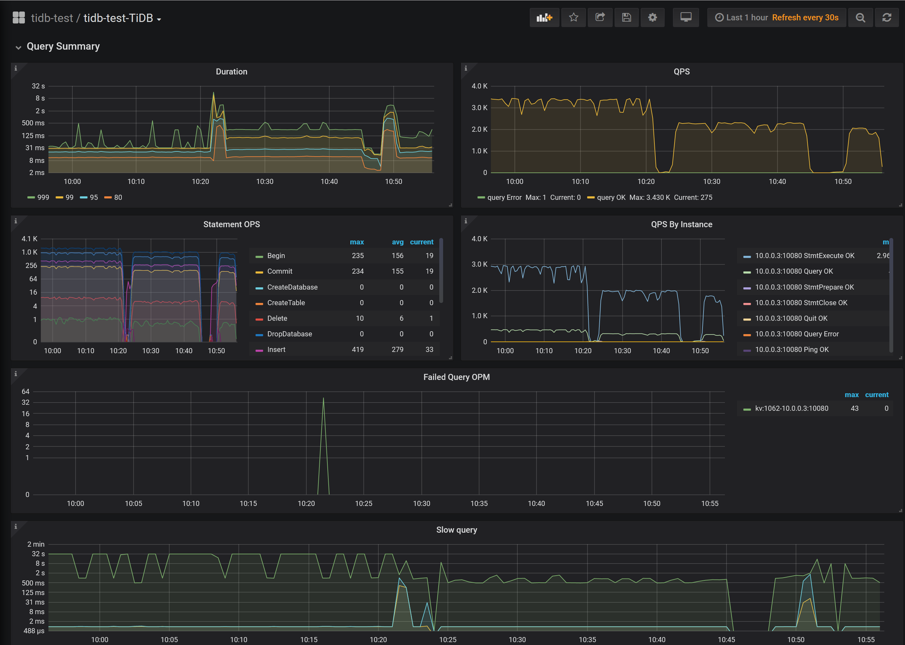

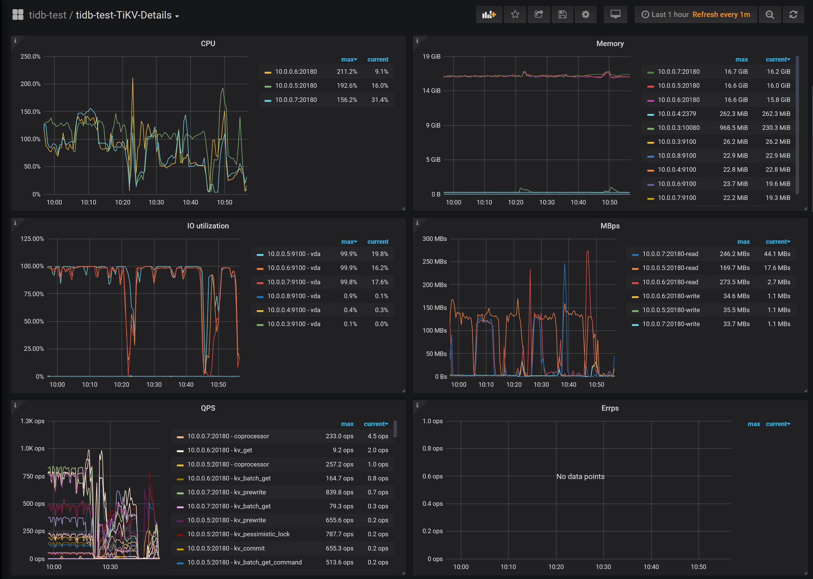

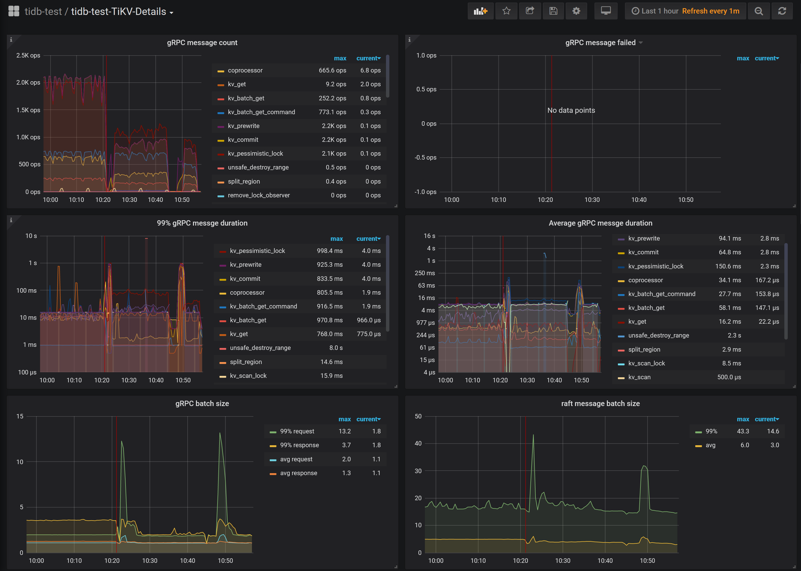

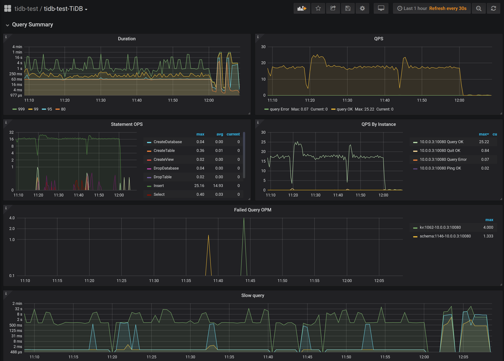

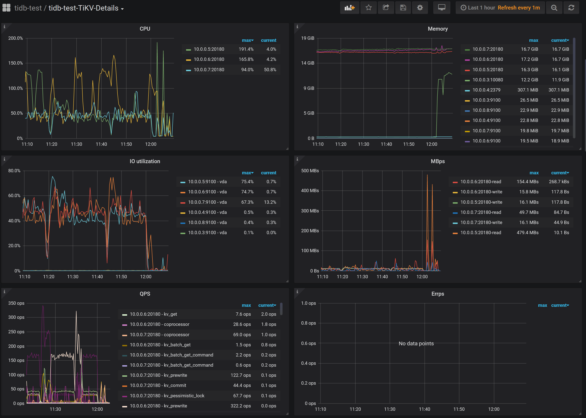

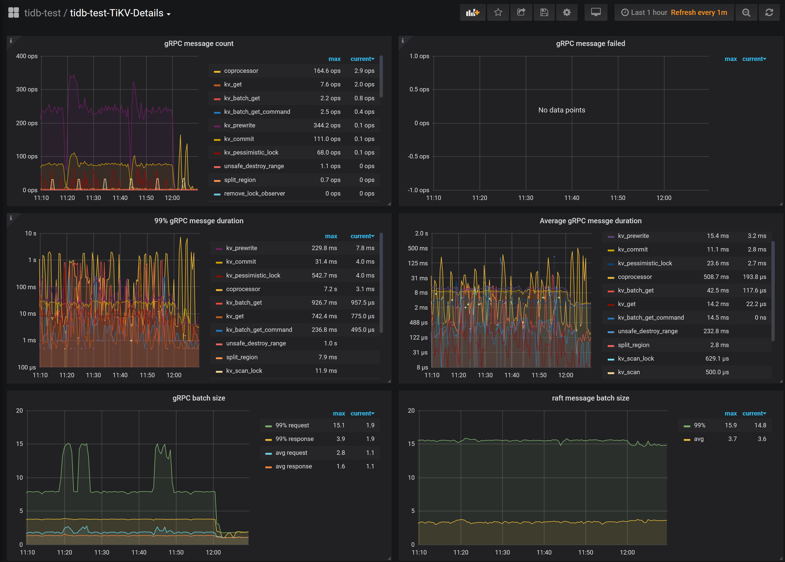

---

### 测试结果分析

> 因为 sysbench 的测试数据量比较大, 这么主要围绕 sysbench 测试结果进行分析

1. 在sb test 数据导入完成后, 表大小大约60G, 实际存储增加了约200G, 共3个TiKV 节点, 平均下来大约每个TiKV节点都有一个数据副本
2. 再打开一个慢查询详情看一下

  
  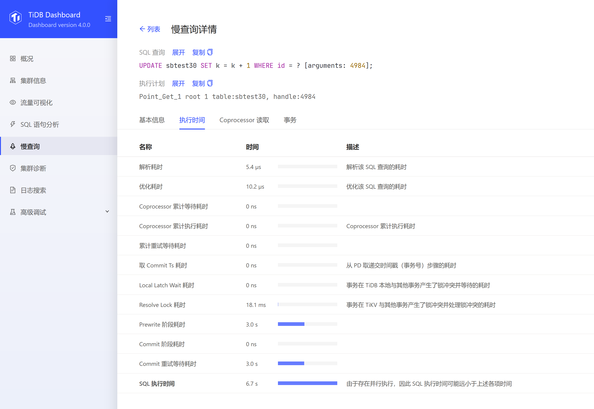

3. 再看一下 Sysbench 测试中 TikV的监控指标

  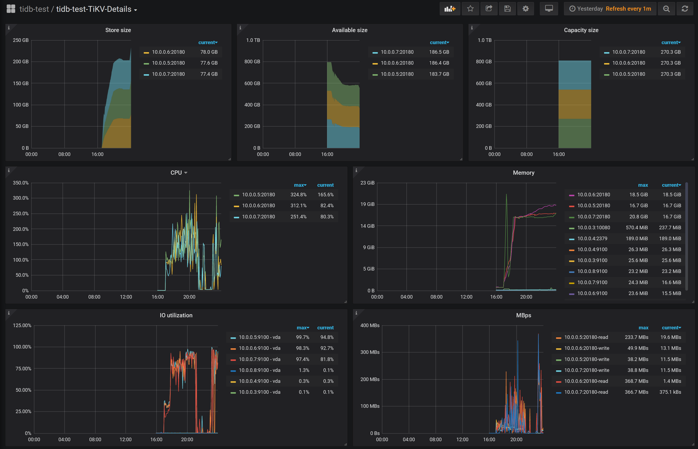

  CPU浮动偶见满载, 内存大约用掉 75%, IO将近100%

### 瓶颈猜想

> 猜测性能瓶颈主要在于TiKV数据存储, </br>
> 一方面体现在高并发时磁盘IO很容易进入高负载, </br>
> 另一方面还要为数据做多副本, 还有事务, 这更是增加了系统负担.

### 问题总结

1. sysbench update_index 发生 TS相关错误, 待解决.
2. go-tpc prepare 发生错误 不能自修复, 待解决.
3. 基准测试对硬件环境要求确实比较高, 数据量很大的时候, 动不动就跑几个小时, 而且有时候还会出错, 可能是对这块不熟, 时间又很不充裕, 这个样做下来很是难受, 可能要想办法搞一个适用于长期开发测试的常态开发配置了.

> **任重道远啊**
