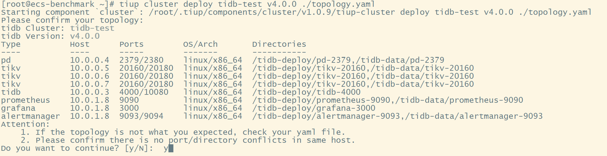
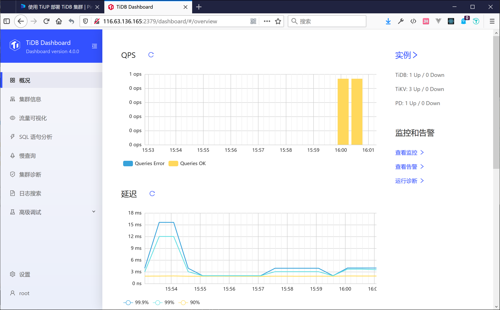
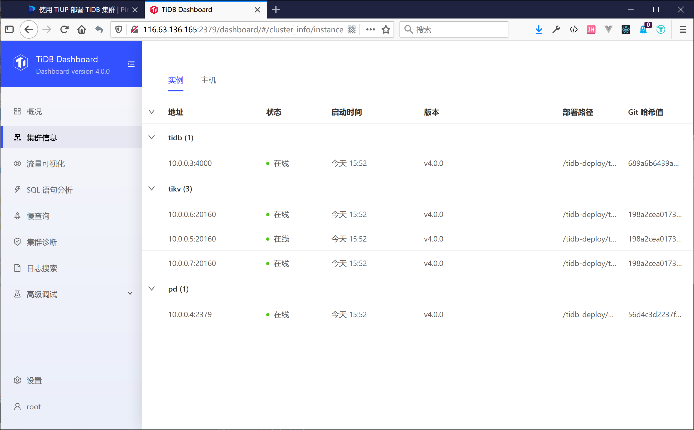
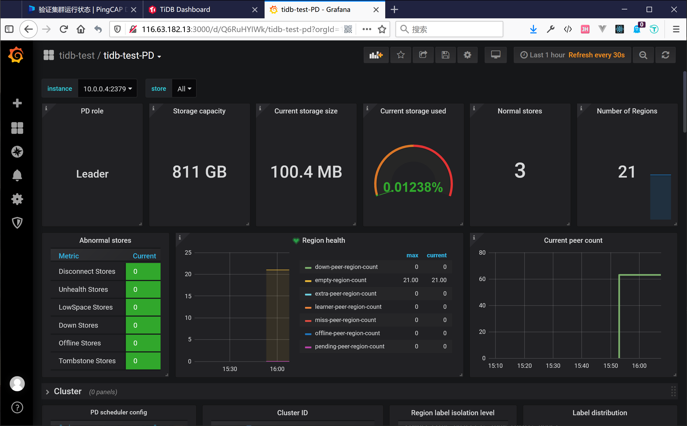

<!-- tags: pingcap, tidb -->
<!-- created: 2020-08-19 19:00 -->

# **High Performance TiDB** 第二课 (更新中...)

<center>

<!-- iframe 
<iframe
    src="//player.bilibili.com/player.html?bvid=BV1TD4y1m7AF&page=1"
    sandbox="allow-top-navigation allow-same-origin allow-forms allow-scripts"
    scrolling="no" border="0" frameborder="no" framespacing="0" allowfullscreen="true">
</iframe>
 -->

[【High Performance TiDB】Lesson 02：对 TiDB 进行基准测试](https://www.bilibili.com/video/BV1TD4y1m7AF)

</center>

> 本次课程介绍了如何使用TiUP部署, 以及比较常用的几个测试工具的使用方法以及测试内容，通过这些工具对 TiDB 的测试，来发现 TiDB 潜在的瓶颈和优化点

<!-- more -->

### 环境准备

> 官方推荐参考配置: [https://docs.pingcap.com/zh/tidb/stable/hardware-and-software-requirements](https://docs.pingcap.com/zh/tidb/stable/hardware-and-software-requirements)
> </br>
> 目前基准测试主要是OLTP, 所以这里暂不部署TiFlash </br>
> Ok, 群里小伙伴的提议, 买几台按需云服务

##### 机器配置

| 组件      | CPU        | 内存 | 磁盘      | 网络 | 实例数量 |
| --------- | ---------- | ---- | --------- | ---- | -------- |
| TiDB      | 2.6GHz 8核 | 16G  | -         | 千兆 | x1       |
| PD        | 2.6GHz 4核 | 8G   | SSD, 256G | 千兆 | x1       |
| TiKV      | 3.0GHz 8核 | 32G  | SSD, 256G | 千兆 | x3       |
| Monitor   | 2.6GHz 4核 | 8G   | SSD, 64G  | 千兆 | x1       |
| Benchmark | 2.6GHz 8核 | 16G  | SSD, 128G | 千兆 | x1       |

> 对于我初学者来说, 还没有查到如何确定磁盘容量大小, </br>
> 包括 PD, TiKV , Monitoring & Grafana, TiFlash 等有状态组件之间的容量大小比例.

##### 拓扑结构

| 实例       | 个数 | 物理机配置             | IP                                     |
| :--------- | :--- | :--------------------- | :------------------------------------- |
| TiDB       | 1    | 8 VCore 16GB * 1       | 10.0.0.3                               |
| PD         | 1    | 4 VCore 8GB * 1 256G   | 10.0.0.4                               |
| TiKV       | 3    | 8 VCore 32GB *3 256G   | 10.0.0.5 </br> 10.0.0.6 </br> 10.0.0.7 |
| Monitoring | 1    | 4 VCore 8GB * 1 64GB   | 10.0.0.8                               |
| Benchmark  | 1    | 8 VCore 16GB * 1 128GB | 10.0.0.9                               |

##### 系统初始化

参考[https://docs.pingcap.com/zh/tidb/stable/check-before-deployment](https://docs.pingcap.com/zh/tidb/stable/check-before-deployment)


```shell
# 安装Ansible
sudo dnf install https://dl.fedoraproject.org/pub/epel/epel-release-latest-8.noarch.rpm -y
sudo dnf install ansible
ansible --version

# 安装 sshpass
yum install -y sshpass;

# 关闭SSH Host Key 检查
sed -i '/.*StrictHostKeyChecking.*/d' /etc/ssh/ssh_config ;
echo "StrictHostKeyChecking no" > /etc/ssh/ssh_config ;
cat /etc/ssh/ssh_config | grep StrictHostKeyChecking ;

# 生成新的 SSH Host Key
rm -rf ~/.ssh/id_rsa*;
echo "" | ssh-keygen -t rsa -P '' ;

# 初始化变量: 所有节点IP
SSH_GROUP=( \
        10.0.0.3 10.0.0.4 \
        10.0.0.5 10.0.0.6 10.0.0.7 \
        10.0.0.8 10.0.0.9\
        );
SSH_PWD=tidb@7758

# 清空旧数据
mkdir -p /etc/ansible
echo "" > ~/.ssh/known_hosts;
echo "" > /etc/ansible/hosts;

echo "[tidb]" >> /etc/ansible/hosts;

# 初始化SSH免密
declare -i node_x=0; \
for x in ${SSH_GROUP[*]}; do \
  node_x+=1; \
  echo $node_x $x $SSH_PWD; \
  echo $x \
    hostname=tidb-$node_x \
    ansible_ssh_port=22 \
    ansible_ssh_user=root \
    ansible_ssh_pass=$SSH_PWD >> /etc/ansible/hosts; \
  sshpass -p "$SSH_PWD" \
    ssh-copy-id -i ~/.ssh/id_rsa.pub $x; \
done;

cat /etc/ansible/hosts;
```

```shell
# 关闭防火墙
ansible all -m selinux -a "state=disabled"
ansible all -m systemd -a "name=firewalld state=stopped"
ansible all -m service -a "name=firewalld enabled=no"

# 安装NTP服务
ansible all -m raw -a "rpm -ivh http://mirrors.wlnmp.com/centos/wlnmp-release-centos.noarch.rpm"
ansible all -m raw -a "yum install -y wntp"
ansible all -m raw -a "ntpdate ntp1.aliyun.com"
```

### 🛠️ 使用[TiUP](https://github.com/pingcap/tiup)部署TiDB集群

##### 安装TiUP

```shell
curl --proto '=https' --tlsv1.2 -sSf https://tiup-mirrors.pingcap.com/install.sh | sh

source .bash_profile

which tiup

tiup update --self && tiup update cluster
```

##### 创建拓扑配置文件`topology.yaml`

`cat > topology.yaml <<EOF`

```yaml
global:
  user: "tidb"
  ssh_port: 22
  deploy_dir: "/tidb-deploy"
  data_dir: "/tidb-data"

pd_servers:
  - host: 10.0.0.4

tidb_servers:
  - host: 10.0.0.3

tikv_servers:
  - host: 10.0.0.5
  - host: 10.0.0.6
  - host: 10.0.0.7

monitoring_servers:
  - host: 10.0.0.8

grafana_servers:
  - host: 10.0.0.8

alertmanager_servers:
  - host: 10.0.0.8
```

`EOF`

##### 部署集群



```shell
# 部署
tiup cluster deploy tidb-test v4.0.0 ./topology.yaml
# 启动
tiup cluster start tidb-test
# 查看
tiup cluster list
```

###### 访问

- Dashboard:  {pd-ip}:{pd-port}/dashboard





- Grafana: {Grafana-ip}:3000




##### 修改参数配置

> 参考[https://docs.pingcap.com/zh/tidb/stable/maintain-tidb-using-tiup](https://docs.pingcap.com/zh/tidb/stable/maintain-tidb-using-tiup)

- 打开配置编辑

```shell
tiup cluster edit-config tidb-test
```

- 增加全局配置

```yaml
server_configs:
  tidb:
    log.slow-threshold: 300
    binlog.enable: false
    binlog.ignore-error: false
  tikv:
    # 默认4, 如果部署的机器 CPU 核数特别少(<=8)，可以考虑将该配置设置为 2
    server.grpc-concurrency: 2
    # raftstore.apply-pool-size: 2
    # raftstore.store-pool-size: 2
    # rocksdb.max-sub-compactions: 1
    # storage.block-cache.capacity: "16GB"
    # readpool.unified.max-thread-count: 12
    # 如果机器 CPU 核数较少，可将 rocksdb.max-background-jobs 与 raftdb.max-background-jobs 同时设置为 4
    rocksdb.max-background-jobs: 4
    raftdb.max-background-jobs: 4
    #
    readpool.storage.use-unified-pool: false
    readpool.coprocessor.use-unified-pool: true
```

- 重新加载

```shell
tiup cluster reload tidb-test
```


### 🩺 [sysbench](https://github.com/akopytov/sysbench) 基准测试

> 参考文档: [https://book.tidb.io/session4/chapter3/sysbench.html](https://book.tidb.io/session4/chapter3/sysbench.html)

##### 安装

```shell
curl -s https://packagecloud.io/install/repositories/akopytov/sysbench/script.rpm.sh | sudo bash
yum -y install sysbench
sysbench --version
```

##### 编辑配置文件 `config`

```ini
mysql-host=10.0.0.3
mysql-port=4000
mysql-user=root
mysql-password=
mysql-db=sbtest
time=600
threads=16
report-interval=10
db-driver=mysql
```

##### 创建测试数据库

```sql
create database sbtest;
```

##### 导入测试数据

- 导入数据前先将数据库设置为乐观事务模式

```sql
set global tidb_disable_txn_auto_retry = off;
set global tidb_txn_mode="optimistic";
```

- 导入数据

```shell
sysbench --config-file=config oltp_point_select --tables=32 --table-size=10000000 prepare
```

- 导入数据后再将数据库设置为悲观事务模式

```sql
set global tidb_txn_mode="pessimistic";
```

- 导入记录

```

```

##### 测试

- point select

```shell
sysbench --config-file=config oltp_point_select --threads=128 --tables=32--table-size=5000000 run
```

- update index

```shell
sysbench --config-file=config oltp_update_index --threads=128 --tables=32--table-size=5000000 run
```

- read only

```shell
sysbench --config-file=config oltp_read_only --threads=128 --tables=32--table-size=5000000 run
```


### 🩺 [go-ycsb](https://github.com/pingcap/go-ycsb) 基准测试

> YCSB(Yahoo! Cloud System Benchmark), 雅虎推出的云数据库基准测试套件
> go-ycsb 一个 Go 的 YCSB 移植

##### 安装

```shell
# 需要go环境
git clone https://github.com/pingcap/go-ycsb.git $GOPATH/src/github.com/pingcap/go-ycsb
cd $GOPATH/src/github.com/pingcap/go-ycsb
make

./bin/go-ycsb
```

### 🩺 [go-tpc](https://github.com/pingcap/go-tpc) 基准测试

> 用于对 TiDB 和几乎与 MySQL 兼容的数据库的 TPC 中的工作负载进行基准测试的一个工具箱

TPC 是一系列事务处理和数据库基准测试的规范。TPC已经推出了四套基准程序，被称为TPC－A、TPC－B、TPC－C和TPC－D。其中A和B已经过时，不再使用了。TPC－C是在线事务处理(OLTP)的基准程序，TPC－D是决策支持(Decision Support) 的基准程序。TPC即将推TPC－E，作为大型企业(Enterprise)信息服务的基准程序。

##### 安装

```shell
curl --proto '=https' --tlsv1.2 -sSf https://raw.githubusercontent.com/pingcap/go-tpc/master/install.sh | sh
```

### 测试结果分析


### 🗳️ 问题和建议

- 暂无