# Java-JVM

## 一, 运行时数据区域

 

1. 程序计数器
   
    程序计数器(Program Counter Register)，是一块较小的内存空间，可以看作是当前线程所执行的字节码的行号指示器。在虚拟机的概念模型中字节码解释器的工作就是通过改变这个计数器的值来选取下一条需要执行的字节码指令，分支、循环、跳转、异常处理、线程恢复等基础功能都依赖于此计数器。JVM中的程序计数器也是在Java虚拟机规范中唯一一个没有规定任何OutOfMemoryError情况的区域。在任意时刻一条JVM线程只能执行一个方法的代码，方法可以是Java方法，或者是native方法。

    此处还有2点需注意：
    
    1. Java虚拟机中的程序计数器仅仅是虚拟机中的，存在于内存之上的“虚拟”计数器，而不是电脑中的实体程序计数器。
   
    2. JVM线程中执行的方法有2种类型：普通Java方法和由其他语言实现的native方法。如果当前执行的是普通Java方法，则程序计数器记录的是虚拟机字节码指令的地址。如果当前执行的是native方法，则计数器的值为空（Undefined）。
   
2. 虚拟机栈
   
   和程序计数器一样，Java虚拟机栈(Java Virtual Machine Stacks)也是线程私有的，即生命周期和线程相同。Java虚拟机栈和线程同时创建，用于存储栈帧。每个方法在执行时都会创建一个栈帧(Stack Frame)，用于存储局部变量表、操作数栈、动态链接、方法出口等信息。每一个方法从调用直到执行完成的过程就对应着一个栈帧在虚拟机栈中从入栈到出栈的过程。
   
   Java虚拟机规范中Java虚拟机栈内存的大小既可以被实现成固定大小，也可以根据计算动态拓展或收缩，当前大部分的JVM实现是支持动态拓展的。
   
   Java虚拟机栈可能发生的异常：
   
   1. 线程请求分配的栈容量>Java虚拟机最大栈容量，则JVM会抛出StackOverFlowError异常。
   
   2. 如果Java虚拟机可动态拓展，则如果在拓展的过程中无法申请到足够的内存，就会抛出OutOfMemoryError异常

3. 本地方法栈
   
   本地方法栈(Native Method Stack)和Java虚拟机栈类似，区别在于Java虚拟机栈是为了Java方法服务的，而本地方法栈是为了native方法服务的。在虚拟机规范中并没有对本地方法实现所采用的编程语言与数据结构采取强制规定，因此不同的JVM虚拟机可以自己实现自己的native方法。此处需要说明：Sun HotSpot虚拟机就直接将本地方法栈和Java虚拟机栈合二为一了。

4. 堆
   
   前面所说的程序计数器、Java虚拟机栈、本地方法栈通常只占很小一部分的内存空间，对与大多数应用来说，Java堆(Java Heap)才是JVM管理的内存空间中最大的一块。此区域存在的唯一目的就是存放对象实例，几乎所有的对象实例都会在这被分配内存，而且Java堆是被所有线程共享的一块内存区域。Java堆是Java中垃圾收集器管理的主要区域，因此也被称为GC堆—Garbage Collected Heap.

5. 方法区
   
   方法区(Method Area)，与Java堆一样是各个线程共享的内存区域。用于存储被JVM加载的类信息、常量、静态变量、即时编译器编译后的代码等数据。虽然Java虚拟机规范将方法区描述为堆的一个逻辑部分，但是它却有个别名叫做Non-Heap(非堆),目的就是和Java堆区分开来。

   > - 在Java7以前，HotSpot虚拟机中，方法区也被称为“永久代”  
   > - 在Java8中, HotSpot虚拟机改变了原有方法区的物理实现，将原本由JVM管理内存的方法区的内存移到了虚拟机以外的计算机本地内存，并将其称为元空间（Metaspace）

## 二, 垃圾回收

> 垃圾收集主要是针对`堆`和`方法区`进行。程序计数器、虚拟机栈和本地方法栈这三个区域属于线程私有的，只存在于线程的生命周期内，线程结束之后就会消失，因此不需要对这三个区域进行垃圾回收。