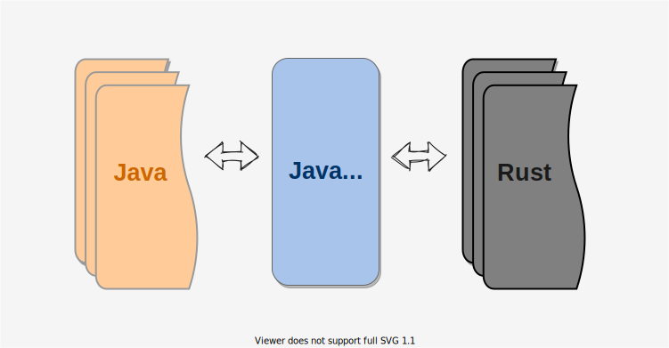

<!-- categories:  rust -->
<!-- tags: jni -->
<!-- created: 2020-04-08 -->

# Rust 之 JNI

<!-- iframe 
<iframe
    src="//player.bilibili.com/player.html?bvid=BV17K411T7Kd&page=1"
    sandbox="allow-top-navigation allow-same-origin allow-forms allow-scripts"
    scrolling="no" border="0" frameborder="no" framespacing="0" allowfullscreen="true">
</iframe>
 -->




> 本文介绍了如何用 Rust 实现一个 JNI 动态库 </br>
> 本文采用动态注册方式 </br>

<!-- more -->

## 创建一个 lib

```shell
cargo new --lib jni-demo
```

## 导入 jni 包

```toml
# Cargo.toml

[dependencies]
# 编写文章时的最新版本为 0.16.0
jni = { version = "0.16.0", default-features = false }
# 可以使用*号引入最新版本
#jni = { version = "*", default-features = false }
```

## 编写 lib.rs

````rust
/// lib.rs 部分代码

/// 使用宏简化声明 NativeMethod 对象
/// ## Examples
/// ```
/// let method:NativeMethod = jni_method!(native_method, "(Ljava/lang/String;)V");
/// ```
macro_rules! jni_method {
    ( $method:tt, $signature:expr ) => {
        jni::NativeMethod {
            name: jni::strings::JNIString::from(stringify!($method)),
            sig: jni::strings::JNIString::from($signature),
            fn_ptr: $method as *mut c_void,
        }
    };
}


use jni::JNIEnv;
use jni::{JavaVM, NativeMethod};


/// 本地方法
#[no_mangle]
pub fn native_println(env: JNIEnv, _obj: jobject, data: jstring) {
    // TODO do something...
}

/// Jni OnLoad 动态注册本地方法
#[no_mangle]
#[allow(non_snake_case)]
unsafe fn JNI_OnLoad(jvm: JavaVM, _reserved: *mut c_void) -> jint {
    loge!("JNI_OnLoad");

    // java 类名
    let class_name: &str = "library/jni/JniUtils";
    // 本地方法
    let jni_methods = [
        jni_method!(native_println, "(Ljava/lang/String;)V"),
    ];

    register_natives(&jvm, class_name, jni_methods.as_ref())
}

unsafe fn register_natives(jvm: &JavaVM, class_name: &str, methods: &[NativeMethod]) -> jint {
    let env: JNIEnv = jvm.get_env().unwrap();
    let jni_version = env.get_version().unwrap();
    let version: jint = jni_version.into();

    info!("JNI Version : {:#?} ", jni_version);

    let clazz = match env.find_class(class_name) {
        Ok(clazz) => clazz,
        Err(e) => {
            error!("java class not found : {:?}", e);
            return JNI_ERR;
        }
    };
    let result = env.register_native_methods(clazz, &methods);

    if result.is_ok() {
        info!("register_natives : succeed");
        version
    } else {
        error!("register_natives : failed ");
        JNI_ERR
    }
}
````

## 添加 Java 回调

```rust
# 关键代码, 添加回调逻辑

use jni::objects::{GlobalRef, JObject, JString, JValue};
use jni::sys::*;
use jni::JNIEnv;
use jni::{JavaVM, NativeMethod};

use lazy_static::lazy_static;

// 添加一个全局变量来缓存回调对象
lazy_static! {
    // jvm
    static ref JVM_GLOBAL: Mutex<Option<JavaVM>> = Mutex::new(None);
    //callback
    static ref JNI_CALLBACK: Mutex<Option<GlobalRef>> = Mutex::new(None);
}

/// 动态库被 java 加载时 会出发此函数, 在此动态注册本地方法
#[no_mangle]
#[allow(non_snake_case)]
unsafe fn JNI_OnLoad(jvm: JavaVM, _reserved: *mut c_void) -> jint {

    ...

    let class_name: &str = "library/jni/Native";
    let jni_methods = [
        # 添加注册一个可以传递java回调对象的本地方法
        jni_method!(native_set_callback, "(Llibrary/jni/Native$Callback;)V")
    ];

    let ok = register_natives(&jvm, class_name, jni_methods.as_ref());

    // 在动态库被java加载时, 缓存一个jvm到全局变量, 调用回调时使用
    let mut ptr_jvm = JVM_GLOBAL.lock().unwrap();
    *ptr_jvm = Some(jvm);

    ok
    ...
}


# 方法实现
#[no_mangle]
pub fn native_set_callback(env: JNIEnv, _obj: jobject, callback: jobject) {
    // 创建一个全局引用,
    let callback = env.new_global_ref(JObject::from(callback)).unwrap();

    // 添加到全局缓存
    let mut ptr_fn = JNI_CALLBACK.lock().unwrap();
    *ptr_fn = Some(callback);
}

/// 回调 Callback 对象的 { void onStateChanged(int state) } 函数
fn call_java_callback(state: i32) {
    call_jvm(&JNI_CALLBACK, move |obj: JObject, env: &JNIEnv| {
        let uid: JString = env.new_string(uid.clone()).unwrap();
        let args: [JValue; 1] = [JValue::from(state)];
        match env.call_method(obj, "onStateChanged ", "(I)V", args.as_ref()) {
            Ok(jvalue) => {
                debug!("callback succeed: {:?}", jvalue);
            }
            Err(e) => {
                error!("callback failed : {:?}", e);
            }
        }
    });
}

///
/// # 封装jvm调用
fn call_jvm<F>(callback: &Mutex<Option<GlobalRef>>, run: F)
where
    F: Fn(JObject, &JNIEnv) + Send + 'static,
{
    let ptr_jvm = JVM_GLOBAL.lock().unwrap();
    if (*ptr_jvm).is_none() {
        return;
    }
    let ptr_fn = callback.lock().unwrap();
    if (*ptr_fn).is_none() {
        return;
    }
    let jvm: &JavaVM = (*ptr_jvm).as_ref().unwrap();

    match jvm.attach_current_thread_permanently() {
        Ok(env) => {
            let obj = (*ptr_fn).as_ref().unwrap().as_obj();
            run(obj, &env);

            // 检查回调是否发生异常, 如果有异常发生,则打印并清空
            if let Ok(true) = env.exception_check() {
                let _ = env.exception_describe();
                let _ = env.exception_clear();
                // let _ = env.throw_new("java/lang/Exception", "JNI抛出的异常！");
            }
        }
        Err(e) => {
            debug!("jvm attach_current_thread failed: {:?}", e);
        }
    }
}

```

```rust
# 调用示例

/// 回调 Java 层 hook(String uid, String data) 函数
fn java_callback_example(uid: String, data: String) {
    call_jvm(&JNI_CALLBACK, move |obj: JObject, env: &JNIEnv| {
        let uid: JString = env.new_string(uid.clone()).unwrap();
        let data: JString = env.new_string(data.clone()).unwrap();
        let args: [JValue; 2] = [
            JValue::from(JObject::from(uid)),
            JValue::from(JObject::from(data)),
        ];
        match env.call_method(
            obj,
            "hook",
            "(Ljava/lang/String;Ljava/lang/String;)V",
            args.as_ref(),
        ) {
            Ok(jvalue) => {
                debug!("call on prepare succeed: {:?}", jvalue);
            }
            Err(e) => {
                error!("call on prepare failed : {:?}", e);
            }
        }
    });
}

```
